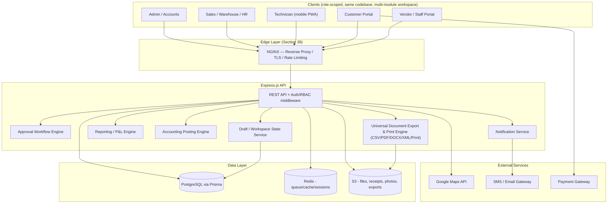
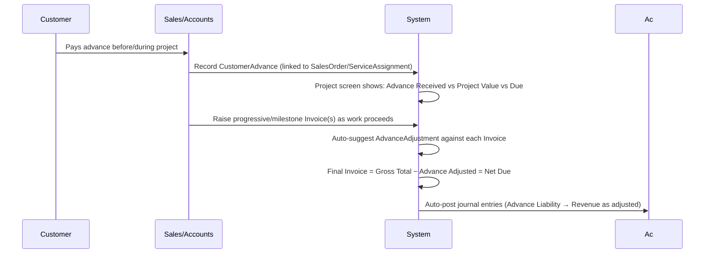
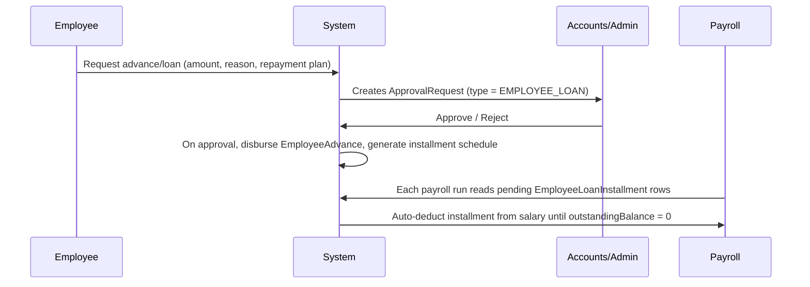
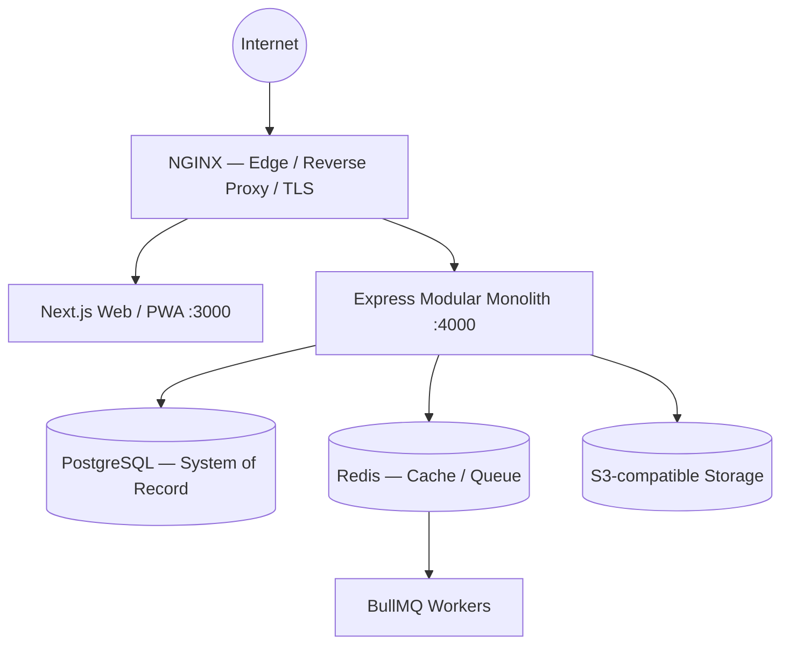

# Brother's Technology System — Unified Business Management Platform
## Full Project Architecture Document (v3.4)

**Owner:** Brother's Technology System
**Purpose:** This document is the single source of truth for building Brother's Technology System's complete business management platform — inventory, sales, procurement, field service, finance, HR, and mobile operations — with Claude Code, module by module, phase by phase.

**v3.0 revision note:** cross-checked against `Accounting_ERP_Existing_Application_Cross_Check_Upgrade_Spec_English.md` plus four explicitly-raised requirements. Nothing below was removed or renumbered — Sections 1–29 are unchanged; **Sections 30–37 are new**, and Module Map entries 66–71 (Section 8) are new. See Section 37 for the full cross-check alignment summary.

**v3.1 revision note:** adds **Nginx** as the mandatory production Edge / Reverse Proxy / TLS layer in front of the Next.js web app and Express API, per the companion document `architecture_nginx.md`. Nothing in Sections 1–37 was removed or renumbered — the Tech Stack (Section 3), High-Level Architecture diagram (Section 4), Repository Structure (Section 5), and Security Architecture (Section 22) are updated in place to reference the edge layer; **Section 38 is new** and carries the full Nginx edge architecture, Docker service topology, and deployment rules. This is an infrastructure-layer addition only — it does not change the application architecture, domain model, or module scope.

**v3.2 revision note:** closes a real gap found in a 24-point architecture validation pass: Section 38.2 (v3.1) described this system as "DDD, Modular Monolith, Clean/Hexagonal architecture, internal domain events" already specified in Sections 1–37 — on inspection, those patterns were named but never actually laid out anywhere in the document (no bounded contexts, no layer separation, no domain-event catalog, no module dependency rules). **Sections 39–55 are new** and now actually specify what Section 38 already claimed existed, plus several previously-unaddressed infrastructure concerns (background jobs, realtime, file storage, environment/config, scalability, caching, observability, error handling, backup/DR, and — added on a follow-up pass — explicit user-flow and data-flow traces beyond Section 42's single worked example) found in the same review. Section 22 (Security Architecture) is updated in place for MFA (matching `prd.md` v2.3) and a pointer to the new Environment & Configuration section. Section 3 (Tech Stack) gains one line for the `/api/v1/` convention, matching `prd.md` v2.3. **Section 56 (Architecture Validation Report) is new** and summarizes the full pass, including items that remain open. Nothing in Sections 1–38 was removed, renumbered, or contradicted.

**v3.3 revision note — Module 72, Service-Only Customer Workflow:** adds paid, non-warranty service requests (a customer with no prior purchase). Section 7.12's `Ticket` model is given a full definition for the first time (it was previously named narratively only) — `ticketType` (`WARRANTY_CLAIM`/`PAID_SERVICE_REQUEST`) and a nullable `serialNumberId` are the only schema changes this module needed. Section 8's module map and Section 39's Bounded Context Map are updated to list Module 72. **Section 57 is new** and is the module's full deep-dive, placed after Section 56 rather than inserted among Sections 30–36 where it would thematically sit, specifically to avoid renumbering Sections 39–56 and invalidating the many cross-references between them. Nothing in Sections 1–56 was removed or contradicted; Section 39's Field Service and Customer Support rows gained "72" in their module list, and Section 7.12 gained the `Ticket` model — both in-place additions, not rewrites.

**v3.4 revision note — Challan Return, Damage/Loss, Employee Performance, Admin correction:** built from six uploaded specification documents (five plus a sixth, `employee-work-performance-feature-update.md`, that the first five referenced but didn't include — supplied separately and read in full). Section 7.4 (Sales) gains full `DeliveryChallanLine`, `DeliveryChallanReturn`, and `DeliveryChallanReturnLine` models (Module 73). A new model group is added for Module 74 (Warehouse Damage & Loss): `DamageLossReport`, `DamageLossLine`. **No new table is added for Module 75 (Employee Work & Performance)** — per its own source document's explicit architectural principle, it is a reporting/aggregation layer over `ServiceAssignment`/`Ticket`/`ProductCustody`/`Attendance` and is implemented as views and query services, not physical tables; this is a deliberate correction to an earlier, incorrect assumption (surfaced in `database-schema.md`'s own working notes) that it would need an `EmployeeWorkLedger` table. **Section 22 (Security Architecture) is updated for the Admin permission-model correction** — full detail and the reasoning for changing it live in `prd.md` §6, referenced here rather than repeated. Section 39's Bounded Context Map and Section 8's module map both gain rows for Modules 73–75. **Section 58 is new** and is these three modules' combined deep-dive, appended after Section 57 for the same renumbering-avoidance reason Section 57 itself was appended after Section 56. Nothing in Sections 1–57 was removed or contradicted.

---

## 0. How To Use This Document With Claude Code

- Keep this file at the repo root as `architecture.md` (or `docs/architecture.md`) so Claude Code can reference it every session.
- **Confirmed Assumptions:**
  - Architecture: Multi-tenant SaaS (Requires `tenantId` across all entities).
  - Mobile: PWA first, with React Native (Expo) app support built into the architecture.
  - Payment: SSLCommerz.
  - Attendance/Leave: In scope.
  - Advance as Cost: Project-wise conveyance and external product purchases only.
  - SMS Gateway: Free tier solution.
  - Employee Loan: Interest-bearing.
  - Company Loan: Interest-free.
  - Investment: Custom calculation/flexible withdrawal based on investor preference.
  - Draft Retention: 1 hour only.
  - XML Export: Generic schema for universal usage.

---

## 1. Business Context & Goals

Brother's Technology System sells **products and services** — hardware/technology sales plus installation, repair, and maintenance service. The platform must give:

1. End-to-end **Inventory** control: procurement → warehouse → serial/batch → sale → return — with **full SKU-level lifecycle traceability** (Section 12).
2. End-to-end **Finance** control: invoicing, payments, accounting, expenses, and **100% profit & loss visibility** — company-wide, per project/order, and per department/head (Section 11, 19).
3. **Customer, Vendor, Technician, and Service** management as first-class modules.
4. A **Technician workflow**: assign a technician (and specific products/equipment) to an order/invoice/project; issue project-wise cash advances; let technicians submit conveyance bills and record extra products/cash used from their own mobile dashboard; route all of this through **Admin/Accounts approval**; close the project; roll everything into project profitability.
5. **Customer advance / partial payment** handling for projects — customers frequently pay in advance before or during a project, and the system must track what's received, what's adjusted, and what's still due (Section 13).
6. **Company loan and investment** tracking — the company itself sometimes takes loans and receives investment, and both must be visible in the books and in cash-flow planning (Section 14).
7. **Employee advance / loan** management — staff sometimes need salary advances or loans that must be tracked and reconciled against payroll (Section 15).
8. **Live location tracking** for technicians/employees during assigned tasks, and a **remote employee management** system generally.
9. **Role-scoped mobile app access** — every user gets an app experience scoped to only what their role allows (Section 20).
10. A **multi-module workspace** — a user working inside one module can minimize it and open another without losing any in-progress (unsaved) work; unsaved work is kept as a **draft**, never deleted (Section 17).
11. **Universal document export** — every invoice, challan, purchase order, and generated report can be downloaded as **CSV, PDF, Word (DOCX), or XML** (Section 16).
12. **Search and filter** on every module's list screens, not just a global search (Section 18).
13. Branded **document generation** (Quotation, Invoice, Challan) on the company's own letterhead, sent and tracked from inside the system.
14. Centralized **document/file storage** for all business documents.
15. **Universal print** — not just download — on every document and report, with an optional company-letterhead header/footer the user chooses at print time rather than one baked in permanently (Section 33).
16. **Data edit/delete governance** — once any record is submitted, editing or deleting it is never a same-role action; it always requires explicit **Super Admin** approval, platform-wide (Section 34).
17. **Drill-down reporting** — every dashboard figure, P&L line, and report total is clickable through to the exact transactions behind it, point/topic/module-wise (Section 35).
18. A fully-specified, standalone **Quotation** module — creation, branded printing, conversion to Sales Order, and win/loss tracking — not merely a step in a workflow diagram (Section 36).

---

## 2. Key Design Principles

- **Single system of record.** One PostgreSQL database, one API, one permission model — not siloed spreadsheets or side tools.
- **Everything traceable to money.** Every stock movement, technician action, loan, advance, and approval eventually posts to the accounting ledger, so P&L is always derivable, not reconstructed manually.
- **Approval-gated exceptions.** Anything outside the plan (extra product used, extra cash spent, discount, stock adjustment, employee loan, stock write-off) is *not silently allowed* — it becomes an `ApprovalRequest` that Accounts/Admin must clear.
- **Row-level scoping, not just role-based screens.** A technician's dashboard query is filtered at the data layer (`WHERE technicianId = currentUser.id`), so it's impossible to leak other users' data even if the UI has a bug.
- **Mobile-first for field roles, desktop-first for back-office roles** — same API, same database, either way.
- **Nothing in progress is ever silently lost.** Switching modules, losing connectivity, or closing the app must never discard a user's unsaved input — it becomes a recoverable draft (Section 17).
- **Every document is portable.** Anything the system generates for a human to read (invoice, report, statement) must leave the system in the format the recipient needs — CSV for a spreadsheet, PDF for printing/emailing, Word for further editing, XML for another system to ingest (Section 16).
- **Find anything in two actions.** Every list screen in every module supports search plus structured filters, so no one has to scroll a 2,000-row table to find one record (Section 18).
- **Nothing changes after submission without a Super Admin's sign-off.** Once a record leaves DRAFT status, editing or deleting it is never a same-role action, no matter how senior — it becomes a `RECORD_EDIT_REQUEST`/`RECORD_DELETE_REQUEST` that only a Super Admin can clear (Section 34). This is a stronger guarantee than audit-logging alone: the change is approved *before* it happens, not merely recorded after.

---

## 3. Tech Stack

| Layer | Choice | Why |
|---|---|---|
| Frontend (web + admin) | **Next.js (App Router) + TypeScript + Tailwind CSS + shadcn/ui** | SSR for dashboards/reports, fast iteration |
| Field/mobile experience | **Same Next.js app as an installable, role-scoped PWA** | Avoids maintaining separate native codebases per role; see Section 20 |
| Frontend state (workspace) | **Zustand (or Redux Toolkit) + a Draft-sync layer** | Powers the multi-module taskbar/tab workspace and draft autosave (Section 17) |
| Backend API | **Node.js + Express.js + TypeScript**, all routes under **`/api/v1/`** (matching `prd.md` Section 10.9) | Simple, well-understood, easy for Claude Code to extend module-by-module; versioned from day one so a future breaking change doesn't force a flag-day migration |
| ORM / DB | **Prisma ORM + PostgreSQL** | Strong relational integrity — essential for accounting/inventory/loan correctness |
| Auth | **JWT (access + refresh tokens) + RBAC** | Refresh rotation for security |
| Background jobs | **BullMQ + Redis** | Scheduled reports, reminders, backups, notification fan-out, heavy document exports |
| Realtime | **Socket.IO (or SSE)** | Live technician location, live notifications, live approval-inbox updates |
| File storage | **S3-compatible object storage** | Product images, receipts, visit photos, signed documents, generated exports |
| Maps/Location | **Google Maps API** | Geocoding, live tracking map, geofencing |
| Document export engine | **Puppeteer (PDF), `docx` npm package (Word), `csv-stringify` (CSV), `xmlbuilder2` (XML)** | One shared renderer per document, four output adapters (Section 16) |
| Barcode/QR | **`bwip-js` / `qrcode`** | SKU label printing (Section 24.6) |
| Payments (customer portal) | **SSLCommerz or equivalent BD aggregator (bKash/Nagad/Rocket/cards)** | Confirm gateway choice — Section 26 |
| Notifications | SMTP (email) + local SMS gateway + Web Push | |
| **Edge / Reverse Proxy** | **Nginx (mandatory)** | TLS termination, host/path routing, security headers, first-layer rate limiting, hides internal app ports (Section 38) |
| Deployment | Docker Compose (nginx + web + api + worker + postgres + redis) → VPS/Cloud | Only Nginx publishes ports 80/443 publicly (Section 38.7) |

---

## 4. High-Level Architecture



---

## 5. Repository Structure (monorepo)

```
/apps
  /web            → Next.js app (all roles, route-guarded by role, multi-module workspace shell)
  /api            → Express.js API
/packages
  /db             → Prisma schema + migrations + seed
  /shared-types   → Shared TypeScript types/DTOs (used by web + api)
  /ui             → Shared Tailwind/shadcn components (incl. SearchFilterBar, ExportMenu, ModuleTaskbar)
  /export-engine  → CSV/PDF/DOCX/XML renderers, shared by every module
  /config         → eslint, tsconfig, env schema (zod)
/infra            → mandatory Edge/Reverse-Proxy + deployment layer (Section 38)
  /nginx
    nginx.conf
    /conf.d
      app.conf     → app.<domain> → web:3000
      api.conf     → api.<domain> → api:4000
    /snippets
      security-headers.conf
      proxy-common.conf
  /docker         → per-service Dockerfiles
  /scripts        → deploy/ops scripts
/docs
  architecture.md        → this file
  architecture_nginx.md  → Nginx edge-layer deep dive (companion to Section 38)
docker-compose.yml
docker-compose.prod.yml
.env.example
```

---

## 6. Roles & Access Model

| Role | Primary Surface | Typical Access |
|---|---|---|
| Super Admin | Web | Everything, incl. system settings, backups |
| Admin | Web | Everything except system-level config |
| Accounts / Finance | Web | Finance, payments, advances, loans, investments, approvals, reports |
| HR / Payroll Officer | Web | Employee records, payroll, employee advances/loans, attendance/leave |
| Branch Manager | Web | Own branch: sales, inventory, staff, reports |
| Sales Executive | Web/mobile | Quotation, order, customer, own KPIs, customer advance entry |
| Warehouse / Inventory Staff | Web | Stock, GRN, transfer, adjustment, SKU lifecycle updates |
| **Technician / Field Staff** | **Mobile PWA** | **Only own assignments, custody, advance, conveyance, visit reports — nothing else** |
| Customer | Portal | Own quotations/orders/invoices/tickets/warranty, own advance/due balance |
| Vendor / Supplier Staff | Portal | Own POs, payments, statements |

Enforcement = **RBAC (menu/route level) + row-level filters (data level)**, per Design Principle in Section 2.

---

## 7. Core Data Model (by domain)

> Field lists below are the essential columns; exact Prisma schema is generated at Phase 0 (Section 25). All money fields use `Decimal`, all soft-deletable entities get `deletedAt`, all entities get `createdAt/updatedAt` + audit hooks.

### 7.1 Identity & Access
`User`, `Employee`, `Role`, `Permission`, `RolePermission`, `Branch`, `Department` — login, profile, role assignment, branch/warehouse/customer access scoping.

### 7.2 Master Data
`Customer`, `CustomerAddress`, `Supplier`, `SupplierContact`, `Product`, `Category`, `Brand`, `Unit`, `Warehouse`, `WarehouseZone/Rack/Bin`, `TaxRate`.

### 7.3 Procurement
`PurchaseRequest` → `PurchaseOrder` → `GoodsReceiptNote (GRN)` → `PurchaseInvoice` → `SupplierPayment`, `PurchaseReturn`.

### 7.4 Sales
`Quotation` → `SalesOrder` → `DeliveryChallan` (single/multiple shipments) → `Invoice` (single or consolidated billing from selected challans) → `Payment` / `CreditNote`.

**Continuous Project Delivery & Consolidated Billing:**
For projects spanning days or months, materials/products are dispatched continuously via individual `DeliveryChallan` records (`billingStatus: "UNBILLED"`). When billing the client, single, multiple, or all unbilled challans under the project/sales order are consolidated into a single commercial `Invoice`. On consolidation, each included challan is linked to `Invoice.id` and transitioned to `billingStatus: "BILLED"`, preventing duplicate billing while ensuring exact itemized fulfillment reconciliation.

**Quotation — fully specified (see Section 36):**

```prisma
enum QuotationStatus { DRAFT SENT ACCEPTED REJECTED EXPIRED CONVERTED }

model Quotation {
  id                     String   @id @default(cuid())
  quotationNumber        String   @unique          // QT-<branch>-<year>-<seq>
  customerId             String
  branchId               String
  quotationDate          DateTime @default(now())
  validUntil             DateTime
  subtotal               Decimal
  discountTotal          Decimal  @default(0)
  vatTotal               Decimal  @default(0)
  grandTotal             Decimal
  termsAndConditions     String?
  salesExecutiveId       String
  status                 QuotationStatus @default(DRAFT)
  convertedToSalesOrderId String?
  lines                  QuotationLine[]
  createdAt              DateTime @default(now())
}

model QuotationLine {
  id           String   @id @default(cuid())
  quotationId  String
  quotation    Quotation @relation(fields: [quotationId], references: [id])
  productId    String?               // null = custom/manual line
  description  String
  quantity     Decimal
  unitPrice    Decimal
  discountPct  Decimal  @default(0)
  taxRateId    String?
}
```

### 7.5 Inventory
`StockLedger`, `StockAdjustment`, `StockTransfer`, `Batch`, `SerialNumber`, inventory valuation (FIFO/moving average).

### 7.6 SKU Full Lifecycle Tracking — **NEW (Brother's Technology System requirement, see Section 12)**

| Entity | Purpose |
|---|---|
| `SKULifecycleEvent` | One immutable row per stage-change of one serialized/batch unit — from purchase order to current status |
| `SKUCurrentState` (materialized view or denormalized table) | Fast lookup: "where is this unit right now, and in what state" |

```prisma
enum SKULifecycleStage {
  PO_RAISED GRN_RECEIVED WAREHOUSE_IN QC_PASSED QC_FAILED
  RESERVED ISSUED_TO_TECHNICIAN SOLD DELIVERED INSTALLED
  RETURNED_BY_CUSTOMER WARRANTY_CLAIM_RAISED REPAIRED REPLACED
  DAMAGED LOST SCRAPPED TRANSFERRED_BRANCH
}

model SKULifecycleEvent {
  id                String            @id @default(cuid())
  productId         String
  serialNumberId    String?           // for serialized items
  batchId           String?           // for batch-tracked items
  stage             SKULifecycleStage
  quantity          Decimal           @default(1)
  fromLocation      String?           // warehouseId / technicianId / customerId
  toLocation        String?
  refTable          String?           // PurchaseOrder, GRN, SalesOrder, Invoice, ProductCustody, WarrantyClaim...
  refId             String?
  unitCostSnapshot  Decimal?
  branchId          String?
  remarks           String?
  recordedById      String
  recordedAt        DateTime          @default(now())
}
```

### 7.7 Field Service & Technician Operations

The workflow that follows an order to the field: order → technician → products issued → advance → field work → conveyance → approval → closure → P&L. Sits alongside, and links to, Sales (`SalesOrder`/`Invoice`) and Support (`Ticket`).

| Entity | Purpose |
|---|---|
| `ServiceAssignment` | The "project": one order/invoice/ticket that needs field service |
| `TechnicianAssignment` | Which technician(s) are on this project |
| `ProductCustody` | Products/equipment (catalog **or manual/custom**) handed to a technician for this project, with cost snapshot and status (assigned/used/returned/damaged/lost/sold) — every status change also writes a `SKULifecycleEvent` |
| `TechnicianAdvance` | Cash advance issued to a technician for a project, tracked until reconciled |
| `ConveyanceBill` | Technician's travel/food/misc expense claim, project-wise, with receipt photo |
| `ProjectClosureReport` | Technician's end-of-job report: what was used, returned, extra taken, extra cash spent, customer sign-off |
| `ApprovalRequest` | Generic — used by conveyance, advance, extra product usage, and reused across other modules (Section 10) |
| `LiveLocationLog` | GPS pings tied to an employee and (optionally) an active assignment |

```prisma
enum ApprovalStatus   { PENDING APPROVED REJECTED }
enum CustodyStatus    { ASSIGNED USED RETURNED DAMAGED LOST SOLD_TO_CUSTOMER }
enum AssignmentStatus { ASSIGNED IN_PROGRESS COMPLETED CLOSED CANCELLED }
enum ApprovalType {
  CONVEYANCE ADVANCE EXTRA_PRODUCT_USAGE PROJECT_CLOSURE
  PURCHASE_ORDER STOCK_ADJUSTMENT EXPENSE DISCOUNT
  CREDIT_LIMIT_OVERRIDE WARRANTY_REPLACEMENT
  EMPLOYEE_LOAN CUSTOMER_ADVANCE_REFUND COMPANY_LOAN_DISBURSEMENT
}

model ServiceAssignment {
  id              String   @id @default(cuid())
  sourceType      String   // SALES_ORDER | INVOICE | TICKET
  sourceId        String
  title           String
  customerId      String
  branchId        String
  status          AssignmentStatus @default(ASSIGNED)
  technicians     TechnicianAssignment[]
  custodyItems    ProductCustody[]
  advances        TechnicianAdvance[]
  conveyanceBills ConveyanceBill[]
  closureReport   ProjectClosureReport?
  createdById     String
  createdAt       DateTime @default(now())
  updatedAt       DateTime @updatedAt
}

model TechnicianAssignment {
  id           String   @id @default(cuid())
  assignmentId String
  assignment   ServiceAssignment @relation(fields: [assignmentId], references: [id])
  technicianId String
  roleInJob    String   @default("LEAD") // LEAD | ASSISTANT
  assignedAt   DateTime @default(now())
  unassignedAt DateTime?
}

model ProductCustody {
  id              String   @id @default(cuid())
  assignmentId    String
  assignment      ServiceAssignment @relation(fields: [assignmentId], references: [id])
  technicianId    String
  productId       String?           // null = custom/manual item
  customItemName  String?
  serialNumberId  String?
  quantity        Decimal  @default(1)
  unitCost        Decimal           // cost snapshot, for project costing
  status          CustodyStatus @default(ASSIGNED)
  assignedAt      DateTime @default(now())
  resolvedAt      DateTime?
  approvalId      String?           // set when extra/unplanned usage needs approval
}

model TechnicianAdvance {
  id           String   @id @default(cuid())
  assignmentId String
  assignment   ServiceAssignment @relation(fields: [assignmentId], references: [id])
  technicianId String
  amount       Decimal
  purpose      String?
  status       ApprovalStatus @default(PENDING)
  paidAt       DateTime?
  approvedById String?
  reconciledAt DateTime?        // matched against actual usage at closure
}

model ConveyanceBill {
  id            String   @id @default(cuid())
  assignmentId  String
  assignment    ServiceAssignment @relation(fields: [assignmentId], references: [id])
  technicianId  String
  billDate      DateTime
  category      String   // TRANSPORT | FOOD | MISC | OTHER
  amount        Decimal
  receiptFileId String?
  status        ApprovalStatus @default(PENDING)
  approvedById  String?
  approvedAt    DateTime?
  rejectionNote String?
}

model ProjectClosureReport {
  id                      String   @id @default(cuid())
  assignmentId            String   @unique
  assignment              ServiceAssignment @relation(fields: [assignmentId], references: [id])
  technicianId            String
  summaryNotes            String?
  extraCashUsed           Decimal  @default(0)
  customerSignatureFileId String?
  submittedAt             DateTime @default(now())
  status                  ApprovalStatus @default(PENDING)
}

model ApprovalRequest {
  id            String   @id @default(cuid())
  type          ApprovalType
  refTable      String
  refId         String
  requestedById String
  amount        Decimal?
  level         Int      @default(1)
  approverRole  String
  status        ApprovalStatus @default(PENDING)
  decidedById   String?
  decidedAt     DateTime?
  remarks       String?
  createdAt     DateTime @default(now())
}

model LiveLocationLog {
  id           String   @id @default(cuid())
  employeeId   String
  assignmentId String?
  sessionId    String
  lat          Float
  lng          Float
  recordedAt   DateTime @default(now())
}
```

### 7.8 Finance & Accounting
`ChartOfAccounts`, `JournalEntry`/`JournalLine` (double-entry, auto-posted from invoice/purchase/payment/expense/advance/loan), `Voucher`/`VoucherLine` (the user-facing entry layer that creates `JournalEntry`s — see Section 7.19 and Section 30), `Expense`, `ExpenseCategory`, `Ledger` views, `TrialBalance`, `ProfitAndLoss`, `BalanceSheet`.

### 7.9 Customer Advance / Partial Payment — **NEW (Brother's Technology System requirement, see Section 13)**

```prisma
enum AdvanceStatus { RECEIVED PARTIALLY_ADJUSTED FULLY_ADJUSTED REFUNDED }

model CustomerAdvance {
  id           String   @id @default(cuid())
  customerId   String
  projectRef   String?               // ServiceAssignment or SalesOrder id
  amount       Decimal
  receivedDate DateTime @default(now())
  method       String                // CASH | BANK | MOBILE_BANKING | CARD
  status       AdvanceStatus @default(RECEIVED)
  adjustments  AdvanceAdjustment[]
  branchId     String
  receivedById String
  createdAt    DateTime @default(now())
}

model AdvanceAdjustment {
  id             String   @id @default(cuid())
  advanceId      String
  advance        CustomerAdvance @relation(fields: [advanceId], references: [id])
  invoiceId      String
  amountAdjusted Decimal
  adjustedAt     DateTime @default(now())
  adjustedById   String
}
```

### 7.10 Company Loan & Investment Management — **NEW (Brother's Technology System requirement, see Section 14)**

```prisma
enum LoanStatus { ACTIVE CLOSED DEFAULTED }

model CompanyLoan {
  id                 String   @id @default(cuid())
  lenderName         String                    // Bank / NBFI / Individual
  loanType           String                    // TERM_LOAN | OVERDRAFT | LEASE
  principalAmount    Decimal
  interestRate       Decimal
  tenureMonths       Int
  disbursementDate   DateTime
  status             LoanStatus @default(ACTIVE)
  outstandingBalance Decimal
  branchId           String?
  repayments         LoanRepaymentSchedule[]
  createdAt          DateTime @default(now())
}

model LoanRepaymentSchedule {
  id            String   @id @default(cuid())
  loanId        String
  loan          CompanyLoan @relation(fields: [loanId], references: [id])
  installmentNo Int
  dueDate       DateTime
  principalDue  Decimal
  interestDue   Decimal
  paidAmount    Decimal  @default(0)
  paidDate      DateTime?
  status        String   @default("PENDING")   // PENDING | PAID | OVERDUE
}

model Investment {
  id                    String   @id @default(cuid())
  investorName          String
  investmentType        String                 // EQUITY | DEBT | GRANT
  amount                Decimal
  equityPercentage      Decimal?
  interestOrReturnRate  Decimal?
  receivedDate          DateTime
  termsNote             String?
  status                String   @default("ACTIVE")
  createdAt             DateTime @default(now())
}
```

Both `CompanyLoan` and `Investment` auto-post to the Chart of Accounts (Loan Payable / Investment Capital ledgers) so the company-wide P&L and Balance Sheet always reflect them — see Section 14.

### 7.11 Employee Advance & Loan Management — **NEW (Brother's Technology System requirement, see Section 15)**

```prisma
model EmployeeAdvance {
  id                 String   @id @default(cuid())
  employeeId         String
  amount             Decimal
  reason             String?
  requestedAt        DateTime @default(now())
  approvalId         String?                    // routed via ApprovalRequest, type = EMPLOYEE_LOAN
  disbursedAt        DateTime?
  repaymentPlan      String                      // SINGLE_DEDUCTION | INSTALLMENTS
  installments       EmployeeLoanInstallment[]
  outstandingBalance Decimal
  status             LoanStatus @default(ACTIVE)
}

model EmployeeLoanInstallment {
  id             String   @id @default(cuid())
  advanceId      String
  advance        EmployeeAdvance @relation(fields: [advanceId], references: [id])
  dueMonth       DateTime
  amountDue      Decimal
  deductedAmount Decimal  @default(0)
  status         String   @default("PENDING")
}
```

### 7.12 Warranty & Support

`Warranty`, `WarrantyClaim`, linked to `SerialNumber` and, when field work is needed, to `ServiceAssignment`. A warranty claim also writes a `SKULifecycleEvent` (`WARRANTY_CLAIM_RAISED` / `REPLACED` / `REPAIRED`).

**`Ticket` — given a full model in this revision (Section 57, Module 72); previously named only narratively:**

```prisma
enum TicketType   { WARRANTY_CLAIM PAID_SERVICE_REQUEST }
enum TicketStatus { OPEN QUOTE_PENDING QUOTE_ACCEPTED ASSIGNED IN_PROGRESS RESOLVED CLOSED }

model Ticket {
  id                 String     @id @default(cuid())
  ticketNumber       String     @unique          // TK-<branch>-<year>-<seq>
  ticketType         TicketType
  customerId         String
  branchId           String
  serialNumberId     String?              // required for WARRANTY_CLAIM, null for PAID_SERVICE_REQUEST
  serviceQuotationId String?              // set once a PAID_SERVICE_REQUEST gets its Service Quotation (Quotation model, Section 7.4)
  description        String
  status             TicketStatus @default(OPEN)
  serviceAssignmentId String?             // set once dispatched — same ServiceAssignment model as every other assignment
  createdAt          DateTime   @default(now())
  closedAt           DateTime?
}
```

`serialNumberId` being nullable (rather than required, as the narrative description above implies for the warranty case) is the one schema change Module 72 needed — everything else it uses (`Quotation`, `ServiceAssignment`, `ProductCustody`, `TechnicianAdvance`, `ConveyanceBill`, `ProjectClosureReport`, `Invoice`) is unchanged from Sections 7.4 and 7.7.

### 7.13 Employee & Workforce Management
`Timesheet`, `KPI`, `LiveLocationLog` (7.7), `Attendance`, `LeaveRequest` (see Section 26 — flagged as an assumption).

### 7.14 Universal Document Export & Print — **NEW (Brother's Technology System requirement, see Sections 16 & 33)**

```prisma
enum ExportFormat { CSV PDF DOCX XML }

model ExportJob {
  id            String   @id @default(cuid())
  requestedById String
  sourceModule  String                // INVOICE | QUOTATION | CHALLAN | REPORT_SALES | REPORT_PNL | REPORT_SKU | ...
  sourceId      String?               // single-record export
  filterQuery   Json?                 // list/report export
  format        ExportFormat
  status        String   @default("QUEUED")  // QUEUED | PROCESSING | READY | FAILED
  fileId        String?
  requestedAt   DateTime @default(now())
  completedAt   DateTime?
}

model PrintPreference {
  id                String   @id @default(cuid())
  userId            String
  documentType      String              // QUOTATION | INVOICE | CHALLAN | PURCHASE_ORDER | STATEMENT | CONVEYANCE_BILL | ...
  includeLetterhead Boolean             // remembered choice from the Print Options prompt (Section 33)
  updatedAt         DateTime @updatedAt

  @@unique([userId, documentType])
}
```

### 7.15 Multi-Module Workspace & Draft State — **NEW (Brother's Technology System requirement, see Section 17)**

```prisma
model DraftState {
  id            String   @id @default(cuid())
  userId        String
  moduleKey     String                // e.g. "SALES_ORDER_FORM", "PURCHASE_GRN_FORM"
  recordId      String?               // null when creating a brand-new record
  formDataJson  Json
  isDirty       Boolean  @default(true)
  lastSavedAt   DateTime @updatedAt
  createdAt     DateTime @default(now())

  @@unique([userId, moduleKey, recordId])
}
```

### 7.16 Cross-Cutting
`Notification`, `Document`/`Attachment` (polymorphic, used by every module for files/receipts/photos/exports), `AuditLog` (before/after values on every write), `SavedFilter` (per-user saved search/filter presets — see Section 18).

### 7.17 Employee Payroll & Salary Self-Service — **NEW (Brother's Technology System requirement, see Section 28)**

```prisma
enum PayrollRunStatus       { DRAFT PROCESSING FINALIZED PAID }
enum ReconciliationOutcome  { SHORTFALL_DEDUCT EXCESS_REIMBURSE BALANCED }

model SalaryStructure {
  id            String    @id @default(cuid())
  employeeId    String
  basicSalary   Decimal
  allowances    Json                      // { transport: 2000, food: 1500, ... }
  effectiveFrom DateTime
  effectiveTo   DateTime?
  branchId      String
  createdById   String
  createdAt     DateTime  @default(now())
}

model PayrollRun {
  id            String    @id @default(cuid())
  month         String                    // "2026-09"
  branchId      String?
  status        PayrollRunStatus @default(DRAFT)
  generatedById String
  generatedAt   DateTime  @default(now())
  finalizedById String?
  finalizedAt   DateTime?
  payslips      PayslipLine[]
}

model PayslipLine {
  id                          String   @id @default(cuid())
  payrollRunId                String
  payrollRun                  PayrollRun @relation(fields: [payrollRunId], references: [id])
  employeeId                  String
  basicSalary                 Decimal
  allowancesTotal             Decimal
  grossSalary                 Decimal
  attendanceDeduction         Decimal  @default(0)   // from AttendanceSalaryRule + Attendance (7.13)
  employeeLoanDeduction       Decimal  @default(0)   // pulled from EmployeeLoanInstallment (7.11)
  otherDuesDeduction          Decimal  @default(0)   // any other approved payable against the employee
  projectAdvanceConveyanceNet Decimal  @default(0)   // + = reimbursement owed, − = shortfall deducted
  netPayable                  Decimal
  paymentMethod               String                 // CASH | BANK | MOBILE_BANKING
  bankProofId                 String?                // -> BankTransactionProof (7.18), required when paymentMethod = BANK
  status                      String   @default("PENDING")  // PENDING | PAID
  paidAt                      DateTime?
}

model AttendanceSalaryRule {
  id                          String   @id @default(cuid())
  branchId                    String?
  absentDeductionPerDay       Decimal            // e.g. 1/30th of basic per unapproved absence
  lateDeductionPerOccurrence  Decimal?
  effectiveFrom               DateTime
}

model ProjectAdvanceConveyanceReconciliation {
  id                     String   @id @default(cuid())
  assignmentId           String
  assignment             ServiceAssignment @relation(fields: [assignmentId], references: [id])
  technicianId           String
  totalAdvanceIssued     Decimal            // sum of approved TechnicianAdvance for this assignment
  totalApprovedSpend     Decimal            // sum of approved ConveyanceBill + approved extraCashUsed (ProjectClosureReport)
  variance               Decimal            // totalApprovedSpend − totalAdvanceIssued
  outcome                ReconciliationOutcome
  computedAt             DateTime @default(now())
  appliedToPayrollRunId  String?            // set once pulled into a PayslipLine
  appliedAt              DateTime?
}
```

### 7.18 Bank Transaction Proof — **NEW (Brother's Technology System requirement, see Section 29)**

```prisma
model BankTransactionProof {
  id                  String   @id @default(cuid())
  refTable            String              // SUPPLIER_PAYMENT | CUSTOMER_PAYMENT | PAYSLIP_LINE | LOAN_REPAYMENT | INVESTMENT | CUSTOMER_ADVANCE | COMPANY_LOAN_DISBURSEMENT
  refId               String
  bankName            String?
  accountName         String?
  accountNumberMasked String?             // last 4 digits only — full account numbers are never stored (Section 22 posture)
  chequeNumber        String?
  transactionDate     DateTime
  attachmentFileId    String              // -> Document/Attachment (7.16) — cheque/checkbook photo or bank slip image
  uploadedById        String
  uploadedAt          DateTime @default(now())
}
```

### 7.19 Voucher Management — **NEW (Cross-check gap-fill, see Section 30)**

```prisma
enum VoucherType {
  JV PV RV CV SV PuV SRV PRV EV AV OV TV
  // Journal / Payment / Receipt / Contra / Sales / Purchase /
  // Sales Return / Purchase Return / Expense / Adjustment / Opening / Transfer
}
enum VoucherStatus { DRAFT SUBMITTED PENDING_APPROVAL APPROVED POSTED REVERSED }

model Voucher {
  id                   String   @id @default(cuid())
  voucherNumber        String   @unique          // JV-DHK-2026-000123
  voucherType          VoucherType
  voucherDate          DateTime @default(now())
  postingDate          DateTime?
  referenceNumber      String?
  narration            String
  attachmentFileId     String?
  createdById          String
  approvedById         String?
  postedById           String?
  status               VoucherStatus @default(DRAFT)
  linkedJournalEntryId String?
  reversalOfVoucherId  String?
  branchId             String
  lines                VoucherLine[]
  createdAt            DateTime @default(now())
}

model VoucherLine {
  id           String   @id @default(cuid())
  voucherId    String
  voucher      Voucher  @relation(fields: [voucherId], references: [id])
  accountId    String
  debit        Decimal  @default(0)
  credit       Decimal  @default(0)
  customerId   String?
  supplierId   String?
  employeeId   String?
  technicianId String?
  departmentId String?
  headId       String?
  projectId    String?
}
```

### 7.20 Suspense Account Management & Cheque Register — **NEW (Cross-check gap-fill, see Sections 31.3 & 32)**

```prisma
model SuspenseEntry {
  id                          String    @id @default(cuid())
  voucherId                   String                     // -> Voucher (7.19) originally posted to Suspense
  suspenseAccountId           String
  amount                      Decimal
  unresolved                  Boolean   @default(true)
  reclassifiedToAccountId     String?
  reclassifiedAt              DateTime?
  reclassificationApprovalId  String?                    // -> ApprovalRequest (7.7), type SUSPENSE_RECLASSIFICATION
  createdAt                   DateTime  @default(now())
}

enum ChequeStatus { ISSUED PRESENTED CLEARED BOUNCED CANCELLED }

model ChequeRegisterEntry {
  id                     String   @id @default(cuid())
  bankTransactionProofId String                        // -> BankTransactionProof (7.18)
  chequeStatus           ChequeStatus @default(ISSUED)
  clearedDate            DateTime?
  bouncedReason          String?
  updatedAt              DateTime @updatedAt
}
```

### 7.21 Data Edit & Delete Governance — **NEW (Cross-check gap-fill, see Section 34)**

Reuses `ApprovalRequest` (7.7) rather than a parallel system — extends `ApprovalType` with two values and fixes the approver role:

```prisma
// Extends the ApprovalType enum in 7.7:
//   RECORD_EDIT_REQUEST
//   RECORD_DELETE_REQUEST
//   SUSPENSE_RECLASSIFICATION   (7.20)
//
// For these three types only, ApprovalRequest.approverRole is always "SUPER_ADMIN",
// regardless of which role would normally approve that record type — the one
// deliberate exception to "configurable approver role per type."

model RecordChangeRequest {
  id                     String   @id @default(cuid())
  approvalRequestId      String                     // -> ApprovalRequest (7.7)
  refTable               String                     // which record's table
  refId                  String                     // which record
  changeType             String                     // EDIT | DELETE
  requestedFieldChanges  Json?                      // before/after diff, EDIT only
  reason                 String                     // mandatory — why the change/deletion is needed
  createdAt              DateTime @default(now())
}
```

---

## 8. Full Functional Module Map

Every module Brother's Technology System needs, mapped to the domain that implements it. Modules **1–52** are the core operational scope; modules **53–63** are the seven capabilities specifically requested (Sections 12–18) plus additional advanced modules recommended in Section 24; modules **64–65** were added after initial requirements gathering; modules **66–71** close the cross-check gap-fill pass (Sections 30–36); module **72** extends the Ticket and Field Service models for paid, non-warranty service requests (Section 57); modules **73–75** close gaps found in a follow-up review of five detailed feature/integrity/security specifications (Section 58) — Delivery Challan Return, Warehouse Damage & Loss, and a reporting-only Employee Performance layer.

| # | Module | Domain in this architecture |
|---|---|---|
| 1 | Authentication & Authorization | 7.1 Identity |
| 2 | User & Employee Management | 7.1 Identity |
| 3 | Role-Based Access Control (RBAC) | 7.1 Identity |
| 4 | Dashboard & Business Overview | Reporting Engine |
| 5 | Product & Item Master Management | 7.2 Master Data |
| 6 | Supplier / Vendor Management | 7.2 Master Data |
| 7 | Customer Management | 7.2 Master Data |
| 8 | Purchase Management | 7.3 Procurement |
| 9 | Quotation Management | 7.4 Sales |
| 10 | Sales Order Management | 7.4 Sales |
| 11 | Inventory Management | 7.5 Inventory |
| 12 | Warehouse & Branch Management | 7.2 / 7.5 |
| 13 | Batch & Serial Number Management | 7.5 Inventory |
| 14 | Challan / Delivery Note Management | 7.4 Sales |
| 15 | Invoice & Billing Management | 7.4 Sales |
| 16 | Payment Management | 7.4 Sales / Finance |
| 17 | Accounting & Finance | 7.8 Finance |
| 18 | Expense Management | 7.8 Finance |
| 19 | Customer Complaint / Ticket Management | 7.12 Support |
| 20 | Warranty Management | 7.12 Support |
| 21 | Field Visit Management | 7.7 Service Ops |
| 22 | Product Assign & Receive (Custody) | 7.7 Service Ops |
| 23 | Employee Work Summary & KPI | 7.13 Workforce |
| 24 | Notification Management | 7.16 Cross-cutting |
| 25 | Approval Workflow Management | 7.7 / 7.16 (Section 10) |
| 26 | Reports & Analytics | Reporting Engine (Section 19) |
| 27 | Audit Trail & Activity Logging | 7.16 Cross-cutting |
| 28 | Document & File Management | 7.16 Cross-cutting |
| 29 | Tax & VAT Management | 7.2 / 7.8 |
| 30 | System Settings | System Admin |
| 31 | Numbering & Document Templates | System Admin |
| 32 | API & Third-Party Integrations | External services |
| 33 | Search & Global Filtering | Cross-cutting (Section 18) |
| 34 | Import & Export (bulk data) | Cross-cutting |
| 35 | Backup & Data Recovery | System Admin |
| 36 | Security Management | Section 22 |
| 37 | System Administration | System Admin |
| 38 | Customer Portal | Portals |
| 39 | Vendor / Staff Portal | Portals |
| 40 | Mobile / Responsive Requirements | Section 20 |
| 41 | Master Data Management | 7.2 Master Data |
| 42 | Business/Branch Configuration | System Admin |
| 43 | Business Workflow | Section 9 |
| 44 | Status Management | All domains (status enums per entity) |
| 45 | Data Management (retention, soft delete) | System Admin |
| 46 | Technician Management | 7.7 Service Ops |
| 47 | Conveyance & Advance Management + Approval | 7.7 Service Ops |
| 48 | Project-wise Profit & Loss | Reporting Engine (Section 11) |
| 49 | Live Location Tracking / Remote Employee Mgmt | 7.7 / 7.13 (Section 21) |
| 50 | Role-scoped Mobile Apps | Section 20 |
| 51 | Customer Advance / Partial Payment Management | 7.9 (Section 13) |
| 52 | Employee Advance & Loan Management | 7.11 (Section 15) |
| **53** | **SKU Full Lifecycle Tracking** | **7.6 (Section 12)** |
| **54** | **Company Loan Management** | **7.10 (Section 14)** |
| **55** | **Investment Management** | **7.10 (Section 14)** |
| **56** | **Universal Document Export Engine (CSV/PDF/Word/XML)** | **7.14 (Section 16)** |
| **57** | **Multi-Module Workspace (Minimize / Switch / Draft Autosave)** | **7.15 (Section 17)** |
| **58** | **Department/Head-wise Report Generation** | **Reporting Engine (Section 19)** |
| **59** | **HR & Payroll Management** *(advanced addition)* | **Section 24.1** |
| **60** | **Fixed Asset & Depreciation Management** *(advanced addition)* | **Section 24.2** |
| **61** | **AMC / Recurring Service Contract Management** *(advanced addition)* | **Section 24.3** |
| **62** | **Bank & Cash Reconciliation** *(advanced addition)* | **Section 24.4** |
| **63** | **CRM / Lead & Sales Pipeline** *(advanced addition)* | **Section 24.6** |
| **64** | **Employee Payroll & Salary Self-Service + Real-Time Advance–Conveyance Reconciliation** *(added after initial requirements gathering)* | **7.17 (Section 28)** |
| **65** | **Bank Transaction Proof — Cheque / Bank Account Attachment** *(added after initial requirements gathering)* | **7.18 (Section 29)** |
| **66** | **Voucher Management Layer** *(cross-check gap-fill)* | **7.19 (Section 30)** |
| **67** | **Day Book, Cash Book, Bank Book & Receipt-Payment Statement** *(cross-check gap-fill)* | **Reporting Engine (Section 31)** |
| **68** | **Suspense Account Management** *(cross-check gap-fill)* | **7.20 (Section 32)** |
| **69** | **Universal Print & Letterhead Toggle Engine** *(cross-check gap-fill, extends Module 56)* | **7.14 (Section 33)** |
| **70** | **Data Edit & Delete Governance — Super Admin Approval** *(cross-check gap-fill, extends Module 25)* | **7.21 (Section 34)** |
| **71** | **Universal Report & Dashboard Drill-Down Standard** *(cross-check gap-fill)* | **Reporting Engine (Section 35)** |
| **72** | **Service-Only Customer Workflow** *(extends Modules 19, 20, 21, 22)* | **7.12 (Section 57)** |
| **73** | **Delivery Challan Return Management** *(extends Module 9)* | **7.4 (Section 58)** |
| **74** | **Warehouse Damage & Loss Management** *(new)* | **7.5-adjacent, new models (Section 58)** |
| **75** | **Employee Work & Performance Reporting Layer** *(reporting layer — no new table, Section 58)* | **Views/queries over 7.7, 7.13 (Section 58)** |

---

## 9. Core Workflows

### 9.1 Service Order → Technician → Closure → P&L

```mermaid
sequenceDiagram
  participant S as Sales
  participant Sys as System
  participant T as Technician (mobile)
  participant Ac as Accounts/Admin
  S->>Sys: Create Sales Order / Invoice needing service
  S->>Sys: Create ServiceAssignment, assign technician(s)
  S->>Sys: Assign products/equipment (catalog or custom) as ProductCustody
  T->>Sys: Request advance (optional)
  Ac->>Sys: Approve & pay TechnicianAdvance
  T->>Sys: Check-in at customer site (GPS logged)
  T->>Sys: Perform work; log notes/photos
  T->>Sys: Mark ProductCustody items used/returned; flag extra items taken
  T->>Sys: Submit ConveyanceBill (receipt photo)
  T->>Sys: Check-out; submit ProjectClosureReport (extra cash, customer signature)
  Sys->>Ac: Route conveyance + extra usage + closure as ApprovalRequests
  Ac->>Sys: Approve / Reject each
  Sys->>Sys: On approval, auto-post Journal Entries (COGS, technician expense) + SKULifecycleEvent
  Sys->>Sys: Compute Project P&L (Section 11)
  Sys->>Sys: ServiceAssignment.status = CLOSED
```

### 9.2 Standard Sales & Purchase Flows (unchanged core ERP flow)
- **Quotation → Payment:** Create Quotation → Convert to Sales Order → Reserve Inventory → Generate Delivery Challan → Dispatch → Issue Invoice → Record Payment (net of any adjusted `CustomerAdvance`, Section 13).
- **Purchase → Stock:** Purchase Requisition → Purchase Order → GRN → Serial/Batch Tagging (writes `SKULifecycleEvent: PO_RAISED → GRN_RECEIVED → WAREHOUSE_IN`) → Stock Allocation → Purchase Invoice → Supplier Payment.
- **Complaint → Resolution:** Ticket Created → Serial/Warranty Check → Technician Assigned (creates a `ServiceAssignment`, flows through 9.1) → Repair/Replace (writes `SKULifecycleEvent`) → Customer Sign-off → Ticket Closed.

### 9.3 Customer Advance / Partial Payment Flow



### 9.4 Employee Advance / Loan Flow



### 9.5 Company Loan / Investment Flow (accounting-level, not field-level)
- **Loan:** Loan agreed with lender → `CompanyLoan` created with repayment schedule → disbursement auto-posts a journal entry (Cash Dr / Loan Payable Cr) → each `LoanRepaymentSchedule` installment paid auto-posts (Loan Payable + Interest Expense Dr / Cash Cr) → outstanding balance and overdue installments surface on the Finance dashboard.
- **Investment:** Investment received → `Investment` created → auto-posts a journal entry (Cash Dr / Investment Capital Cr) → equity/return terms stored for reporting, not enforced by the system (legal/contractual matter).

---

## 10. Generic Approval Workflow Engine

Rather than building separate approval logic per module, one engine handles all of them:

- `ApprovalRequest.type` covers: `CONVEYANCE`, `ADVANCE`, `EXTRA_PRODUCT_USAGE`, `PROJECT_CLOSURE`, `PURCHASE_ORDER`, `STOCK_ADJUSTMENT`, `EXPENSE`, `DISCOUNT`, `CREDIT_LIMIT_OVERRIDE`, `WARRANTY_REPLACEMENT`, `EMPLOYEE_LOAN`, `CUSTOMER_ADVANCE_REFUND`, `COMPANY_LOAN_DISBURSEMENT`.
- Configurable **approver role per type**, and **multi-level** via `level` (e.g., conveyance over a set threshold needs a second approval).
- A single **"My Approvals"** inbox for Admin/Accounts, filterable by type — this is the screen where conveyance bills, advances, employee loans, and extra-product usage all land for decision.
- The inbox itself has full search/filter (Section 18) and its aging report exports in all four formats (Section 16).

---

## 11. Profit & Loss Model

Three complementary views, all always derivable — this directly answers the "100% profit and loss" requirement, at every level the business asked for (company, project, and department/head):

**A. Project/Order-wise P&L** (operational, real-time)
```
Project Profit = Invoice Revenue (net of tax, discount & adjusted CustomerAdvance)
                − COGS (ProductCustody items marked USED, at unitCost snapshot)
                − Approved ConveyanceBills for that assignment
                − Approved/unreconciled TechnicianAdvance treated as cost
                − Any other direct cost tagged to the assignment
```
Rolls up to **customer-wise**, **technician-wise**, **branch-wise**, and **product-wise margin** reports.

**B. Company-wide P&L** (accounting-standard)
Generated from the Chart of Accounts / Journal Entries — Trial Balance → Profit & Loss Statement → Balance Sheet. Every operational transaction (invoice, purchase, payment, expense, approved conveyance, COGS from custody, loan interest, investment inflow) **auto-posts a journal entry**, so (A) and (B) reconcile — a working ERP guarantee, not a manual spreadsheet exercise.

**C. Department / Head-wise P&L** (Section 19)
Every `JournalLine` and every `Expense` carries a `departmentId`/`headId` tag (Sales, Service, Warehouse, HR, Admin, etc.), so revenue and cost can be sliced by department/head on demand — see Section 19 for the report itself.

---

## 12. SKU Full Lifecycle Tracking (Module 53 — Brother's Technology System requirement)

**The ask:** *"products er full sku lifecycle track kora jay emon akti module... purchase theke current status dekha jay"* — a module where any product's full life, from purchase to current status, can be seen.

**How it works:**
- Every serialized item (or batch, for non-serialized stock) gets a running trail of `SKULifecycleEvent` rows — one per stage-change — starting the moment a `PurchaseOrder` is raised for it, all the way through to its final state (sold, scrapped, lost, etc.).
- Stages tracked: `PO_RAISED → GRN_RECEIVED → WAREHOUSE_IN → QC_PASSED/QC_FAILED → RESERVED → ISSUED_TO_TECHNICIAN → SOLD → DELIVERED → INSTALLED → RETURNED_BY_CUSTOMER → WARRANTY_CLAIM_RAISED → REPAIRED/REPLACED → DAMAGED/LOST/SCRAPPED → TRANSFERRED_BRANCH` (branch-to-branch moves).
- Every stage-change is written automatically by the module that causes it — Purchase writes `PO_RAISED`/`GRN_RECEIVED`, Warehouse writes `WAREHOUSE_IN`/`QC_*`, Sales writes `RESERVED`/`SOLD`/`DELIVERED`, Service Ops writes `ISSUED_TO_TECHNICIAN`/`INSTALLED`, Support writes `WARRANTY_CLAIM_RAISED`/`REPAIRED`/`REPLACED`. No manual duplicate data entry.
- **SKU Timeline screen:** search any serial number / SKU and see a single vertical timeline — date, stage, actor, location, and a clickable link to the source document (the PO, the GRN, the Invoice, the Custody record, the Warranty Claim) at every step.
- **Current Status report:** filterable list (search/filter per Section 18) of every unit's current stage, current location/holder, and age-in-current-status (e.g., flag anything sitting in "RESERVED" for more than 30 days).
- Feeds directly into inventory valuation, project COGS (Section 11), and warranty eligibility checks.
- Exportable in all four formats (Section 16) — e.g. an auditor can pull the full lifecycle of one serial number as a PDF, or the whole current-status report as CSV/XML.

---

## 13. Customer Advance / Partial Payment Management (Module 51 — Brother's Technology System requirement)

**The ask:** *"customer pertial payment kore project er jonno... advance kore"* — customers often pay part of a project's cost upfront, and this needs to be tracked.

**How it works:**
- `CustomerAdvance` records money received against a project/order **before** a final invoice exists.
- The project/order screen always shows: **Advance Received — Adjusted So Far — Currently Due.**
- As the project progresses and invoices are raised (single final invoice or milestone/progressive billing), the system auto-suggests adjusting available advance against each new invoice, recorded as an `AdvanceAdjustment`.
- Partial adjustment is fully supported — an advance can be spread across several invoices, or an invoice can be only partly covered by advance with the rest paid separately.
- Refund path: if a project is cancelled with unused advance, a `CUSTOMER_ADVANCE_REFUND` approval request is raised before any refund is recorded.
- Reports (search/filter + 4-format export, Sections 18 & 16): Advance Register, Advance vs Adjusted vs Outstanding (per customer/project/branch), and Aged Unadjusted Advances.
- Auto-posts to accounting: advance received → Cash Dr / Customer Advance (liability) Cr; on adjustment → Customer Advance Dr / Revenue Cr.

---

## 14. Company Loan & Investment Management (Modules 54–55 — Brother's Technology System requirement)

**The ask:** *"company ke loan nite hoy and investment nite hoy"* — the company itself sometimes borrows and sometimes receives investment, and both need managing.

**Loan management (`CompanyLoan`):**
- Records lender, loan type (term loan/overdraft/lease), principal, interest rate, tenure, and disbursement date.
- Auto-generates a `LoanRepaymentSchedule` (principal + interest split per installment).
- Each installment paid is logged against the schedule; overdue installments are flagged automatically.
- Dashboard widgets: total outstanding company liability, upcoming installments (next 30/60/90 days), overdue installments.

**Investment management (`Investment`):**
- Records investor, type (equity/debt/grant), amount, equity percentage or return rate, and terms.
- Feeds the Investment Register report and the company's capital structure view.

**Accounting integration:** both disbursement/receipt and every repayment auto-post journal entries (Section 9.5), so loans and investments are always reflected in the company-wide Balance Sheet and cash-flow projections — never a side spreadsheet.

**Reports** (search/filter + 4-format export): Loan Register, Repayment Schedule & Overdue report, Investment Register, Total Liabilities vs Capital summary.

---

## 15. Employee Advance & Loan Management (Module 52 — Brother's Technology System requirement)

**The ask:** *"employee der advance loan dite hoy ei bisoy gulo manage kora lagbe"* — staff advances/loans need managing.

**How it works:**
- Employee requests an advance/loan (amount, reason, preferred repayment plan: single deduction or installments) from web or mobile dashboard.
- Routed through the generic Approval Engine (`ApprovalRequest.type = EMPLOYEE_LOAN`) to HR/Accounts/Admin — no advance is disbursed without approval (Design Principle, Section 2).
- On approval, `EmployeeAdvance` is disbursed and an `EmployeeLoanInstallment` schedule is generated.
- Each payroll run automatically deducts the due installment(s) until the outstanding balance reaches zero — no manual tracking in a spreadsheet.
- Employee's own dashboard always shows their current outstanding balance and remaining installments.
- **Reports** (search/filter + 4-format export): Outstanding Employee Loans (by employee/branch/department), Monthly Deduction Schedule, and Loan History per employee.

---

## 16. Universal Document Export Engine — CSV / PDF / Word / XML (Module 56 — Brother's Technology System requirement)

**The ask:** *"sokol dhoroner report/invoice soho joto docs toiri hobe ta jeno csv, pdf, word and xml format a download option thake"* — every generated report, invoice, and document must be downloadable in all four formats.

**Design:**
- One shared rendering layer per document type (invoice, quotation, challan, purchase order, and every report listed across Sections 12–19) — built once from a single data source (a template + the record/query result), then adapted to four output formats. This guarantees the PDF, the Word file, the CSV, and the XML for the same document always agree with each other.
- `POST /api/export { sourceModule, sourceId?, filterQuery?, format }` → creates an `ExportJob`.
  - **Single-record exports** (one invoice, one challan) return synchronously — near-instant.
  - **List/report exports** (e.g. a 3-month sales report) are queued via BullMQ, rendered server-side, stored in S3, and the user is notified with a download link when ready — so a heavy export never freezes the UI.
- **Format behavior:**
  - **CSV** — flat tabular data, for spreadsheets and further analysis.
  - **PDF** — rendered from the same branded HTML/Handlebars template used on-screen (via Puppeteer), print-ready, with the company letterhead.
  - **Word (DOCX)** — generated via the `docx` library, edit-ready for accountants/office staff who need to annotate or adjust before sending.
  - **XML** — schema-versioned structured export, for feeding external systems (auditor tools, tax software, integration partners).
- **Where it shows up:** every list screen, every report screen, and every single-document view (Invoice, Quotation, Challan, Purchase Order, SKU Timeline, P&L, Advance Register, Loan Register, etc.) gets the same **Export ▾** control with all four formats — implemented once as a shared `ExportMenu` UI component (Section 5), not rebuilt per module.

---

## 17. Multi-Module Workspace — Minimize, Switch, Draft Autosave (Module 57 — Brother's Technology System requirement)

**The ask:** *"ak module a kaj korar somoy jeno oi module minimize kore onno module on kora jay, abong running module er kaj kora data jeno delete na hoy... data jeno draft hisebe thake"* — while working in one module, the user should be able to minimize it and switch to another, and the in-progress work in the first module must never be lost — it should be kept as a draft.

**Design:**
- The web/PWA shell is not a plain single-page-at-a-time app — it has a lightweight **module taskbar/tab-bar**, similar to an operating system: several modules can be open at once, one active, the rest minimized.
- Opening a second module (e.g. switching from an in-progress Sales Order form to check Inventory) never closes or discards the first — it **minimizes** to the taskbar.
- While a module is open, its full in-progress form state is auto-saved as a `DraftState` row (Section 7.15), debounced (e.g. every 5–10 seconds, and immediately on minimize), keyed to `userId + moduleKey (+ recordId)`.
- Reopening a minimized module from the taskbar restores its exact draft state instantly — nothing retyped.
- **This never touches already-committed data.** `DraftState` only ever holds unsaved, in-progress input for a form that hasn't been submitted yet. A submitted invoice, a saved GRN, a posted journal entry — anything already committed to its real table — is completely unaffected by switching modules; there is no mechanism by which minimizing/switching can alter or delete live records.
- Drafts are **server-side and user-scoped**, so they survive logout, browser close, or even switching devices — not just an in-memory browser trick.
- On next login, if any `DraftState` rows exist for that user, the system prompts: **"Continue where you left off?"** — restoring every minimized module exactly as it was.
- Applies uniformly across every module in Section 8 — the workspace shell is a cross-cutting UI layer, not something rebuilt per module.

---

## 18. Search & Filter Standard — Every Module (Module 33, applied everywhere)

**The ask:** *"prottek module er jonno search and filter option add korbe"* — every module needs its own search and filter, not just a global search bar.

**Standard, applied to every list screen in every module (Sections 8, 12–19):**
- A **search bar** (keyword search across the module's key text fields — name, code, invoice number, customer, serial number, etc.).
- A **filter panel** with fields relevant to that module — always including at least date range, status, and branch where applicable, plus module-specific fields (e.g. Inventory: category/warehouse/stock-level; Loans: lender/status/due-date; SKU Lifecycle: stage/product/technician).
- Filters are combinable (AND) and the result count updates live.
- **Saved filter presets** (`SavedFilter`, Section 7.16) — a user can save a frequently-used search+filter combination (e.g. "Overdue loan installments, this branch") and reopen it in one click.
- Search/filter state itself is part of a module's `DraftState` (Section 17) — switching away and back restores the exact filter the user had applied.
- Implemented once as a shared `SearchFilterBar` UI component (Section 5) with per-module field configuration, not rebuilt from scratch in every module.

---

## 19. Reporting & Analytics, Including Department/Head-wise Reports (Modules 26, 48, 58)

All standard reports are retained: sales, inventory, customer/supplier, finance, exports, scheduled/auto-email reports. Plus, specific to Brother's Technology System's requirements:

- **Project-wise P&L report** (Section 11A).
- **Company-wide P&L / Trial Balance / Balance Sheet** (Section 11B).
- **Department/Head-wise report generation** (Section 11C — Module 58, *"prottek head dhore report genaration option thakte hobe"*): every `JournalLine` and `Expense` carries a `departmentId`/`headId`, so Admin/Accounts can generate a P&L, expense breakdown, or budget-vs-actual report scoped to any single department/head (Sales, Service, Warehouse, HR, Admin/Finance) or compare all heads side by side, for any date range.
- **SKU Current Status report** and per-unit SKU Timeline (Section 12).
- **Advance vs Adjusted vs Outstanding report**, customer-wise and project-wise (Section 13).
- **Company Loan Register & Repayment/Overdue report**, and **Investment Register** (Section 14).
- **Employee Loan/Advance outstanding and deduction-schedule report** (Section 15).
- Technician performance & cost report (visits, resolution time, conveyance/advance totals, KPI score).
- Outstanding advances not yet reconciled, and pending-approvals aging report.

Every report on this list is: **searchable/filterable** (Section 18), **exportable in CSV/PDF/Word/XML** (Section 16), and **workspace-aware** — a report a user is configuring (date range, filters not yet run) is preserved as a draft if they switch modules mid-setup (Section 17).

---

## 20. Mobile / Role-Scoped App Strategy — One App Experience Per User (Module 50)

**The ask:** *"prottek user base mobile app architecture thakbe"* — every user type needs its own mobile app experience.

Two ways to deliver that, same underlying API either way:

1. **Recommended (default for this architecture): one Next.js app, installable as a role-scoped PWA.** After login, each role gets its **own home screen, own menu, and own icon** (the PWA manifest is branded per role — e.g. "BTS Technician", "BTS Sales", "BTS Accounts", "BTS HR"). Route guards + row-level scoping (Section 2) enforce that, for example, a technician can never see another technician's data or any non-technician module. This delivers "a separate app per user role" without maintaining five-to-eight native codebases.
2. **Future upgrade path:** wrap the same API in **React Native (Expo)** for true native per-role apps once the PWA version is validated. No backend changes needed — the API is already role-agnostic REST.

**Per-role mobile surface:**

| Role | Mobile home screen shows |
|---|---|
| Technician / Field Staff | Today's assignments, product custody, advance request, conveyance submission, check-in/out + GPS, closure report |
| Sales Executive | Own quotations/orders, customer advance entry, own KPIs |
| Warehouse Staff | GRN entry, stock lookup, SKU scan/lifecycle update |
| Branch Manager | Branch dashboard, approvals inbox, staff summary |
| Accounts/Finance | Approvals inbox, advance/loan registers, P&L snapshot |
| HR | Employee list, leave/attendance, employee loan approvals |
| Customer (portal) | Own quotations/invoices, advance/due balance, ticket status |
| Vendor (portal) | Own POs, payments, statement |

Mobile-specific requirements (offline caching for field visits, camera for barcode/photos/signatures, GPS check-in/out, push notifications, lightweight assets for 3G/4G) apply primarily to Technician and Sales roles, and every mobile screen inherits the same search/filter standard (Section 18) and export options (Section 16) as its desktop counterpart.

---

## 21. Live Location Tracking

- Technician app sends GPS coordinates periodically **only while an active session is open** (check-in → check-out), written to `LiveLocationLog`.
- Admin gets a live map (Google Maps + Socket.IO) showing all active technicians, plus historical route per completed visit.
- **Geofence validation** at check-in to confirm the technician is actually at the customer's address.
- Employee-wise tracking dashboard aggregates: visits/day, time on-site, travel distance — feeds the KPI module (Section 8, Module 23).

---

## 22. Security Architecture

- **Nginx (Section 38) is the public entry point.** It terminates TLS/HTTPS, applies baseline security headers, enforces first-layer rate limiting and request-size limits, and hides application ports (`:3000`, `:4000`) from direct public access. Nginx never performs authentication, RBAC, or business-rule decisions — those stay entirely inside the Express application, per the bullets below and Section 38's Golden Rules.
- JWT access token (short-lived) + refresh token (rotated, revocable).
- **Multi-factor authentication is mandatory for Super Admin and Accounts/Finance roles** (matching `prd.md` Section 10.5) — a second, separate step after password entry (TOTP code), not required for other roles at this time.
- Password hashing via bcrypt/Argon2, RBAC + permission-based route guards, CSRF/XSS protection, ORM-parameterized queries (SQLi safe by default via Prisma).
- **Admin is a configurable `Permission`/`RolePermission` bundle, not a hardcoded near-superuser role** (correction detailed in full in `prd.md` §6, not repeated here) — assembled from the same permission catalog as every other role in Section 6.1 of `prd.md`, so Brother's Technology System can run one broad Admin or several scoped ones without a schema change.
- Field-level audit log (before/after) on all financial, inventory, loan, and advance writes — extended in Section 52 to also cover identity/access events (login failures, permission changes), which this section previously left out.
- IP allow-listing and rate limiting are layered: Nginx provides coarse, infrastructure-level protection on all public/portal endpoints (Section 38.3); the application then enforces authentication, tenant scope, and business authorization on top — the Nginx layer is never a substitute for these.
- Encryption in transit (HTTPS, terminated at Nginx per Section 38.6) and at rest for sensitive fields (customer payment info, NID uploads).
- Automated daily DB backups + on-demand backup/restore — expanded into a full policy in Section 54.
- `DraftState` rows (Section 17) are user-scoped and access-controlled exactly like any other user data — a draft is never visible to anyone but its owner and Super Admin.
- PostgreSQL and Redis are never exposed on public ports — reachable only from application containers on the internal Docker network (Section 38.7).
- Secrets (DB credentials, JWT signing key, SSLCommerz/Google Maps/SMS API keys) are never committed to source control — see Section 49 for the full environment/configuration and secrets-handling architecture, which this section previously had no pointer to at all.
- Dependency/supply-chain scanning (`npm audit` or equivalent) runs in CI — see Section 56 for why this was added.

---

## 23. Non-Functional Requirements

- **Multi-branch aware** throughout (every major entity carries `branchId`).
- **Offline-tolerant** field data entry (technician visit reports cache locally, sync on reconnect).
- **Localization:** BDT currency, Bangla + English UI strings, Asia/Dhaka timezone default.
- **Performance:** paginated list APIs, indexed search (Section 18), background jobs for heavy reports/exports (Section 16).
- **Auditability:** nothing is hard-deleted in financial/inventory/loan/advance tables — soft delete + audit trail only.
- **No lost work:** the draft-autosave guarantee (Section 17) applies to every data-entry form in every module, not just a subset.

---

## 24. Additional Advanced Modules (Recommended Beyond Core Scope)

These are not explicitly requested but are natural, high-value extensions given what Brother's Technology System already needs — each slots into the existing domains and inherits search/filter, 4-format export, and the multi-module workspace automatically. All are optional and can be built in a later phase.

### 24.1 HR & Payroll Management
Full payroll run (basic + allowances − deductions, including automatic `EmployeeLoanInstallment` deduction from Section 15), payslip generation (exportable PDF/Word), tax/PF handling, and attendance/leave integration (Section 7.13).

### 24.2 Fixed Asset & Depreciation Management
Tracks the company's *own* assets (vehicles, tools, laptops, office equipment) — distinct from sellable inventory/SKU stock. Records acquisition cost, depreciation method/schedule, current book value, and assignment (e.g. a vehicle or toolkit assigned to a technician), auto-posting depreciation journal entries monthly.

### 24.3 AMC / Recurring Service Contract Management
For customers on an Annual Maintenance Contract: tracks contract terms, scheduled preventive-maintenance visits (auto-generates `ServiceAssignment`s on schedule), renewal reminders, and contract-wise profitability (rolls into Section 11A).

### 24.4 Bank & Cash Reconciliation
Matches bank statement lines (imported CSV/API) against system-recorded payments, expenses, and loan installments; flags unmatched entries for Accounts to resolve — keeps the Chart of Accounts trustworthy.

### 24.5 Barcode / QR Label Printing
Generates a barcode/QR label per serialized unit at GRN time, linked directly to its `SKULifecycleEvent` trail (Section 12) — scan a unit anywhere in its life to pull up its full timeline instantly.

### 24.6 CRM / Lead & Sales Pipeline
Pre-sales funnel (Lead → Qualified → Quotation) sitting just before the existing Quotation module (Section 8, Module 9), so marketing/sales activity is tracked from first contact, not just from the first quotation.

### 24.7 Tax / VAT Return Filing Assistant
Compiles the VAT/tax data already captured by Module 29 into the return-ready summary format Bangladesh's NBR filing expects, reducing the accountant's manual reassembly work each period.

### 24.8 E-Signature Integration
Lets customers sign off on quotations, project closure reports, and delivery challans digitally from the portal or the technician's mobile device, replacing the paper-signature step in Section 9.1.

---

## 25. Suggested Build Roadmap (Phases for Claude Code)

| Phase | Deliverable |
|---|---|
| 0 | Repo scaffold, Prisma schema (full, generated from Section 7), Auth + RBAC, Branch/Warehouse setup, shared `SearchFilterBar` + `ExportMenu` UI components |
| 1 | Master data: Product, Category, Customer, Supplier, Warehouse, Tax — with search/filter on every list screen from day one |
| 2 | Purchase → GRN → Inventory core (stock, batch, serial, adjustment, transfer) + **SKU Lifecycle Tracking** wired in from the first stock event (Section 12) |
| 3 | Sales: Quotation → Sales Order → Delivery Challan → Invoice → Payment, with branded templates and the 4-format Export Engine (Section 16) live from this phase; full Quotation lifecycle (Section 36) and Print + Letterhead Toggle (Section 33) ship in the same phase |
| 4 | **Customer Advance / Partial Payment** (Section 13), wired into Sales Order and Invoice |
| 5 | **Service Ops module** (Section 7.7/9.1): ServiceAssignment, TechnicianAssignment, ProductCustody, Advance, ConveyanceBill, Closure, Approval engine — **Data Edit & Delete Governance** (Section 34) ships as an extension of the Approval Engine in this same phase |
| 6 | Accounting: Chart of Accounts, **Voucher Management Layer** (Section 30), auto-posting journal entries from Phases 2–5, Ledger, Trial Balance, P&L, Balance Sheet, **Day Book/Cash Book/Bank Book/Receipt-Payment Statement** (Section 31), **Suspense Account Management** (Section 32) |
| 7 | **Company Loan & Investment Management** (Section 14), **Employee Advance & Loan Management** (Section 15), wired into Accounting and Payroll |
| 8 | Warranty, Ticket/Complaint management (linked into Service Ops and SKU Lifecycle) |
| 9 | Employee management: Timesheet, KPI, Attendance/Leave (if confirmed), Live Location Tracking |
| 10 | **Multi-Module Workspace** (taskbar, minimize/switch, `DraftState` autosave — Section 17) rolled out across all modules built so far |
| 11 | Dashboards & full Reports/Analytics, including Project-wise and Department/Head-wise P&L (Section 19), built against the **Universal Drill-Down Standard** (Section 35) from the first report onward |
| 12 | Customer Portal + Vendor/Staff Portal, Notifications (email/SMS/push) |
| 13 | System Settings, Numbering templates, Import/Export, Backup, Audit Trail, Security hardening |
| 14 | Mobile PWA polish per role: offline sync, camera/GPS integration, push notifications, role-scoped install (Section 20) |
| 15 | Optional advanced modules (Section 24), prioritized by Brother's Technology System as needed |

Each phase should ship with its own API tests and a working UI slice — including search/filter and export — before moving to the next.

---

## 26. Open Questions / Assumptions To Confirm

| Topic | Assumption made here | Confirm? |
|---|---|---|
| Company structure | Single company, multiple branches — **not** a multi-tenant SaaS for other clients | Y/N |
| Mobile delivery | Unified PWA with role-scoped home screens now; native apps (React Native) as a later phase | Y/N |
| Payment gateway | SSLCommerz (or similar BD aggregator) for customer portal online payment | Confirm provider |
| Attendance/Leave | Included as part of "full remote employee management," though not explicitly detailed | Y/N |
| Advance treated as cost | Unreconciled technician advance counted as a project cost until reconciled at closure | Y/N |
| SMS gateway | Provider not yet specified — needs selection (e.g., local aggregator) | Confirm provider |
| Employee loan interest | Assumed interest-free, salary-deducted; confirm if interest should apply | Y/N |
| Company loan interest accrual | **Resolved (Phase 0):** not a single company-wide method — Company Loan can be interest-bearing or interest-free, decided per loan via `CompanyLoan.interestRate` (see `prd.md` §14, `Accounting_and_Finance_Full_Specification.md` §21) | Resolved |
| Draft retention period | Assumed drafts are kept indefinitely until the user submits or explicitly discards them | Y/N |
| XML export schema | No external system named yet to define the exact XML schema against | Confirm target system(s) |
| Edit/Delete approver | Only the **Super Admin** role (not delegatable) can clear a `RECORD_EDIT_REQUEST`/`RECORD_DELETE_REQUEST` (Section 34). **Resolved (Phase 0):** no second approver role is added for business continuity — instead, a Super Admin's own requests skip the approval gate entirely and are auto-approved (`Accounting_and_Finance_Full_Specification.md` §67.2) | Resolved |
| Letterhead default | Assumed outbound documents (Quotation, Invoice, Challan, PO, Statements) default the Print Options toggle to "Yes, include letterhead" (Section 33) | Y/N |
| Sales Commission | **Resolved (Phase 0): deferred**, not built in the initial scope — only the two placeholder COA lines (Commission Expenses/Commissions Received) are kept for later (`Accounting_and_Finance_Full_Specification.md` §65.5) | Resolved (deferred) |
| Non-current asset categories | **Resolved (Phase 0):** "Investments" (outward), "Tender," and "Pre-Production Expenses" are confirmed needed and kept in the Chart of Accounts (Finance spec §65.3) | Resolved |
| Fiscal year convention | **Resolved (Phase 0): calendar year** (1 January – 31 December), not the Bangladesh statutory year (`Accounting_and_Finance_Full_Specification.md` §57.2) | Resolved |
| Foreign currency / FX handling | **Resolved (Phase 0): out of scope** — all purchasing reaches the books already converted to BDT; no FX gain/loss accounting is built (`Accounting_and_Finance_Full_Specification.md` §57.4) | Resolved |
| Admin permission migration | **Resolved and signed off:** all six Admin-family roles (default Admin plus five narrower profiles) are needed from day one (`admin-permission-migration-matrix.md` §6) | Resolved |

---

## 27. Glossary

- **ServiceAssignment ("Project")** — the field-service unit of work tied to an order/invoice/ticket.
- **Custody** — products/equipment currently in a technician's possession for a specific project.
- **Reconciliation** — matching an advance against actual approved spend at project closure (technician) or against payroll deductions (employee loan).
- **SKU Lifecycle** — the full, ordered trail of stage-changes one serialized/batch unit goes through from purchase order to its final state.
- **Draft State** — a user's unsaved, in-progress form data for a module, auto-saved so switching or minimizing modules never loses it.
- **P&L (Project-wise / Department-wise)** — profitability computed per order/assignment or per department/head, distinct from the company's standard accounting P&L, but reconciled through auto-posted journal entries.
- **Voucher** — the user-facing transaction-entry document (Payment, Receipt, Journal, Contra, etc.) that creates a `JournalEntry` on posting; see Section 30.
- **Suspense Account** — a temporary holding account for money that cannot yet be definitively classified, resolved via an approved reclassification; see Section 32.
- **Drill-Down** — the standard three-tier path (Summary → Breakdown → Source Document) every report figure supports; see Section 35.
- **Print Options / Letterhead Toggle** — the prompt shown when printing or exporting an outbound document, asking whether to include the company letterhead header/footer; see Section 33.
- **Record Edit/Delete Request** — the Super-Admin-gated approval request created whenever anyone attempts to edit or delete a submitted/posted record; see Section 34.

---

## 28. Employee Payroll & Salary Self-Service and Real-Time Advance–Conveyance Reconciliation (Module 64 — Brother's Technology System requirement, added after initial requirements gathering)

**The ask:** *"employee salary HR module theke manage kora jabe, prottek employee tar dashboard e total salary o kon mas koto pelo dekhte parbe, advance o onno paonadir kata jaowa taka dekhbe, project-wise advance-conveyance kom-beshi hole seta realtime a admin dashboard e update hoye employee o admin dujonei dekhte parbe, ar admin dashboard theke attendance-wise soho full payroll manage kora jabe"* — salary must be manageable from the HR module; every employee should see their total salary, month-by-month history, and the running month's figure on their own dashboard; advance and other-dues deductions should be visible; project-wise advance-vs-conveyance shortfall/excess should update in real time on the admin dashboard and be visible to the employee; and Admin should be able to manage attendance-wise salary and the employee's full payroll from the admin dashboard.

**How it works:**
- HR now owns full salary administration for every employee via `SalaryStructure` (basic + allowances per employee, effective-dated so raises/promotions never overwrite history).
- **Admin/HR dashboard — Payroll:** run attendance-wise payroll per branch/month as a `PayrollRun`. Each `PayslipLine` is computed, never manually re-typed, pulling in: attendance deductions (from `AttendanceSalaryRule` against `Attendance`, Section 7.13), the employee's due `EmployeeLoanInstallment` (Section 7.11), any other approved payable/dues against the employee, and the net project advance-conveyance effect described below. Admin/HR can review, adjust with a logged reason, and finalize each run before payment.
- **Employee self-service — "My Salary" panel:** available on every internal employee's own dashboard/mobile home screen (Technician, Sales Executive, Warehouse Staff, Branch Manager, Accounts, HR, Admin, Super Admin — Section 6), row-level scoped to `WHERE employeeId = currentUser.id` per the row-level-scoping principle (Section 2). It shows:
  - Total salary earned and a full payslip history, one line per month (basic, allowances, deductions, net paid).
  - The running/current month's live-computed expected salary — already reflecting attendance to date, the current loan installment due, other approved dues, and any pending (not-yet-applied) project advance-conveyance items.
  - A clear, itemized breakdown — advance/loan deduction, other-dues deduction, and project advance/conveyance adjustment (as a credit or a debit) — using the exact same figures Accounts/Admin sees, never a separately maintained number.
- **Project-wise advance vs. conveyance reconciliation**, wired directly into the existing Field Service flow (Section 7.7 / 9.1): the moment a technician's `ConveyanceBill`(s) and `ProjectClosureReport` for a `ServiceAssignment` are approved, the system computes a `ProjectAdvanceConveyanceReconciliation` for that assignment — if approved spend is **less** than the advance issued, the shortfall is queued as a payroll deduction (`SHORTFALL_DEDUCT`); if approved spend **exceeds** the advance, the excess is queued as a reimbursement (`EXCESS_REIMBURSE`). Nothing is silently absorbed either way (Design Principle, Section 2).
- This computation is pushed in **real time** over the same Socket.IO/SSE channel already used for live approvals (Sections 3–4): Admin sees it land on the Finance/Payroll dashboard instantly, and the technician sees it on their own "My Salary" panel immediately — well before the next `PayrollRun` formally applies it.
- At the next `PayrollRun`, every pending `ProjectAdvanceConveyanceReconciliation` for that employee is pulled in as `projectAdvanceConveyanceNet` on their `PayslipLine`, then stamped with `appliedToPayrollRunId` so it is never double-counted.
- Salary can be paid by CASH, BANK, or MOBILE_BANKING. When BANK is chosen, a `BankTransactionProof` (Section 29) is required before the `PayslipLine` can be marked PAID — enforced the same way an `ApprovalRequest` gates any other exception (Design Principle, Section 2).
- **Reports** (search/filter + 4-format export, Sections 18 & 16): Payroll Register per run, Attendance Deduction report, Project Advance-Conveyance Reconciliation report (pending vs. applied, by technician/branch), and per-employee Salary History.
- **Accounting integration:** each finalized `PayrollRun` auto-posts a journal entry (Salary Expense Dr / Cash-or-Bank Cr); the loan, advance, and other-dues deduction lines post against their own existing ledgers exactly as Section 15 already describes — payroll never creates a second, disconnected version of a balance that's already tracked elsewhere.
- **Suggested roadmap placement:** extends the payroll work already planned in Phase 7 (Section 25) and the mobile self-service surfaces planned in Phase 14; the "My Salary" panel ships alongside the dashboards work in Phase 11.

---

## 29. Bank Transaction Proof — Cheque / Bank Account Attachment (Module 65 — Brother's Technology System requirement, added after initial requirements gathering)

**The ask:** *"bank payment hole checkbook/cheque er chobi upload korar option thakbe, ar j kono bank-related transaction e bank account information ebong cheque/proof-er chobi upload korar option thakbe"* — whenever a payment is made by bank, there should be an option to upload a photo of the cheque/checkbook, and for any bank-related transaction there should be an option to upload bank account information along with a proof image.

**How it works:**
- Any transaction anywhere on the platform settled by **BANK** or **CHEQUE** — Salary payment (Section 28), Supplier Payment (7.3), Customer Payment/Invoice Payment (7.4), Customer Advance (7.9), Company Loan disbursement/repayment (7.10), Investment receipt (7.10) — gets the same `BankTransactionProof` capability: bank name, account name, a **masked** account number (last 4 digits only — full account numbers are never stored, consistent with the Section 22 posture on sensitive fields), an optional cheque number, transaction date, and an image upload of the cheque/checkbook leaf or the bank deposit/transfer slip (stored through the existing `Document`/`Attachment` mechanism, Section 7.16).
- Attaching a bank proof is **required, not optional**, once a transaction's payment method is set to BANK or CHEQUE — the UI blocks marking that record as completed/paid until a proof is attached, the same approval-gated-exception pattern used everywhere else (Design Principle, Section 2).
- Every relevant transaction-detail screen (Payment, Payroll, Supplier Payment, Loan, Investment, Customer Advance) gets the same **"Attach Bank Proof"** control — one shared component, not rebuilt per module, mirroring how the Export ▾ control (Section 16) and `SearchFilterBar` (Section 18) are shared.
- The proof image is retrievable from the transaction record and from the finance audit trail (Section 22) at any time — useful for day-to-day reconciliation and directly feeds the future Bank & Cash Reconciliation module (Section 24.4) when it is built.
- **Reports** (search/filter + 4-format export): Bank Transactions Register, filterable by "proof attached / missing," so Accounts can flag anything lacking documentation.
- **Suggested roadmap placement:** a cross-cutting capability like Section 16 (Document Export) and Section 17 (Workspace) — introduce alongside the Accounting phase (Phase 6) so it's in place before Company Loan/Employee Loan/Payroll payments (Phases 7 onward) start needing it.

---

## 30. Voucher Management Layer (Module 66 — cross-check gap-fill)

**The gap:** the cross-check document's §6 requires a full Voucher layer — Journal, Payment, Receipt, Contra, Sales, Purchase, Sales Return, Purchase Return, Expense, Adjustment, Opening, and Transfer vouchers — with numbering, narration, attachments, approval/posting states, print, export, and reversal. This architecture already had `JournalEntry`/`JournalLine` (7.8) but never the user-facing Voucher documents that create them.

**How it works:**
- A `Voucher` (7.19) is the form Accounts/Cashier actually fills in. On posting, it creates exactly one balanced `JournalEntry` with `sourceModule = "VOUCHER"`, `sourceType = voucherType`, `sourceId = voucher.id`.
- **Auto-generated vouchers** — Sales Voucher, Purchase Voucher, Sales Return Voucher, Purchase Return Voucher, and Expense Voucher are created automatically by the system the instant their source document (Invoice, Purchase Invoice, Sales Return, Purchase Return, approved Expense) posts. No re-approval happens at the voucher layer — it inherits whatever approval the source document already required.
- **Manually-created vouchers** — Journal, Payment, Receipt, Contra, Adjustment, Opening, and Transfer are entered directly by Accounts/Cashier and follow the approval matrix in the table below.
- `Total Debit = Total Credit` is validated before a voucher can leave DRAFT — the same rule already enforced on journals directly.
- **Numbering:** `<PREFIX>-<BRANCH>-<FISCAL_YEAR>-<SEQUENCE>` (e.g. `JV-DHK-2026-000123`), reusing the Numbering & Document Templates capability (Module 31) — sequences never reset mid-year or get reused, even across a reversal.
- **Reversal:** a POSTED voucher is never edited or hard-deleted — it is reversed by an equal-and-opposite reversal voucher referencing the original via `reversalOfVoucherId`. Initiating that reversal is itself gated by Section 34 (Data Edit & Delete Governance) — it needs Super Admin approval before it posts.

| Voucher Type | Created By | Approval | Notes |
|---|---|---|---|
| Journal (JV) | Accounts | Accounts lead/Admin | Corrections not covered by a reversal |
| Payment (PV) | Accounts/Cashier | Per Section 10 approval categories | Feeds Cash Book/Bank Book (Section 31) |
| Receipt (RV) | Accounts/Cashier | Not required for standard collections | Feeds Cash Book/Bank Book (Section 31) |
| Contra (CV) | Accounts | Accounts lead | Cash↔Bank movement only, never touches P&L |
| Sales / Purchase / Returns / Expense | System (auto) | Inherits source document's approval | No separate voucher-layer approval |
| Adjustment (AV) | Accounts/Warehouse | `STOCK_ADJUSTMENT` type (Section 10) | |
| Opening (OV) | Accounts, go-live only | Super Admin | See Section 32 of the Finance spec |
| Transfer (TV) | Accounts/Branch Manager | Yes | Both branches' Bank Books show their leg |

**Print & Export:** every voucher gets the shared Print + 4-format Export control (Section 33).

**Reports** (search/filter + 4-format export, Sections 18 & 16): Voucher Register, filterable by type/status/branch/date.

**Suggested roadmap placement:** ships alongside the Accounting phase (Phase 6, Section 25) — vouchers are the entry point to the journal, so they belong in the same phase as Chart of Accounts and journal posting.

---

## 31. Day Book, Cash Book, Bank Book & Receipt-Payment Statement (Module 67 — cross-check gap-fill)

**The gap:** the cross-check document's §7–§10 require four named reports that didn't exist explicitly before this revision — Cash & Bank Management (7.8-adjacent) covered related ground only at a summary level, and cheque lifecycle tracking (issued → cleared/bounced/cancelled) was never modeled.

### 31.1 Day Book
A single, company-wide, chronological view over every posted `Voucher`/`JournalEntry`, filterable by date, voucher type, account, and user — every row drills down to its source voucher (Section 35).

### 31.2 Cash Book
The Day Book filtered to the Cash-in-Hand account(s). Adds a **Daily Cash Closing** step: system Closing Cash is compared against physically counted cash; a mismatch requires a Cash Shortage/Excess Adjustment Voucher with a mandatory reason, approved the same way any Expense is (Section 10).

### 31.3 Bank Book & Cheque Register
The Day Book filtered to a single bank account. The **Cheque Register** (`ChequeRegisterEntry`, 7.20) extends `BankTransactionProof` (7.18) with the lifecycle a proof image alone doesn't capture: `ISSUED → PRESENTED → CLEARED / BOUNCED / CANCELLED`. A BOUNCED cheque automatically reverses the original Payment/Receipt Voucher (Section 30) plus, if applicable, posts a bank-charge expense. Feeds directly into the future Bank & Cash Reconciliation module (Section 24.4) once built.

### 31.4 Receipt & Payment Statement
A single umbrella report grouping every receipt (customer, other income, advance, bank, cash) and every payment (supplier, expense, salary, loan repayment, advance, bank, cash) for a date range, with a cash/bank column split.

**Reports** (search/filter + 4-format export + Print, Sections 18, 16 & 33): all four reports above.

**Suggested roadmap placement:** alongside the Accounting phase (Phase 6) — these reports are simply filtered views over the same Voucher/Journal data introduced in that phase.

---

## 32. Suspense Account Management (Module 68 — cross-check gap-fill)

**The gap:** entirely absent before this revision. The cross-check document's §25 requires a workflow for money that cannot yet be definitively classified — an unidentified bank credit, a receipt that can't yet be matched to an invoice.

**How it works:**
- Any Receipt/Payment/Voucher can be posted to a Suspense account instead of its final account when the correct classification isn't yet known (`SuspenseEntry`, 7.20, `unresolved = true`).
- **Reclassification** moves the amount from Suspense to its final account via a standard Adjustment Voucher — requires approval through a new `ApprovalRequest.type = SUSPENSE_RECLASSIFICATION` (extends the enum in 7.7), always routed to Accounts/Admin.
- **Suspense Aging** uses the same aging buckets already standard elsewhere (Current/1–30/31–60/61–90/90+ days) and surfaces on the Finance Dashboard as a mandatory review line.

**Reports** (search/filter + 4-format export + Print): Suspense Register, Suspense Aging.

**Suggested roadmap placement:** alongside the Accounting phase (Phase 6), immediately after Voucher Management (Section 30) since Suspense entries are just a special voucher destination.

---

## 33. Universal Print & Letterhead Toggle Engine (Module 69 — extends Module 56, Section 16)

**The ask (raised directly, not from the cross-check document):** every report, invoice, challan, quotation, technician conveyance bill — every document and list in the system — needs a **Print** option, not just the existing 4-format Export; and printing/exporting any outbound document must **ask whether to include the company letterhead header/footer**, rather than assuming it's always on.

**Design:**
- Every document and report — every Voucher (Section 30), Day Book/Cash Book/Bank Book (Section 31), General Ledger, Trial Balance, P&L, Balance Sheet, Customer/Supplier Statement, Payslip, Quotation (Section 36), Invoice, Delivery Challan, Purchase Order, Technician Conveyance Bill, Project Closure Report, and every list screen — gets, alongside the existing **Export ▾** control (Section 16), a distinct **Print** action. Print renders the exact same shared HTML/Handlebars template already used for the on-screen view and PDF export directly into the browser's/device's native print dialog — visually identical to the PDF, without generating or storing a file. Implemented once in the shared `ExportMenu` component (Section 5), not rebuilt per module.
- For **outbound documents** — Quotation, Invoice, Delivery Challan, Purchase Order, Customer/Supplier Statement, and a Technician Conveyance Bill/Project Closure Report at hand-over for signature — triggering Print or PDF Export shows a one-time **Print Options** prompt:

  ```text
  Include company letterhead header/footer?
  [ Yes, include letterhead ]   [ No, plain print ]
  ☐ Remember my choice for this document type
  ```

  "Yes" wraps the document in the branded header/footer already implied by Section 1's "company's own letterhead" goal — now explicit and user-controlled. "No" renders the same content plain — useful for internal drafts or printing onto pre-printed physical letterhead paper. The "Remember my choice" checkbox writes a `PrintPreference` (7.14) so a user isn't asked every time, though the prompt always remains reachable to override that default.
- **Purely internal reports** (Day Book, General Ledger, Trial Balance, P&L, Balance Sheet, Voucher Register, dashboards) skip the letterhead prompt entirely — letterhead only applies to documents meant to leave the building or go in front of a customer/vendor/technician.

**Suggested roadmap placement:** extends the Export Engine work already planned in Phase 3 (Section 25) — ship Print + Letterhead Toggle in the same phase as the branded templates and 4-format Export.

---

## 34. Data Edit & Delete Governance — Super Admin Approval (Module 70 — extends Module 25, Section 10)

**The ask (raised directly, not from the cross-check document):** all data should be editable/deletable, but only with Super Admin's approval.

**Design:**
- Once a record leaves DRAFT status under the existing state model (Section 44 of the Finance spec / status enums throughout this document), no one edits or deletes it directly — regardless of role, including Accounts and Admin. The action instead creates a `RECORD_EDIT_REQUEST` or `RECORD_DELETE_REQUEST` (`RecordChangeRequest`, 7.21) — a specialization of the existing generic `ApprovalRequest` (7.7), reusing the same engine rather than building a parallel one.
- **The one deliberate exception to "configurable approver role per type"** (Section 10): for these two types (plus `SUSPENSE_RECLASSIFICATION`, Section 32), `approverRole` is always `SUPER_ADMIN`, regardless of who would normally approve that record type.
- Records still in DRAFT (an unsaved conveyance claim, an unsent Quotation) remain freely editable/discardable by their owner — this governance starts at submission, not at first keystroke (Section 17's Draft-vs-Committed distinction).
- **What "delete" means once approved:** for financial/inventory/loan/advance records, "delete" still never means a hard delete — an approved request triggers the appropriate reversal (Voucher Reversal, Section 30; Credit/Debit Note; or a CANCELLED status). For non-financial master data with zero linked transactions (a duplicate Customer, a mistakenly-created Product), an approved delete performs an actual soft delete.
- **UI behavior:** attempting to edit/delete a submitted record shows a **"Requires Super Admin approval"** notice instead of the normal Save/Delete button; filing the request is one click. The record shows an **"Edit pending approval"** / **"Delete pending approval"** badge until resolved. Super Admin sees these in the same **"My Approvals"** inbox (Section 10), filterable to this type, with a before/after diff view for edits.
- This adds a checkpoint on top of the existing permission model (Section 6/22) — it never grants a role access it didn't already have.

**Reports** (search/filter + 4-format export + Print): Edit/Delete Request Register, filterable by status/requester/record type.

**Suggested roadmap placement:** ships alongside the Approval Workflow Engine (Section 10), which is already planned in Phase 5 (Section 25) — extend it there rather than treating this as a separate phase.

---

## 35. Universal Report & Dashboard Drill-Down Standard (Module 71 — cross-check gap-fill)

**The ask (raised directly, not from the cross-check document):** reporting should be available point/topic/module-wise in a detailed view — every summary figure needs a path to its source detail.

**Design:**
- Every number shown anywhere — a dashboard stat card, a P&L/Balance Sheet/Trial Balance line, a chart data point, an aging-bucket cell, a KPI — is clickable through a standard three-tier path:

  ```text
  1. Summary          the dashboard/report number itself
          ↓ click
  2. Breakdown         a filtered list (reuses SearchFilterBar, Section 18), pre-filtered
                        to exactly the accounts/date-range/dimension behind that number
          ↓ click a row
  3. Source Document   the original Voucher/Invoice/Bill/Journal Entry itself
  ```

- Every report in this architecture inherits this standard automatically — it is a cross-cutting API/UI contract, implemented once, exactly like Search/Filter (Section 18) and Export (Section 16) already are, not designed per report.
- **API contract:** every report/dashboard endpoint returning an aggregate figure also carries enough of its original filter/aggregation key (account ID range, date range, dimension IDs) for the frontend to call straight through to the Breakdown list without guessing.

**Suggested roadmap placement:** ships alongside Dashboards & full Reports/Analytics (Phase 11, Section 25) — build every report against this contract from that phase onward rather than retrofitting later.

---

## 36. Quotation Module — Full Specification (extends Module 9)

**The ask (raised directly, not from the cross-check document):** Quotation creation must be a complete, standalone capability of this application — not merely an arrow in the Sales workflow diagram (Section 9).

**Design:**
- Full field-level model in Section 7.4 (`Quotation`/`QuotationLine`): customer, branch, line items (product/service, quantity, unit price, discount%, tax), subtotal/discount/VAT/grand total, terms, sales executive, and a `QuotationStatus` lifecycle: `DRAFT → SENT → ACCEPTED → REJECTED → EXPIRED → CONVERTED`.
- **No accounting posting at this stage** — a Quotation is pre-revenue and never touches the Journal; the point of this section is document generation and lifecycle completeness, since printing/sending it to a customer is the actual ask.
- **Document generation, Print & Letterhead:** same branded template system as Invoice/Challan (Section 16), with the full Print + 4-format Export control (Section 33) including the Letterhead Toggle — defaulting to **Yes** since a Quotation is, by definition, outbound, but remaining user-togglable.
- **Conversion:** accepting a Quotation converts it 1:1 into a `SalesOrder` (Section 9), copying every line item exactly — no re-keying — and stamps the Quotation `CONVERTED` with a link to the resulting order.
- **Expiry:** a Quotation past `validUntil` with no customer decision auto-transitions to `EXPIRED` via a scheduled BullMQ job, and is excluded from the Sales pipeline's "open" counts.

**Reports** (search/filter + 4-format export + Print): Quotation Register (status, value, conversion rate), Win/Loss Report (Accepted+Converted vs. Rejected+Expired, by sales executive/branch/product) — feeds the Sales Executive dashboard.

**Suggested roadmap placement:** ships in Phase 3 (Section 25) alongside the rest of the Sales flow — this section only adds field/lifecycle completeness to work already scheduled there.

---

## 37. Cross-Check Alignment Summary

`Accounting_ERP_Existing_Application_Cross_Check_Upgrade_Spec_English.md` was cross-checked against this document section-by-section. The Finance spec (`Accounting_and_Finance_Full_Specification.md`, Section 70) carries the full item-by-item matrix; this summary covers the parts of the cross-check document that belong to *this* document specifically.

| Cross-Check § | Topic | Addressed In |
|---|---|---|
| §36 | User, Role & Permission — action-level matrix | Section 6 (roles), formalized further by Section 34's Edit/Delete action |
| §40 | Database Architecture Cross-Check | Section 7 — every table the cross-check document lists maps to an existing or newly-added (7.19–7.21) entity; none are duplicated |
| §41 | Database Integrity Rules | Prisma + PostgreSQL (Section 3) already enforces FKs, uniqueness, and decimal precision for money fields; soft-delete convention already stated (Section 22) and reinforced by Section 34.3 |
| §42 | API Cross-Check (`/approve`, `/post`, `/reverse`, `/ledger`, `/report` per module) | Section 9 (Core Workflows) + the generic Approval Engine (Section 10); `/reverse` formalized by Section 30.6 (Voucher reversal) and gated by Section 34 |
| §43 | UI Cross-Check (List/Create/View/Edit/Approval/Posting/Reverse/Print/Export/History per module) | Sections 16, 18, 33 (Print/Export/Search — implemented once, applied everywhere); Edit/Delete/History behavior standardized by Section 34.4 |
| §46–47 | Security / Backup | Section 22 (Security Architecture), Section 23 (NFRs) |
| §48 | Existing Application Upgrade Rules | Not applicable — this is a greenfield build, not a retrofit of a live application |

For the remaining cross-check sections (Accounting Engine, COA, Voucher, Day Book/Cash Book/Bank Book, Suspense, Fiscal Year/Year-End Closing, Financial Reports, Reconciliation Tests), see the Finance spec's own §70 Cross-Check Alignment Matrix — those are accounting-logic concerns owned by that document, referenced from this architecture rather than duplicated in it.

---

## 38. Edge / Reverse Proxy Architecture — Nginx (New in v3.1)

**The ask (raised directly, not from the cross-check document):** the full project must be built to this model architecture, and Nginx must be used — mandatory, not optional.

**Final decision:** the production architecture is

> **Nginx + Docker + Next.js + Express Modular Monolith + PostgreSQL + Redis + BullMQ + S3-compatible Storage**

Nginx is added strictly as the **Edge / Reverse Proxy / TLS layer** in front of everything already specified in Sections 1–37 (DDD, Modular Monolith, Clean/Hexagonal architecture, internal domain events, REST API, Prisma/PostgreSQL, Redis/BullMQ, Next.js PWA, Docker deployment). Nginx does not replace application authentication, authorization, business rules, or domain architecture — see the Golden Rules (38.9) and Section 22.

### 38.1 High-Level Architecture



### 38.2 Why Nginx

Without it, Next.js (`:3000`) and Express (`:4000`) would each need to be exposed directly to the Internet. With Nginx, both sit behind a single, version-controlled edge layer that owns TLS, routing, logging, and edge protection — keeping infrastructure concerns out of application code (Section 2's "single system of record" principle extends naturally to "single edge boundary").

### 38.3 Nginx Responsibilities (belongs here)

Reverse proxying · TLS/HTTPS termination · HTTP connection management · request size limits · first-layer rate limiting · security headers · static asset delivery where appropriate · host/path-based routing · compression · WebSocket upgrade proxying (Socket.IO, Section 4) · access/error logging · upstream failure handling · hiding internal application ports.

### 38.4 What Nginx Must NOT Handle (belongs in Express)

Business authorization, RBAC decisions, tenant-level authorization, inventory validation, accounting rules, financial calculations, approval-workflow logic (Section 10), service-order business rules (Section 7.7), SKU lifecycle rules (Section 7.6), domain events, accounting posting (Section 30), or complex application authentication. All of this stays in the Express application's domain/application layers exactly as already specified in Sections 6–15.

### 38.5 Domain Routing

Preferred production structure — a clean frontend/API boundary:

```text
https://app.<domain>   → Nginx → Next.js :3000
https://api.<domain>   → Nginx → Express :4000
```

A same-domain alternative (`<domain>/` and `<domain>/api/`) is valid for smaller deployments, but `app.<domain>` / `api.<domain>` is the standard for this project.

### 38.6 TLS / HTTPS

Nginx terminates HTTPS; traffic to application containers is internal HTTP only.

- TLS 1.2+ (TLS 1.3 where supported)
- Let's Encrypt (or a managed certificate) with automatic renewal
- HTTP → HTTPS redirect, HSTS once HTTPS is verified
- Secure cookies; no production authentication over plain HTTP

### 38.7 Internal Network & Port Isolation

Only Nginx publishes public ports:

| Port | Exposure |
|---|---|
| 80, 443 | Public — Nginx only |
| 3000 (Next.js), 4000 (Express) | Internal Docker network only |
| 5432 (PostgreSQL), 6379 (Redis) | Internal Docker network only — never public |

This formalizes and hardens the "Data Layer" boundary already implied in Section 4 — PostgreSQL and Redis were always meant to be backend-only; Nginx plus Docker networking is what makes that boundary enforceable, not just conventional.

### 38.8 Docker / Container Topology

`docker-compose.yml` services (see Section 5 for the matching `/infra` repository layout):

```text
nginx      → edge / reverse proxy, ports 80/443
web        → Next.js, internal :3000
api        → Express, internal :4000
worker     → BullMQ background jobs
postgres   → internal :5432
redis      → internal :6379
```

Optional: `minio` (self-hosted S3-compatible storage — an external S3 provider is preferred for production), monitoring, log aggregation.

### 38.9 Golden Rules

1. Nginx is the public entry point; application ports stay private (38.7).
2. Nginx handles edge concerns, never business logic (38.3, 38.4).
3. Authentication and authorization stay in the Express application/domain layer (Sections 6, 22).
4. Tenant isolation stays in the backend/database access layer (Design Principle, Section 2) — Nginx never decides which tenant can access which rows.
5. PostgreSQL and Redis are never publicly exposed (38.7).
6. Long-running jobs (PDF/CSV/XLSX export, email/SMS, large reports, reconciliation jobs — Section 21) belong in BullMQ workers, not in ever-longer Nginx timeouts.
7. Do not cache authenticated or tenant-specific responses (financial data, customer/employee data, inventory, private reports) at the Nginx layer.
8. Use HTTPS everywhere in production; keep Nginx configuration version-controlled (`/infra/nginx`, Section 5).
9. Do not introduce microservices merely because Nginx exists — the Express Modular Monolith (Sections 2, 7) remains the initial architecture; extract a service later only for a measurable reason (independent scaling, independent deployment, or a clear team-ownership boundary).

### 38.10 Request Flow, Rate Limiting, Realtime, Health Checks & Conceptual Config

Full operational detail — WebSocket/Socket.IO upgrade proxying, layered rate-limit policy (public API vs. authentication endpoints vs. uploads vs. private API), request correlation IDs travelling Client → Nginx → Express → Worker, `/health` / `/health/live` / `/health/ready` endpoints, per-upstream failure-handling behavior, and conceptual `nginx.conf` server blocks for `app.<domain>` and `api.<domain>` — is maintained in the companion document **`architecture_nginx.md`**, which this section summarizes. Read it alongside this section before writing the actual `/infra/nginx` configuration.

---

## 39. Bounded Context Map

Sections 1–38 describe *what* the platform does, module by module, but never named the bounded contexts those modules group into or how the contexts relate. This section does that.

| Bounded Context | Owns | Modules |
|---|---|---|
| **Identity & Access** | User, Role, Session, RBAC policy | 1–3 |
| **Master Data** | Product, Customer, Supplier, Warehouse, Tax, Location | 5, 6, 7, 41 |
| **Procurement & Inventory** | PO, GRN, Stock Ledger, SKU Lifecycle | 8, 11, 12, 13, 53, 74 |
| **Sales** | Quotation, Sales Order, Challan, Invoice | 9, 10, 14, 15, 16, 73 |
| **Field Service** | ServiceAssignment, ProductCustody, TechnicianAdvance, ConveyanceBill, ProjectClosureReport | 21, 22, 46, 47, 49, 72 |
| **Finance & Accounting** | ChartOfAccounts, JournalEntry/Line, Voucher, Ledger, P&L, Balance Sheet | 17, 18, 29, 48, 51, 52, 54, 55, 66–68 |
| **Payroll** | PayrollRun, PayslipLine, Salary Structure | 64 |
| **Customer Support** | Ticket, Warranty | 19, 20, 72 |
| **HR & Workforce** | Employee record, Attendance, KPI, Performance reporting (view-only, Module 75) | 2, 23, 75 |
| **Platform / Cross-Cutting** | ApprovalRequest, Notification, DraftState, Export, Audit Log, Edit/Delete Governance | 24, 25, 33, 56, 57, 69, 70, 71 |
| **Portals** | Customer Portal, Vendor Portal (read/limited-write views into other contexts) | 38, 39 |

**Relationships (context mapping):**

- **Finance & Accounting is downstream of everything.** Procurement, Sales, Field Service, and Payroll are all *upstream* — they generate business events; Finance consumes them and posts to the ledger. Finance never reaches back upstream to change a Sales Order or a ServiceAssignment.
- **Platform / Cross-Cutting is a shared kernel.** `ApprovalRequest`, `Notification`, `DraftState`, and the Audit Log are used by every other context identically — they are the one exception to "contexts don't share models directly."
- **Portals are anti-corruption layers.** A Customer or Vendor never gets direct model access into Sales/Procurement — the Portal context exposes a deliberately narrow, read-mostly view (Section 8.15) so a change to an internal Sales model never has to consider an external user's screen.
- **Master Data is a conformist supplier.** Every other context depends on it (Product, Customer, Supplier records) and none of them are allowed to fork or duplicate it locally — there is exactly one `Product` table, not a per-context copy.

This map is the reference for Section 41 (Module Dependency Rules) and Section 44 (Domain Events) below — both existed as an implicit assumption before this revision; this section is what makes the assumption explicit and checkable.

---

## 40. Layered Architecture

Referenced by name in Section 38.2 ("Clean/Hexagonal architecture") but not previously defined. Applies inside the Express Modular Monolith (Section 2, 7) — every module, regardless of bounded context, follows the same four layers:

| Layer | Responsibility | Depends on | Never depends on |
|---|---|---|---|
| **Presentation** | Express route handlers: parse request, call one Application-layer use-case, shape the HTTP response (Section 43's envelope) | Application | Domain, Infrastructure |
| **Application** | Use-cases/orchestration (e.g., "close a ServiceAssignment"): coordinates Domain logic and Infrastructure calls inside one transaction (Section 45) | Domain, Infrastructure (via interfaces) | Presentation |
| **Domain** | Business rules and invariants (e.g., "a JournalEntry's lines must sum to zero", "a posted Voucher cannot be edited") — plain TypeScript, no framework or DB import | Nothing else | Presentation, Application, Infrastructure |
| **Infrastructure** | Prisma repositories, BullMQ producers, S3 client, email/SMS senders, external API clients (Maps, SSLCommerz) | Domain (implements its interfaces) | Presentation, Application |

**The rule that actually matters:** a route handler (Presentation) never imports `PrismaClient` directly and never contains an `if` statement that encodes a business rule. Both of those belong in Application/Domain. This is the one rule Claude Code should self-check against for every new module — it's the difference between "Modular Monolith" (Section 2) and just a monolith.

Folder-level enforcement is in Section 5 (Repository Structure) — each module folder gets its own `routes/`, `application/`, `domain/`, and `infra/` subfolder, so the layering is visible in the file tree, not just a convention someone has to remember.

---

## 41. Module Dependency Rules

Closes a real risk found in review: the Release Roadmap (Section 25) builds Sales (Phase 3), Customer Advance (Phase 4), and Service Ops (Phase 5) before Core Accounting (Phase 6) — all three auto-post journal entries as part of their core function. Without an explicit dependency rule, that's a contradiction. It isn't one, because of the rule below — this section just makes it explicit.

**Allowed dependency direction, matching Section 39's context map:**

```
Identity & Access  ←── (everything depends on this)
Master Data        ←── (everything depends on this)
        │
        ▼
Procurement/Inventory, Sales, Field Service, Payroll   (peers — do not depend on each other directly)
        │
        ▼
Finance & Accounting   (depends on all of the above; nothing depends on Finance)
        │
        ▼
Platform/Cross-Cutting (Approval, Notification, Draft, Audit)  ←── used by everything, including Finance
```

**What this means for Phase 0–6 sequencing specifically:** Sales, Customer Advance, and Service Ops depend on the *Posting/Ledger Stub* introduced in Phase 0 (`prd.md` Section 13, v2.3) — a bare `JournalEntry` table and a single `postBalancedEntry()` function — not on the full Chart-of-Accounts management UI, Trial Balance, or P&L reporting that Phase 6 actually builds. The dependency is on Finance's *posting capability*, which exists from Phase 0; Phase 6 is where Finance's *own* features (the parts of Finance nothing else depends on) get built.

**Two hard rules for Claude Code to enforce module-by-module:**

1. A peer context (Sales, Procurement, Field Service, Payroll) never imports another peer's Domain or Infrastructure code directly. If Sales needs Inventory data, it goes through Inventory's Application-layer interface, not its Prisma models.
2. Finance is never imported by anything upstream of it. If a future feature seems to need Sales to "ask Finance a question," that's a sign the interaction should be inverted into a domain event (Section 44) instead.

---

## 42. Low-Level Architecture — Worked Example

Sections 1–38 specify data models and business rules; this section shows the Presentation → Application → Domain → Infrastructure call shape (Section 40) concretely, using the platform's most complex flow — Service Assignment closure through to payroll reconciliation (`prd.md` Section 9.1, Finance spec §58) — as the worked example every other module's low-level design should mirror.

```
POST /api/v1/service-assignments/:id/close        [Presentation]
  → ServiceAssignmentApplication.closeAssignment(id, closureInput)   [Application]
      1. loads Domain aggregate: ServiceAssignment + its ConveyanceBills + ProductCustody
      2. ServiceAssignment.validateCloseable()                       [Domain — throws if a required approval is still pending]
      3. wraps the following in one DB transaction (Section 45):
         a. FinanceApplication.postClosureJournalEntries(assignment) [Application, cross-context via interface — Section 39]
         b. InventoryApplication.reconcileCustodyOnClose(assignment) [Application, cross-context via interface]
         c. ServiceAssignment.markClosed()                           [Domain]
      4. emits ServiceAssignmentClosed domain event (Section 44) — after commit, not inside the transaction
      5. AdvanceConveyanceReconciliation.compute(assignment)         [Domain — Finance spec §58's SHORTFALL_DEDUCT / EXCESS_REIMBURSE / BALANCED logic]
      6. PayrollApplication.queueReconciliationForNextRun(result)    [Application, cross-context via interface]
  → Presentation formats the result per Section 43's response envelope
```

**Why this shape, specifically:** step 3 is one transaction because a closed assignment with no journal entry (or vice versa) would violate the platform's core "everything traceable to money" principle (Section 2) — this is Section 45's transaction-boundary rule applied concretely. Step 4's event fires *after* commit so a Notification or dashboard subscriber never reacts to a change that could still roll back. Steps 3a/3b/6 call other contexts through their Application-layer interface, never their Domain or Prisma models directly, per Section 41's dependency rule.

Every other module's low-level design should be written the same way before Claude Code implements it: name the Presentation entry point, the Application use-case, which Domain invariants gate it, what's inside the transaction, and what fires as an event afterward.

---

## 43. API Boundary & Service Contracts

- **Versioning:** every route lives under `/api/v1/` (Section 3, matching `prd.md` Section 10.9). A breaking change ships as `/api/v2/` alongside the old version, never as an in-place change to `/v1/`.
- **Resource-oriented REST**, not RPC-style verbs in the URL: `POST /api/v1/service-assignments/:id/close`, not `POST /api/v1/closeServiceAssignment`.
- **Response envelope**, consistent across all 75 modules:
  ```json
  { "data": { }, "meta": { "requestId": "..." }, "error": null }
  ```
  On failure, `data` is `null` and `error` is `{ "code": "VALIDATION_ERROR", "message": "...", "fields": { } }` — matching Section 53's error taxonomy below.
- **Idempotency:** any `POST`/`PATCH` that creates or mutates a financial record (Section 45, Finance spec's posting rules) accepts an `Idempotency-Key` header; a repeated request with the same key returns the original result instead of creating a duplicate. This closes the posting-integrity gap `prd.md` Section 10.12 flagged.
- **Pagination:** list endpoints use cursor-based pagination (`?cursor=...&limit=...`), not offset-based — offset pagination degrades badly on the Ledger and Audit Log tables, which are the platform's largest.
- **Cross-context calls stay in-process.** Because this is a Modular Monolith (Section 2), one context calling another's Application-layer interface (Section 41) is a plain TypeScript function call, not an HTTP request — there is no internal service mesh to design. This stops being true only if a context is ever extracted into its own service (Section 38's Golden Rule 9), at which point that specific interface becomes the contract to formalize first.

---

## 44. Domain Event & Internal Event Flow

Referenced by name in Section 38.2 ("internal domain events") but not previously defined — this section defines it.

- **Mechanism:** an in-process `EventEmitter`-based bus for same-instance subscribers (dashboards, notifications), backed by a `DomainEvent` outbox table for anything that must survive a process restart or fan out to a BullMQ worker (Section 46). Not a message broker (Kafka/RabbitMQ) — a Modular Monolith at this scale doesn't need one, and adding one would contradict Section 38's Golden Rule 9.
- **Rule:** an event is emitted *after* its originating transaction commits (Section 45), never inside it — a subscriber must never be able to observe a change that later rolls back.
- **Naming:** past-tense, context-prefixed — `ServiceAssignmentClosed`, `InvoicePosted`, `ConveyanceBillApproved`, `PayrollRunCompleted` — never a generic `RecordUpdated`.

**Representative catalog** (not exhaustive — the pattern, not a complete list, is what matters for Claude Code to extend):

| Event | Published by | Subscribed by |
|---|---|---|
| `SalesInvoicePosted` | Sales | Finance (ledger posting), Notification |
| `ServiceAssignmentClosed` | Field Service | Finance, Payroll, Notification |
| `ConveyanceBillApproved` | Approval Engine | Field Service, Finance |
| `EditDeleteRequestApproved` | Platform/Cross-Cutting | the originating context, Audit Log |
| `PayrollRunCompleted` | Payroll | Notification ("My Salary updated" — `prd.md` Section 10.6) |
| `StockBelowReorderPoint` | Inventory | Notification (`prd.md` Section 10.6) |

This is what makes Section 41's dependency rule practical rather than aspirational: Finance doesn't need Sales to call it directly (which would violate the dependency direction) — Finance subscribes to `SalesInvoicePosted` and reacts on its own schedule. The same pattern is why Section 39 could state "Finance never reaches back upstream" as a rule instead of a hope.

---

## 45. Database Transaction Boundary Rules

Not previously specified anywhere, despite the platform's central principle (Section 2) being "everything traceable to money" — a principle that a missing transaction boundary can silently violate.

**The rule:** any Application-layer use-case that changes business state *and* is supposed to post a journal entry, adjust stock, or write an audit record does all of it inside one Prisma `$transaction`. If any part fails, all of it rolls back — there is no state where, for example, a Sales Invoice exists but its journal entry doesn't (or vice versa).

**Concretely, in every module, the transaction boundary is the Application-layer use-case (Section 40), never the Domain layer (which doesn't know about the database) and never spread across multiple Presentation-layer calls.** Section 42's worked example shows this explicitly at step 3.

**What stays outside the transaction:** anything that calls an external system — sending an SMS, calling the Payment gateway, calling Google Maps — is never inside a DB transaction, since an external call can hang and would hold a DB lock open. External calls happen either before the transaction (validate first, then commit) or after it (via a domain event, Section 44, and a BullMQ job, Section 46), never nested inside it.

---

## 46. Background Job Architecture

`BullMQ + Redis` is named in the Tech Stack (Section 3) and referenced throughout (Sections 16, 21, 38.9) but never architected as its own system until now — no retry policy, queue catalog, or failure handling existed anywhere in this document.

**Queue catalog:**

| Queue | Jobs | Priority |
|---|---|---|
| `exports` | CSV/PDF/Word/XML generation for any document >1 page or >100 rows (Section 16) | Normal |
| `reports` | Heavy dashboard/report aggregation (Section 19) | Normal |
| `notifications` | Email/SMS/push fan-out (Section 8.14 of `prd.md`) | High |
| `reconciliation` | Advance–Conveyance reconciliation runs (Finance spec §58) | High |
| `payroll` | `PayrollRun` processing | High |
| `backup` | Scheduled DB/file backups (Section 54) | Low, off-peak only |

**Retry policy (closes a gap found in review):** exponential backoff, 3 attempts (1min → 5min → 30min), then the job moves to a dead-letter queue rather than disappearing silently. A `notifications` job additionally falls back to in-app-only after its final SMS/email attempt fails (matching `prd.md` Section 10.6). Every job carries the same `Idempotency-Key` concept as Section 43's API rule, so a retried job never double-posts a journal entry or double-sends a payslip.

**Observability:** every queue is visible on a Bull Board (or equivalent) instance restricted to Super Admin, and a failed job that exhausts retries fires a `JobFailed` domain event (Section 44), which Section 52's logging/alerting picks up.

---

## 47. Realtime Architecture

`Socket.IO (or SSE)` is named in the Tech Stack (Section 3) for live location, notifications, and approval-inbox updates, but never architected — no room strategy, scaling plan, or fallback was specified.

- **Transport:** Socket.IO, with the Redis adapter (`@socket.io/redis-adapter`) from day one — the app tier is expected to run more than one instance (Section 50), and without the Redis adapter, a message emitted from instance A never reaches a client connected to instance B.
- **Rooms, scoped to match Section 39's contexts and Section 6's row-level access rule:** `branch:<branchId>` (branch-wide updates — new assignment, stock alert), `user:<userId>` (personal notifications, "My Salary" updates), `approval-inbox:<approverRoleId>` (live approval queue updates). A client joins only the rooms its role and branch entitle it to — this is enforced server-side at `connection` time, mirroring the row-level scoping principle (Section 2), not left to the client to self-select.
- **Fallback:** a client that can't sustain a WebSocket connection (older Android devices in the field, per `prd.md` Section 10.8) degrades to Socket.IO's built-in long-polling transport automatically — no separate SSE implementation is needed unless field testing shows long-polling itself is unreliable on the target devices.
- **Nginx's role is limited to upgrade proxying** (`Upgrade`/`Connection` headers, sticky sessions if long-polling is in play) — per Section 38's Golden Rule 2, Nginx does not know about rooms, events, or payloads.

---

## 48. File / Document Storage Architecture

S3-compatible storage is named in the Tech Stack (Section 3) for product images, receipts, visit photos, and exports, but the bucket/key structure and access model were never specified.

- **Key structure:** `<branchId>/<context>/<entityType>/<entityId>/<filename>` — e.g., `br-dhaka-01/field-service/conveyance-bill/CB-2291/receipt.jpg`. This keeps row-level access (Section 2) reconstructable from the path alone during an access audit, and makes a future per-branch storage-quota report trivial.
- **Access:** nothing is public. Every file is served through a short-lived presigned URL (5-minute expiry) generated by the Application layer after it has already checked the requesting user's row-level access to the *entity* the file belongs to — the file's own permissions are never checked independently of its parent record's.
- **Upload path:** the browser/PWA uploads directly to S3 via a presigned PUT URL (not proxied through Express) to keep Nginx/Express request bodies small — `architecture_nginx.md`'s upload-tier rate limit (Section 38.10) governs the presigned-URL *request*, not the upload itself.
- **Lifecycle:** receipts/photos tied to an active record are retained indefinitely (they're audit evidence, Section 22); anything tied to an expired `DraftState` (Section 17) that was never submitted is deleted by the same job that clears the 1-hour draft (per `prd.md` Section 14's resolved Draft Retention decision).

---

## 49. Environment & Configuration Architecture

Not previously specified — closes a gap `prd.md` Section 10.5 already flagged from the product side; this is the technical side of the same decision.

- **Local development:** `.env` (git-ignored, `.env.example` committed with placeholder values) loaded via `dotenv`.
- **Staging/production:** environment variables injected by the deployment platform (Docker Compose `env_file` pointed at a file outside the repo, or the hosting provider's secret store) — never a `.env` file baked into an image.
- **Secrets covered by this rule:** database connection string, JWT signing key, SSLCommerz/Google Maps/SMS API keys, S3 credentials, Redis connection string.
- **Rotation:** any secret is rotated immediately on suspected compromise; the JWT signing key rotation additionally invalidates all outstanding refresh tokens (an accepted trade-off — force re-login rather than leave a compromised signing key valid).
- **Per-environment config that isn't secret** (log level, feature flags, rate-limit tier — `architecture_nginx.md` Section 14) lives in a checked-in `config/<env>.ts`, separate from the secrets above, so a reviewer can see what changes between environments without needing secret access.

---

## 50. Scalability Plan

Not previously specified — the Nginx layer (Section 38) implies multiple upstreams are possible, but nothing stated how or when the app tier actually scales.

- **Express API:** stateless by design (JWT auth, no server-side session storage) — horizontally scalable by simply running more containers behind Nginx's upstream block (`architecture_nginx.md`), with no code change required. This is the first scaling lever, and it's cheap.
- **PostgreSQL:** the initial single-instance setup is expected to hold for the business's actual scale (Section 1). If the Reporting & Analytics module (Section 19) becomes a bottleneck first — likely, since it's the most read-heavy path — a read replica for reports/dashboards is the next lever, before considering any write-side change.
- **Background workers (Section 46):** scale independently of the API by running additional BullMQ worker containers; the `payroll` and `reconciliation` queues are low-volume and unlikely to need this before `exports`/`reports` do.
- **Realtime (Section 47):** already scale-ready via the Redis adapter from day one, so this isn't a later migration.
- **Explicit non-goal:** splitting the Modular Monolith into services is not a scaling response to normal growth (Section 38's Golden Rule 9) — the levers above are expected to cover the business's actual trajectory (multi-branch, not multi-tenant-for-others, per `prd.md` Section 5).

---

## 51. Caching Strategy

Redis is named in the Tech Stack (Section 3) as "queue/cache/sessions," but no actual caching strategy — what's cached, for how long, invalidated how — was ever specified.

- **What's cached:** rarely-changing reference data only — Chart of Accounts tree (Section 7), active branch/warehouse list, role-permission matrix (Section 6.1 of `prd.md`). TTL 15 minutes, invalidated immediately on write via a `CacheInvalidate` domain event (Section 44) rather than waiting out the TTL.
- **What's never cached:** anything Section 38's Golden Rule 7 already bans at the Nginx edge — financial figures, customer/employee data, inventory counts, dashboard aggregates — for the same reason at the application layer, not just the edge: a cached P&L number contradicts the platform's "traceable, reproducible" principle (Finance spec §66) the moment it's stale.
- **Sessions:** refresh-token metadata (for revocation checking) lives in Redis with a TTL matching the refresh token's own expiry — this is the "sessions" part of Redis's role, separate from the caching use above.

---

## 52. Logging & Observability Strategy

Not previously specified beyond a passing mention of correlation IDs in Section 38.10 — no logging format, tool, or alerting was named anywhere.

- **Structured logging:** JSON logs (via `pino`) from every service (Express API, BullMQ workers), never `console.log` — each line carries the request correlation ID that `architecture_nginx.md` already generates at the edge, so one request's full journey (Nginx → Express → any worker it queued) is greppable by one ID.
- **What's logged beyond request/response:** every audit-trail write (Section 22) is also a structured log line, and — closing a gap `prd.md` Section 10.4 already flagged — so is every failed login, permission-denied response, and role/permission change, tagged `security` for easy filtering.
- **Error tracking:** unhandled exceptions report to an error-tracking service (Sentry or equivalent) with the correlation ID attached, separate from routine structured logs — routine logs answer "what happened," error tracking answers "what needs fixing this week."
- **Metrics:** request rate/latency/error-rate per route, queue depth per BullMQ queue (Section 46), and Socket.IO connection count are exported in Prometheus format and scraped — this is what actually tells anyone whether Section 50's scaling levers need pulling, rather than guessing.
- **Alerting:** a job landing in a dead-letter queue (Section 46), a health-check endpoint (`architecture_nginx.md`) failing, or an error-rate spike page whoever's on call — not defined further here since it depends on team size, but the mechanism (metrics + error tracking above) is what any alerting rule would be built on.

---

## 53. Error Handling Strategy

Not previously specified as a system — individual gaps (BullMQ retries, Section 46; idempotency, Section 43) are fixed above, but there was no general error-handling policy.

- **Global error middleware** in Express catches everything and maps it to Section 43's response envelope — a route handler never writes its own ad hoc error JSON shape.
- **Error taxonomy:** `VALIDATION_ERROR` (400, field-level detail included), `AUTH_ERROR` (401), `FORBIDDEN` (403 — includes both RBAC and row-level-scope denials), `NOT_FOUND` (404), `CONFLICT` (409 — includes the self-approval case, `prd.md` Section 9.6, and a duplicate idempotency key), `RATE_LIMITED` (429, from `architecture_nginx.md`'s tiers passed through), `INTERNAL_ERROR` (500, logged to error tracking per Section 52, generic message to the client).
- **External-dependency failures** (Google Maps, SSLCommerz, SMS gateway) never bubble up as a raw 500 — they're caught at the Infrastructure layer (Section 40) and translated to a specific error (`MAPS_UNAVAILABLE`, `PAYMENT_GATEWAY_TIMEOUT`) so the frontend can show a real fallback message instead of a generic failure, closing a gap found in review.
- **Client-side (PWA):** a failed request that's safe to retry (idempotent by Section 43) retries automatically with backoff; anything else surfaces the taxonomy above as the specific, non-apologetic error copy `ui.md` Section 13 already mandates.

---

## 54. Backup & Disaster Recovery

`prd.md` Section 10.3 already proposed the business-facing targets; this section is the technical implementation of those same numbers, so the two documents state one policy, not two.

- **What's backed up:** PostgreSQL (full daily dump + continuous WAL archiving for point-in-time recovery), Redis (RDB snapshot — queue/cache state only, not authoritative data, so a full loss is inconvenient but never a data-loss event), and S3 (versioning enabled at the bucket level, not separately backed up).
- **RTO: 4 hours, RPO: 24 hours** — matching `prd.md` Section 10.3 exactly. WAL archiving means the practical RPO is closer to minutes for Postgres specifically; 24 hours is the stated ceiling, not the expected case.
- **Retention:** 90 days rolling, month-end snapshots retained longer (`prd.md` Section 10.3) — implemented as a lifecycle policy on the backup storage bucket, not a manual process.
- **Restore testing:** a quarterly restore drill into a scratch environment, checked against a row-count/checksum sanity check — a backup that has never been restored is a hope, not a plan, and this document had no restore-testing requirement before this revision.

---

## 55. User Flow & Data Flow Architecture

Section 42 showed one flow (Service Assignment closure) end to end through the layers. This section generalizes that into the pattern every module follows, then traces three more flows — a simple one, a financial one, and a portal one — so the pattern is checked against more than a single complex case.

### 55.1 The Canonical Data Flow Pattern

Every write in the system follows the same shape, regardless of module:

```
Browser/PWA (ui.md component)
   │  HTTPS request, JWT in Authorization header
   ▼
Nginx (Section 38) — TLS, rate limit, routes to Express upstream
   ▼
Express Route (Presentation, Section 40) — auth guard, input validation, calls ONE Application use-case
   ▼
Application use-case (Section 40) — opens a $transaction (Section 45) if the write touches more than one table/context
   ├─▶ Domain layer — invariant checks (Section 40): throws before anything is written if a rule is violated
   ├─▶ Infrastructure — Prisma writes the change(s)
   └─▶ commits
   ▼
AFTER commit: domain event emitted (Section 44) → subscribers in other contexts react on their own schedule
   ▼
Express Route formats the result in Section 43's envelope → back through Nginx → Browser/PWA
   │
   └─▶ (parallel) Socket.IO (Section 47) pushes a room-scoped update to any other connected client that cares — the approval-inbox badge, a live dashboard number
```

This is the pattern to check any new module's design against: which step does its data pass through, and does it skip one it shouldn't (a route handler writing to Prisma directly, skipping Application/Domain — the single most common way a Modular Monolith degrades into an unstructured one).

### 55.2 User Flow — Sales Executive Creates a Quotation (simple case)

Chosen because it's the platform's most common single-user action, unlike Section 42's multi-context example.

1. Sales Executive opens the Quotation form (`ui.md` Section 8's Data Table + Form components) — Presentation only, no write yet.
2. Line items are added client-side; `DraftState` (Section 17) autosaves every 5–10s — a *separate*, lightweight write path from the one below, scoped to the Platform/Cross-Cutting context (Section 39), not the Sales context.
3. On submit: `POST /api/v1/quotations` → Sales Application use-case → Domain validates (total not zero/negative, per `prd.md` Section 6) → Infrastructure writes the `Quotation` row and clears the `DraftState` row in the same transaction (Section 45) → `QuotationCreated` event (Section 44).
4. Response returns the created Quotation in Section 43's envelope; the UI moves from the form to the Quotation's detail view.
5. No other context reacts to `QuotationCreated` at creation time — Finance only cares once it's **Accepted and converted** (`prd.md` Section 9.12), which is a separate, later event (`QuotationConverted`).

### 55.3 Data Flow — Customer Advance Applied to a Sales Order (financial case)

Chosen because it crosses two contexts and must never leave the books unbalanced even for an instant.

1. Accounts records a Customer Advance receipt against a Sales Order: `POST /api/v1/customer-advances` with an `Idempotency-Key` (Section 43).
2. Application use-case opens one transaction (Section 45): Domain checks the advance doesn't exceed the order total per whatever cap is eventually confirmed (`prd.md` Section 6, still open) → Infrastructure writes the `CustomerAdvance` row **and** its `JournalEntry`/`JournalLine`s (debit Bank/Cash, credit Customer Advance Liability — Finance spec Chart of Accounts) in the same commit.
3. `CustomerAdvanceRecorded` event fires after commit (Section 44) → the Sales Order's displayed "Amount Due" updates via a Socket.IO push (Section 47) to anyone viewing it, without a page refresh.
4. When the Sales Order is later invoiced, the Invoice's Application use-case reads the linked advance balance (a cross-context read through Sales's Application interface into Finance, per Section 41 — never a direct Prisma join across contexts) and nets it against the amount due, inside that invoice's own transaction.

### 55.4 User Flow — Customer Portal Views Their Balance (external-actor case)

Chosen because it's the one flow that crosses the Section 39 anti-corruption boundary.

1. Customer logs into the Portal (Section 8.15) — a *separate* login flow from internal roles, still JWT-based, but the token's role claim restricts every subsequent query to `WHERE customerId = :self`, enforced in the Portal context's Application layer, never trusted from the client.
2. `GET /api/v1/portal/balance` → Portal Application use-case → calls Sales's and Finance's Application-layer read interfaces (Section 41's peer/downstream rule still applies even for reads) → assembles a narrow, portal-specific view model — never the internal `Invoice`/`CustomerAdvance` shapes directly.
3. No write, no transaction, no domain event — a pure read flow, included here specifically to show that not every flow needs Sections 44/45; simple reads don't.

---

## 56. Architecture Validation Report

Summary of the 24-point pass that produced Sections 39–54 and the updates to Sections 3 and 22.

**Already solid, no action taken:** Business Context (§1), High-Level Architecture (§4), Domain/Module Breakdown (§7–8), Folder Structure (§5), Auth mechanism (§22), Deployment (§38).

**Named but never actually specified — now fixed (§39–42, §55):** Section 38.2 asserted "DDD, Modular Monolith, Clean/Hexagonal architecture, internal domain events" were already covered in Sections 1–37. They weren't — no bounded contexts, layer separation, dependency rules, or event catalog existed anywhere before this revision, and only one worked example (§42) traced a request through them until §55 added three more (a simple single-user flow, a cross-context financial flow, and an external-actor portal flow) so the pattern is checked against more than one case.

**Absent entirely — now fixed (§43–54):** API contract/versioning, transaction boundaries, background-job retry policy, realtime scaling, file storage architecture, environment/secrets architecture, a scaling plan, a caching strategy, observability, a general error-handling policy, and backup/DR technical detail.

**Kept in sync with `prd.md` v2.3 in this pass:** MFA (§22), `/api/v1/` (§3, §43), idempotency (§43, §46), and the Phase 0 Posting/Ledger Stub rationale (§41).

**Still open — not something this document can resolve alone:**
- Section 41's dependency model assumes Finance's posting interface is stable from Phase 0 onward; if that interface has to change shape later, every peer context that calls it needs a coordinated update. Worth a contract test suite once Phase 0 ships, not before.
- Section 50's read-replica trigger ("if Reporting becomes a bottleneck") is a judgment call with no metric threshold attached — Section 52's metrics are what would inform that threshold once real traffic exists, not before.
- This document still does not have access to `Accounting_ERP_Existing_Application_Cross_Check_Upgrade_Spec_English.md` (Section 37) — unchanged from the last three revisions.

---

## 57. Service-Only Customer Workflow (Module 72)

Covers a customer who calls in for paid service/installation/repair work with no prior purchase or active warranty from Brother's Technology System. This section exists to record exactly what's new versus reused — the analysis this module's addition required — not to re-describe machinery already specified elsewhere.

### 57.1 What's reused unchanged

| Existing piece | Section | Reused how |
|---|---|---|
| `Quotation` model | 7.4 | A "Service Quotation" is a Quotation with service/labour line items and `productId: null` — already supported, no schema change |
| `ServiceAssignment.sourceType = TICKET` | 7.7 | Already a valid origin alongside `SALES_ORDER`/`INVOICE` — a paid-service ticket creates its assignment the same way a warranty ticket does |
| Technician assignment, `ProductCustody`, `TechnicianAdvance`, GPS check-in/out, `ConveyanceBill` | 7.7 | Identical for warranty and paid-service assignments — one Field Service engine, not two |
| `ProjectClosureReport.customerSignatureFileId` | 7.7 | Customer sign-off was already a field on this model — nothing to add |
| `Invoice` | 7.4 | A paid-service Invoice is sourced from `ProjectClosureReport` instead of a `DeliveryChallan` (no physical goods to deliver) — same model, different `sourceType`, no new document type |
| Project P&L | 7.8/44 | Already computed per `ServiceAssignment` regardless of origin |
| Approval Engine | §41, `prd.md` §8.14 | The Service Quotation's customer-acceptance is a business-rule gate (§57.2 below), not a new instance of the internal Approval Engine — the *internal* `ApprovalRequest` flow is unrelated to a *customer* accepting a quotation |

### 57.2 What's genuinely new

- **`Ticket.ticketType` and nullable `serialNumberId`** (Section 7.12) — the only schema change.
- **A domain rule** (Section 40's Domain layer, per module): `ServiceAssignment.create()` for a ticket-sourced assignment throws unless the source `Ticket` is either `ticketType = WARRANTY_CLAIM`, or `ticketType = PAID_SERVICE_REQUEST` **and** its linked `Quotation.status = ACCEPTED`. This is the entire net-new business logic Module 72 adds — one guard clause on an existing creation path, not a parallel workflow.
- **A domain event** (Section 44): `PaidServiceQuotationAccepted`, published when the customer accepts a `PAID_SERVICE_REQUEST` ticket's Quotation, subscribed to by Field Service to unlock `ServiceAssignment` creation for that ticket — the same event-driven pattern already used for `SalesInvoicePosted`/`ServiceAssignmentClosed`, not a new mechanism.
- **A closure rule:** approving a ticket-sourced `ServiceAssignment`'s `ProjectClosureReport` sets the originating `Ticket.status = CLOSED` automatically (both branches, warranty and paid) — implied before, made explicit now since Module 72's paid branch has real money riding on the ticket actually closing when the work is verified done.

### 57.3 Data flow, in one line

`Ticket(PAID_SERVICE_REQUEST)` → `Quotation` → customer Accepts → `PaidServiceQuotationAccepted` event → `ServiceAssignment` (unchanged engine from here) → `ProjectClosureReport` (sign-off already existed) → `Invoice` (existing model, new source) → `Payment` → Project P&L (already computed) → `Ticket.status = CLOSED`.

---

## 58. Delivery Challan Return, Warehouse Damage & Loss, Employee Performance (Modules 73–75)

Built from five uploaded specification documents plus a sixth (`employee-work-performance-feature-update.md`) supplied afterward — all six read in full and cross-checked against Sections 1–57 before anything below was added, specifically to avoid the duplication every one of those six documents itself warns against.

### 58.1 Module 73 — Delivery Challan Return (extends Section 7.4)

```prisma
model DeliveryChallanLine {
  id          String  @id @default(cuid())
  challanId   String
  salesOrderLineId String              // links back to the originating order line — what database-schema.md §27's fulfillment view joins on
  productId   String
  serialNumberId String?
  batchId     String?
  quantity    Decimal @db.Decimal(12, 2)

  challan     DeliveryChallan @relation(fields: [challanId], references: [id], onDelete: Cascade)
  product     Product         @relation(fields: [productId], references: [id], onDelete: Restrict)

  @@index([challanId])
  @@index([salesOrderLineId])
}

enum ChallanReturnCondition { GOOD DAMAGED FAULTY MISSING_PARTS }

model DeliveryChallanReturn {
  id            String   @id @default(cuid())
  returnNumber  String   @unique
  challanId     String
  branchId      String
  createdAt     DateTime @default(now())

  challan       DeliveryChallan @relation(fields: [challanId], references: [id], onDelete: Restrict)
  branch        Branch          @relation(fields: [branchId], references: [id], onDelete: Restrict)
  lines         DeliveryChallanReturnLine[]

  @@index([challanId])
}

model DeliveryChallanReturnLine {
  id                    String                 @id @default(cuid())
  returnId              String
  challanLineId         String
  quantity              Decimal                @db.Decimal(12, 2)
  condition             ChallanReturnCondition
  damageLossReportId    String?                 // set only when condition != GOOD (§58.2)

  return                DeliveryChallanReturn @relation(fields: [returnId], references: [id], onDelete: Cascade)
  challanLine           DeliveryChallanLine   @relation(fields: [challanLineId], references: [id], onDelete: Restrict)

  @@index([returnId])
  @@check(constraint: "quantity > 0", name: "return_line_positive_quantity")
}
```
**The Sales Order line-level quantity fields** (Ordered/Reserved/Challaned/Returned/NetDelivered/Remaining, `prd.md` §8.29) are **computed, not stored** — a view (`database.md` §16's pattern) over `SalesOrderLine` joined against `DeliveryChallanLine` and `DeliveryChallanReturnLine`, consistent with this document's Rule 1 (`database.md` §1): a number two tables could disagree on is never stored twice. **A return quantity exceeding its Challan line's original quantity is rejected by a domain-layer check (`architecture.md` §40) before any write** — not a database constraint, since it requires reading the sibling `DeliveryChallanLine` row, which a `CHECK` constraint cannot do (the same reasoning already applied to the debit=credit rule, Section 45).

### 58.2 Module 74 — Warehouse Damage & Loss (new)

```prisma
enum DamageLossDisposition { SCRAP RETURN_TO_STOCK REPAIR RMA WRITE_OFF }
enum DamageLossStatus      { REPORTED PENDING_APPROVAL APPROVED REJECTED DISPOSED }

model DamageLossReport {
  id             String                @id @default(cuid())
  reportNumber   String                @unique
  branchId       String
  warehouseId    String
  reason         String
  evidenceFileId String?
  status         DamageLossStatus      @default(REPORTED)
  disposition    DamageLossDisposition?
  grossLoss      Decimal               @db.Decimal(14, 2) @default(0)   // quantity × cost basis, computed at approval, not at report time (cost basis can move between report and approval)
  recovery       Decimal               @db.Decimal(14, 2) @default(0)
  netLoss        Decimal               @db.Decimal(14, 2) @default(0)   // grossLoss - recovery
  reportedById   String
  approvedById   String?
  createdAt      DateTime              @default(now())

  branch         Branch      @relation(fields: [branchId], references: [id], onDelete: Restrict)
  warehouse      Warehouse   @relation(fields: [warehouseId], references: [id], onDelete: Restrict)
  lines          DamageLossLine[]

  @@index([branchId, status])
  @@check(constraint: "\"reportedById\" != \"approvedById\"", name: "damage_loss_no_self_approval")   // the same four-eyes rule as ApprovalRequest, Section 33 database-schema.md — extended here per role-based-access file's Four-Eyes list
}

model DamageLossLine {
  id             String  @id @default(cuid())
  reportId       String
  productId      String
  serialNumberId String?
  batchId        String?
  quantity       Decimal @db.Decimal(12, 2)
  costBasis      Decimal @db.Decimal(14, 2)     // snapshot at report time, from Product/Batch cost — never recomputed retroactively if the product's cost later changes

  report         DamageLossReport @relation(fields: [reportId], references: [id], onDelete: Cascade)
  product        Product          @relation(fields: [productId], references: [id], onDelete: Restrict)

  @@index([reportId])
}
```
**Posting on approval, not on report:** a `JournalEntry` (`sourceModule="DAMAGE_LOSS"`) is only created when `status` transitions to `APPROVED`, inside the same transaction as that status change (Section 45's rule) — a `REPORTED` or `PENDING_APPROVAL` record has zero financial effect, matching `prd.md` §8.30's "approval precedes any inventory or financial effect" rule exactly. **Employee liability is never derived from this table automatically** — if Brother's Technology System decides to recover a loss from an employee, that's a separate `EmployeeAdvance`-adjacent transaction (Section 7.11) with its own approval, referencing this report's id for traceability, never a column on `DamageLossReport` itself that would imply automaticity.

### 58.3 Module 75 — Employee Work & Performance (reporting layer — no new table)

Per its own source document's explicit, repeated instruction ("this does NOT necessarily mean a new database table... prefer a database query/reporting view"), this module adds **zero** physical tables. It is a set of views and parameterized query services over data that already exists:

```sql
CREATE VIEW employee_work_summary WITH (security_invoker = true) AS
  SELECT sa."assignedEmployeeId" AS employee_id, sa.status,
         COUNT(*) AS assignment_count,
         COUNT(*) FILTER (WHERE sa.status = 'CLOSED') AS completed_count
  FROM "ServiceAssignment" sa
  GROUP BY sa."assignedEmployeeId", sa.status;
-- Extends, not replaces, the existing ServiceAssignment/Ticket/ProductCustody/Attendance tables (Sections 7.7, 7.12, 7.13).
-- Completion Rate, On-Time %, Rework Rate, Customer Acceptance % are computed at query time from this view joined
-- against Attendance/ApprovalRequest — never stored as an editable column anywhere, per prd.md §8.31's rule.
```
`AssignmentStatus` (Section 7.7) gains three values this module's reporting needs to distinguish reliably: `ACCEPTED`, `VERIFIED`, `CUSTOMER_ACCEPTED` — inserted into the existing enum's lifecycle between `ASSIGNED` and `COMPLETED`/after it, matching `database-schema.md` §14's rule for extending rather than replacing an enum. No other model changes anywhere in the platform for this module.

---

## 59. Module 76 — Long-Term Project Sales, Continuous Site Delivery Challans & Direct Counter Sales

### 59.1 Business Context & Operational Workflow
Brother's Technology System executes two distinct sales patterns beyond standard one-off sales orders:
1. **Long-Term Enterprise Projects (`PROJECT`):**
   - Corporate, government, or infrastructure projects (e.g., HVAC installation, factory automation, corporate tower tech fit-outs) that extend over weeks or months.
   - Material is dispatched incrementally to site using individual **Delivery Challans (`DeliveryChallan`)** as installation phases progress.
   - Rather than invoicing each small truckload or dispatch immediately, multiple dispatched challans accumulate on-site under `billingStatus = "UNBILLED"`.
   - At agreed milestones (monthly or phase completion), Accounts or Sales selects all or a subset of unbilled site challans and consolidates them into a single commercial **Sales Invoice (`Invoice`)** and bill, marking the participating challans as `BILLED`.
   - Real-time project KPI metrics track: Planned Scope & Budget vs. Dispatched Value vs. Invoiced Value vs. Unbilled Challan Count and overall Fulfillment Progress %.

2. **Direct Sales (`DIRECT_SALE`):**
   - Over-the-counter (OTC) or express walk-in sales where a customer purchases stock directly without a multi-step quotation/approval lifecycle.
   - Atomically generates the `SalesOrder` (`orderType = DIRECT_SALE`), commercial `Invoice` (`POSTED`), immediately deducts on-hand inventory from `StockLedger` for the selected warehouse, and optionally registers immediate `Payment` settlement (CASH / BANK / MFS).

### 59.2 Domain & Clean Architecture Specifications
- **Bounded Context:** Sales Bounded Context (`apps/api/src/modules/sales`)
- **Domain Layer:**
  - `ProjectEntity`, `ProjectItemEntity`, `ProjectStatus` (`PLANNING`, `ACTIVE`, `COMPLETED`, `ON_HOLD`, `CANCELLED`).
  - `DirectSaleInput`, `DirectSaleResultEntity`.
- **Application Layer Use Cases:**
  - `CreateProjectUseCase`: Provisions project scope, material budget, and underlying project sales order.
  - `GetProjectUseCase` & `ListProjectsUseCase`: Aggregates real-time fulfillment KPIs, dispatched vs invoiced balances, and unbilled challan count.
  - `UpdateProjectStatusUseCase`: Manages project lifecycle transitions.
  - `CreateDeliveryChallanUseCase`: Supports site dispatch tied to `projectId`, tracking unbilled delivery lines.
  - `CreateInvoiceFromChallansUseCase`: Consolidates multi-challan lines into single commercial invoice and marks challans `BILLED`.
  - `CreateDirectSaleUseCase`: Executes atomic order, invoice, stock deduction, and payment posting.
- **REST Endpoints (`/api/v1/sales`):**
  - `GET /sales/projects` & `POST /sales/projects`
  - `GET /sales/projects/:id` & `PATCH /sales/projects/:id/status`
  - `POST /sales/projects/:id/challans` (Dispatch Site Delivery Challan)
  - `POST /sales/projects/:id/invoices` (Consolidate Challans into Commercial Invoice)
  - `POST /sales/direct` (Instant Counter Sale)
- **UI Components (`apps/web`):**
  - `SalesModule.tsx`: Tabbed view supporting "Project Sales & Site Challans" alongside Quotations, Orders, Invoices.
  - `CreateProjectModal.tsx`: Project planning, duration, delivery site location, and bill-of-materials scope definition.
  - `ProjectDetailDrawer.tsx`: Comprehensive drawer displaying Budget, Dispatched, Invoiced KPIs, progress bar, Planned Scope tab, Site Challans tab (with multi-select bill consolidation), and Commercial Invoices tab.
  - `DirectSaleModal.tsx`: Instant OTC billing interface with live stock-on-hand indicator, warehouse selection, and instant receipt settlement.


