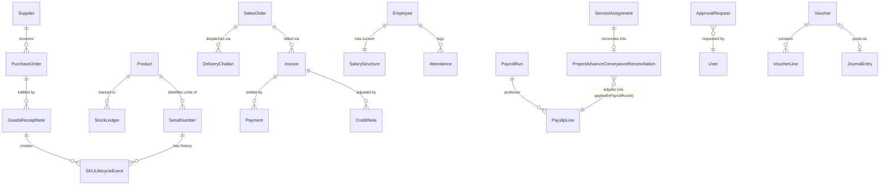

# Database Schema Specification

**Subject:** Brother's Technology System — Unified Business Management Platform
**Built from:** a full read + gap analysis of `database.md`, cross-checked against `dfd.md`, `prd.md` v2.4, `architecture.md` v3.3
**Scope:** 60 headings — this is `database.md`'s successor, not a parallel document. Where a heading below is already fully answered in `database.md`, this document says so and adds only what's missing, rather than restating it. Six domains `database.md` only listed by name now get their full schema (§26, 28, 30, 31, 32, 34) plus two domains it didn't cover at all (§39 System Configuration, §40 Integration).
**Date:** 7 September 2026

---

## 1. Database Schema Overview

One PostgreSQL 15+ database, one schema (`public`) — no per-module or per-tenant schema separation (see §4 for why). ~86 tables across 12 bounded contexts (`architecture.md` §39), all reachable through Prisma's single generated client. `database.md` §1's three rules (ledger is the one source of truth for money, nothing financial is hard-deleted, every table is branch-scoped where applicable) still govern everything below without exception.

## 2. Database Architecture

Single PostgreSQL instance (`architecture.md` §50's scaling plan: vertical first, read replica if Reporting becomes the bottleneck — unchanged, not re-litigated here). Prisma Client, generated from one `schema.prisma`, is the only path any application code takes to the database — no raw SQL from route handlers, no second ORM. Views (`database.md` §16) and the one DB trigger (`database.md` §7) are the only logic that lives in Postgres itself rather than in Prisma/application code, and both are deliberately minimal for exactly the reason `architecture.md` §40 keeps business logic in the Domain layer, not the database: portability and testability.

## 3. Database Technology & Configuration

| Setting | Value | Why |
|---|---|---|
| Engine | PostgreSQL 15 | Already fixed (`architecture.md` §3) |
| Connection pooling | PgBouncer, transaction mode, sized to (Express instance count × Prisma's default pool of 10) | Prisma's own pool alone doesn't protect Postgres from a burst of horizontally-scaled instances (`architecture.md` §50) each opening their own pool |
| `statement_timeout` | 30s for the API role, unset for the background-job role | A runaway API query shouldn't hang a user-facing request; a legitimate heavy report job (`architecture.md` §46) needs to be allowed to actually finish |
| `idle_in_transaction_session_timeout` | 15s | Kills an accidentally-abandoned open transaction before it becomes a lock-contention problem (§24) |
| Extensions enabled | `pgcrypto` (for any DB-side hashing, though passwords are hashed at the application layer per `architecture.md` §22 — this is a defense-in-depth availability, not a requirement to use it there) | Cheap to enable, no reason not to have it available |
| Character encoding | UTF-8, `Asia/Dhaka` as the connection default timezone | Bangla text throughout (`prd.md` §10.1); storing `timestamptz` and converting at read time (§16 below) — never storing naive local time |

## 4. Schema / Namespace Structure

Everything lives in the default `public` Postgres schema — **not** a schema-per-bounded-context (e.g., `sales.quotation`, `finance.journal_entry`). This is a deliberate call, not an oversight: Prisma's cross-schema relation support is workable but adds real friction (every `include`/`select` across a schema boundary needs extra config) for a Modular Monolith (`architecture.md` §2) where §41's dependency rules already keep contexts from reaching into each other inappropriately at the *code* layer — a second, database-schema-level wall on top of that mostly duplicates §41's protection while making every cross-context Prisma query more awkward. If this system ever splits a context into its own deployable service (`architecture.md` §50's explicitly-named non-goal), *that* is the point to also give it its own Postgres schema or database — not before.

## 5. Entity / Table List

Unchanged from `database.md` §2 — same ~80 tables, same grouping by bounded context. This document adds six tables `database.md` didn't name at all: `SystemSetting`, `FeatureFlag` (§39), and `PaymentGatewayTransaction`, `SmsLog`, `EmailLog`, `MapsGeocodeCache` (§40) — bringing the true count to **~86**.

## 6. Prisma Schema

`database.md` §3 already gives the complete, consolidated `schema.prisma` for Identity, Master Data (pattern), Sales/Quotation, Field Service, and Finance in full. §25–§40 below extend that same file with every domain it only listed by name — Inventory, Procurement, HR/Payroll, Loan/Investment, Customer/Supplier beyond `Customer` itself, Approval/Governance, Notification, Document, System Configuration, and Integration. Read together, `database.md` §3 + this document's §25–§40 *is* the full `schema.prisma` — not repeated as one block here to avoid a several-hundred-line duplicate of content already correct in `database.md`.

## 7. Entity Relationship Model

The *modeling philosophy*, as distinct from §8's concrete relationship list: every relationship in this schema is either (a) a direct FK for a genuine one-to-many or one-to-one, or (b) a line/detail table for anything that would otherwise be many-to-many (`database.md` §4 already established why — line tables carry context a bare join table can't). No polymorphic relationship exists except the one named, deliberate exception already flagged (`database.md` §5's `sourceType`/`sourceId` pattern) — this document does not introduce any new polymorphic association, including in the six domains it adds full schema for below.

## 8. Entity Relationships

`database.md` §4's table is the authoritative summary and is unchanged. §48 below (Relationship Matrix) is this document's more exhaustive version of the same information, covering the domains §4 didn't have schema for yet to reference.

## 9. Primary Keys

Not a separate heading in `database.md` — extracted and made explicit here since it was previously only a repeated pattern (`id String @id @default(cuid())` on every model in `database.md` §3) rather than a stated rule.

- **Every table uses a `cuid()` string primary key. No table anywhere in this schema uses a Postgres auto-increment integer (`serial`/`bigserial`) or a raw `uuid()`.** Reasons, in order of how often they'd actually bite: (1) a `cuid` is sortable-ish by creation time without leaking a dense sequential count the way `serial` does across a multi-branch system where row-count-by-branch could itself be sensitive business information; (2) it can be generated client-side before the row is even sent to the database, which several flows in this platform rely on (an idempotency key, `database.md` §11, is generated *before* the request is sent — a client-generatable primary key follows the same pattern for consistency); (3) merges cleanly across environments (`database.md` §18's demo data, §50 below's migrations) with zero collision risk, unlike a `serial` sequence that resets per-environment.
- **Line/detail tables (`QuotationLine`, `JournalLine`, `VoucherLine`) still get their own `cuid` primary key, not a composite `(parentId, lineNumber)` key** — a composite key would make reordering or inserting a line mid-sequence a primary-key-changing operation, which is exactly the kind of "future upgrade issue" this whole exercise is meant to avoid. A separate `lineNumber: Int` field (display order) exists where line order matters, decoupled from identity.

## 10. Foreign Keys & Referential Integrity

`database.md` §5 already states the `Restrict`/`Cascade`/`SetNull` rule and the polymorphic-association trade-off — unchanged. §25–§40 below apply that same rule to every new model without exception; none of them introduce a fourth `onDelete` behavior.

## 11. Unique Constraints

Consolidated list — previously scattered across `database.md` §3's individual models, gathered here as one reference:

| Table.Column(s) | Purpose |
|---|---|
| `User.email`, `Employee.employeeCode`, `Employee.nidNumber` | Login identity, HR identity, national identity — three different identities, three different uniqueness scopes |
| `Branch.code`, `Customer.customerCode`, `Customer.phone` | Business-key uniqueness |
| `Quotation.quotationNumber`, `ServiceAssignment.assignmentNumber`, `JournalEntry.journalNumber` | Document numbering — always branch/year/sequence formatted, never reused even after a document is cancelled |
| `JournalEntry.idempotencyKey`, `JournalEntry.reversalOfId` | Financial-integrity uniqueness (`database.md` §11) |
| `ProjectClosureReport.assignmentId`, `Quotation.supersedesId`, `Ticket.serviceQuotationId`(via `Quotation.ticketId`) | One-to-one relationship enforcement — the DB physically cannot hold a second row where only one should exist |
| `RolePermission.(roleId, permissionId)` (composite) | Join-table uniqueness — the same permission can't be granted to the same role twice |

## 12. Check Constraints

Consolidated from `database.md` §7, plus new ones surfaced by writing out the remaining domains (§25–§40):

- `journal_line_single_sided` — exactly one of debit/credit is non-zero (`database.md` §3, §7).
- `quantity >= 0` on every non-adjustment quantity column.
- `validUntil > createdAt` on `Quotation`.
- **New, from Payroll (§30):** `PayslipLine.netPay = grossPay - deductions + reconciliationAdjustment` is *not* a `CHECK` constraint — it's a generated/computed value at the application layer, deliberately, because a `CHECK` constraint recomputing this on every row would need to reference sibling logic a plain `CHECK` can't express cleanly; a mismatch is instead caught by a unit test on the payroll calculation function (`architecture.md` §40's Domain layer), which is the right layer for this specific rule.
- **New, from Procurement/Inventory (§26, §28):** `StockLedger.quantityOnHand >= 0` — this is the one place this document's general "quantity >= 0" rule has a real, named tension: `requirements.md`'s Edge Case Analysis already flagged that backorder/negative-stock handling is an open business question. Until that's resolved, the `CHECK` constraint stays in place and a backorder is modeled as a separate, explicit `BackorderLine` state rather than a negative on-hand quantity — this document does not silently resolve that open question by picking a schema that assumes an answer.

## 13. Default Values

| Pattern | Default | Applies to |
|---|---|---|
| `status`-type enum fields | The first, "nothing has happened yet" state (`DRAFT`, `OPEN`, `ASSIGNED`) | Every workflow-driving enum |
| `isActive` | `true` | Master data and Identity tables |
| `isServiceOnly`, `mfaEnabled`, other feature-flag-shaped booleans | `false` | Opt-in behaviors |
| `version` (optimistic lock, `database.md` §10) | `0` | The four tables that use it |
| `debit`/`credit` on `JournalLine` | `0` | So a line can be created and then have exactly one side set, matching §12's `CHECK` |
| Every `createdAt` | `now()` | Universal |
| Every `id` | `cuid()` | Universal (§9) |

**Rule for anything not in this table:** no column gets an implicit default just to avoid a migration prompt — a genuinely required field with no sensible default is required, full stop, and its absence in existing data is handled the additive-migration way `database.md` §19 already describes, not papered over with an arbitrary default that then has to be explained forever.

## 14. Enum Definitions

Unchanged from `database.md` §8, including its flagged recommendation (model `TicketType`/`VoucherType`/`ApprovalType` as `String + CHECK` instead of native Postgres enums) — not re-litigated. §29's `NotificationChannel` and §31's `ApprovalRequest`-adjacent enums (below) follow the same native-enum-vs-CHECK judgment call already established there.

## 15. Common / Base Fields

Not a separate heading in `database.md` — the pattern was implicit across every model shown. Made explicit here as the actual convention every one of §25–§40's new models below follows without restating it per-model:

```prisma
// Every table in this schema has these unless explicitly noted otherwise:
id        String   @id @default(cuid())     // §9
createdAt DateTime @default(now())
updatedAt DateTime @updatedAt

// Every BRANCH-SCOPED table additionally has:
branchId  String
branch    Branch @relation(fields: [branchId], references: [id], onDelete: Restrict)

// Every table with a human-facing document/business-key additionally has:
<x>Number String @unique   // §24's naming convention, database.md
```

## 16. Audit Fields

Unchanged from `database.md` §12 (`AuditLog`, capturing full before/after JSON, no `onDelete` relation). One addition: **every table this document adds full schema for below (§25–§40) is in `AuditLog`'s scope** — `entityType` covers all of them, since `AuditLog` was already designed (§12, `database.md`) to be schema-agnostic per entity rather than needing a new column or table per domain.

---

## 17. Soft Delete & Record Lifecycle

Unchanged from `database.md` §13 (`deletedAt` on master/identity data only; financial/inventory/loan/advance tables never deleted at all; `isActive` and `deletedAt` deliberately kept as two different meanings). Record lifecycle *beyond* delete — the actual state machines (`DRAFT→...→CLOSED`-shaped enums) — are documented per-domain in §25–§40, since a generic "lifecycle" section divorced from its specific states would just repeat each domain's own status enum.

## 18. Multi-Tenant & Branch Scoping

Unchanged from `database.md` §14 (RLS as a second, independent enforcement layer under the existing application-level check; `tenantId` ready but inactive pending the still-open business decision, `prd.md` §14). `database.md` §14's example policy covers branch-level scoping only — **a security audit of this document set found that no RLS policy pattern had been shown for the narrower "own records only" scope** `prd.md` §6.1 assigns to Technician (own assignments) and Sales Executive (own quotations), leaving those two roles' data protected by the application layer alone rather than the same defense-in-depth every branch-scoped table gets. Fixed here:

```sql
-- Own-record scope, layered on top of (not instead of) the branch policy already shown:
ALTER TABLE "ServiceAssignment" ENABLE ROW LEVEL SECURITY;   -- already enabled per database.md §14; shown again for context
CREATE POLICY own_record_scope ON "ServiceAssignment"
  USING (
    current_setting('app.current_role')::text NOT IN ('TECHNICIAN')
    OR id IN (
      SELECT "assignmentId" FROM "TechnicianAssignment"
      WHERE "employeeId" = current_setting('app.current_employee_id')::text
    )
  );
-- Combined with database.md §14's branch_scope policy, Postgres AND-combines multiple permissive policies on the
-- same table by default only within the same policy "for" clause and role — two separate CREATE POLICY statements
-- like branch_scope and own_record_scope are OR-combined unless declared restrictive. Both must therefore be
-- declared AS RESTRICTIVE so a Technician needs to satisfy both (their branch AND their own record), not either:
ALTER POLICY branch_scope ON "ServiceAssignment" TO PUBLIC USING (...);  -- mark existing policy RESTRICTIVE at creation, not altered after the fact
```
`app.current_role` and `app.current_employee_id` are set alongside `app.current_branch_id`/`app.is_super_admin` (`database.md` §14) at the same point in the request lifecycle — one Application-layer call sets all four session variables together, never some without others. The same `own_record_scope` pattern applies to `Quotation` for Sales Executive (`salesExecutiveId` instead of the `TechnicianAssignment` join) — one pattern, two tables, not two different designs.

## 19. Department / Project / Cost Center Scoping

Not previously its own heading — `database.md` §3 already showed `departmentId`/`projectId` as optional columns on `JournalLine`, but the *scoping rule* (as distinct from branch scoping, §18) wasn't stated. Making it explicit:

- **`departmentId` is informational tagging, not access-scoping.** Unlike `branchId` (§18, RLS-enforced — a Branch Manager cannot query another branch's rows at all), a Department is a reporting dimension only — Accounts/Finance can see every department's figures, per `prd.md` §6.1's permission matrix already giving that role full Finance access. No RLS policy exists for `departmentId`, and none should — adding one would silently contradict the already-agreed permission matrix.
- **`projectId` (a `ServiceAssignment.id` in practice) is the platform's real cost-center concept** — `prd.md` §2's headline "project-wise P&L" requirement is entirely this column. It's nullable on `JournalLine` (§6, `database.md`) because not every transaction is project-linked (a routine office expense has no project), and that nullability is intentional, not a gap.
- No separate `CostCenter` table exists — `Branch`, `Department`, and `ServiceAssignment` (as project) together already cover every cost-center dimension `prd.md` §8.10's reporting requirements name. Adding a fourth, generic cost-center concept on top would be exactly the kind of speculative complexity §1's "extensibility over premature restriction" principle argues against — nothing in `prd.md`/`architecture.md` asks for a cost center that isn't already one of these three.

## 20. Database Indexes

Unchanged philosophy from `database.md` §6 (branch+status pairs, FK columns, scan-target date columns, the one named `projectId` exception). §25–§40 apply the identical four rules to every new model without restating the reasoning per-domain.

## 21. Composite Indexes

Not previously broken out from §20 as its own heading. The composite (multi-column) indexes specifically, and why each is composite rather than two single-column indexes:

| Index | Table | Why composite, not two separate indexes |
|---|---|---|
| `(branchId, status)` | Every operational table | The actual query is always both together ("this branch's open items") — Postgres can use a composite index for this in one lookup; two single-column indexes would force a slower bitmap-AND for the same query |
| `(entityType, entityId)` | `AuditLog` | Always queried together — "this entity's history" is meaningless with only one half |
| `(roleId, permissionId)` | `RolePermission` | This *is* the primary key (§9's exception, join tables) — composite by necessity, not just performance |
| `(recipientId, createdAt)` | `Notification` (§34) | "This user's notifications, newest first" — the sort column belongs in the index so Postgres can satisfy `ORDER BY` without a separate sort step |
| `(actorId, createdAt)` | `AuditLog` | Same reasoning as above, for "this user's action history" |

## 22. Query & Performance Strategy

- **N+1 avoidance:** every list endpoint (`architecture.md` §43) that renders related data (a Quotation list showing customer name) uses Prisma's `include`, never a per-row follow-up query — enforced by code review, not the database, but named here since it's the single most common way a schema that's fine on paper performs badly in practice.
- **Cursor pagination (`architecture.md` §43) over offset pagination everywhere** — restated here because it's a schema-level decision too: cursor pagination needs a stable, indexed sort column (`createdAt` + `id` as a tiebreaker), which is why every table's `createdAt` is a real column rather than derived, and why `id` being a sortable-ish `cuid` (§9) rather than a random `uuid` isn't purely cosmetic.
- **Heavy aggregation goes to a background job or a materialized view (`database.md` §15–§16), never a synchronous query on the request path** — restated as the query-strategy rule this schema is actually built to support, not just a reporting-section aside.
- **The `Ledger` view (`database.md` §16) is never queried unfiltered** — always `WHERE branchId = ... AND fiscalPeriodId = ...` at minimum; an unfiltered scan of that view degrades linearly with the platform's entire transaction history and there's no legitimate report that needs it unfiltered.

## 23. Database Transaction Rules

Unchanged from `database.md` §9 (`READ COMMITTED` default, `SERIALIZABLE` for period closing only, short-held transactions). Applies identically to every domain added below.

## 24. Concurrency & Locking Rules

Unchanged from `database.md` §10 (optimistic lock on 4 named tables, pessimistic row lock at stock decrement only, append-only `JournalLine` needing no lock, BullMQ jobs never holding a transaction across a queue round-trip). One addition, surfaced by writing out Payroll's full schema (§30): **`PayrollRun` processing gets the same pessimistic-lock treatment as stock decrement, for the same reason** — two HR/Payroll Officers should not be able to start processing the same `PayrollRun` concurrently, and unlike most of this platform's writes, a payroll run is a long-ish batch operation where an optimistic-lock retry would be disruptive rather than cheap. `SELECT ... FOR UPDATE` on the `PayrollRun` row itself, held only for the duration of the status transition to `PROCESSING`, not the whole run.

---

## 25. Accounting / Financial Data Model

`ChartOfAccounts`, `JournalEntry`, `JournalLine` are fully specified in `database.md` §3 — unchanged. What that document didn't expand: `Voucher`/`VoucherLine`, `SuspenseEntry`, `ChequeRegisterEntry`, `BankTransactionProof`.

```prisma
enum VoucherType   { CASH_RECEIPT CASH_PAYMENT BANK_RECEIPT BANK_PAYMENT JOURNAL CONTRA SALES PURCHASE SALES_RETURN PURCHASE_RETURN EXPENSE ADJUSTMENT }
enum VoucherStatus { DRAFT POSTED REVERSED }

model Voucher {
  id            String        @id @default(cuid())
  voucherNumber String        @unique          // sequential per voucherType, never reused
  voucherType   VoucherType
  status        VoucherStatus @default(DRAFT)
  branchId      String
  journalEntryId String?      @unique          // set once posted — links to the JournalEntry it produced
  reversalOfId  String?       @unique
  createdById   String
  createdAt     DateTime      @default(now())

  branch        Branch        @relation(fields: [branchId], references: [id], onDelete: Restrict)
  lines         VoucherLine[]
  journalEntry  JournalEntry? @relation(fields: [journalEntryId], references: [id], onDelete: Restrict)

  @@index([branchId, voucherType, status])
}

model VoucherLine {
  id        String  @id @default(cuid())
  voucherId String
  accountId String
  debit     Decimal @db.Decimal(14, 2) @default(0)
  credit    Decimal @db.Decimal(14, 2) @default(0)
  narration String?

  voucher   Voucher         @relation(fields: [voucherId], references: [id], onDelete: Cascade)
  account   ChartOfAccounts @relation(fields: [accountId], references: [id], onDelete: Restrict)

  @@index([voucherId])
  @@check(constraint: "debit >= 0 AND credit >= 0 AND NOT (debit > 0 AND credit > 0)", name: "voucher_line_single_sided")
}

model SuspenseEntry {
  id          String   @id @default(cuid())
  branchId    String
  amount      Decimal  @db.Decimal(14, 2)
  reason      String
  agingDays   Int      @default(0)             // recalculated by a scheduled job (architecture.md §46), not stored-and-forgotten
  resolvedAt  DateTime?
  resolvedToAccountId String?
  createdAt   DateTime @default(now())

  branch      Branch @relation(fields: [branchId], references: [id], onDelete: Restrict)
  @@index([branchId, resolvedAt])   // "unresolved suspense items" is WHERE resolvedAt IS NULL — index supports the filter either way
}

model ChequeRegisterEntry {
  id            String   @id @default(cuid())
  chequeNumber  String
  bankProofId   String   @unique
  amount        Decimal  @db.Decimal(14, 2)
  status        String   // PENDING_CLEARANCE | CLEARED | BOUNCED — String+CHECK per §14's enum-volatility rule (bank-specific bounce reasons are a plausible future addition)
  bouncedAt     DateTime?
  reversalJournalEntryId String? @unique        // set only if status = BOUNCED

  bankProof     BankTransactionProof @relation(fields: [bankProofId], references: [id], onDelete: Restrict)
  @@index([status])
}

model BankTransactionProof {
  id                  String   @id @default(cuid())
  sourceModule        String                     // same polymorphic pattern as JournalEntry.sourceModule (§10)
  sourceId            String
  accountNumberMasked String                     // last 4 digits only (prd.md §8.20) — full number never stored, anywhere, ever
  proofFileId         String
  uploadedById         String
  uploadedAt          DateTime @default(now())

  chequeRegisterEntry ChequeRegisterEntry?
  @@index([sourceModule, sourceId])
}
```

## 26. Inventory Data Model

Not previously given full schema — `database.md` listed these six tables by name only.

```prisma
enum SKULifecycleStage { RECEIVED IN_STOCK RESERVED SOLD ISSUED_TO_TECHNICIAN INSTALLED RETURNED_TO_SUPPLIER RETURNED_BY_CUSTOMER RETIRED_WARRANTY DAMAGED_WRITTEN_OFF }

model StockLedger {
  id             String   @id @default(cuid())
  productId      String
  warehouseId    String
  quantityOnHand Decimal  @db.Decimal(12, 2) @default(0)
  updatedAt      DateTime @updatedAt

  product        Product   @relation(fields: [productId], references: [id], onDelete: Restrict)
  warehouse      Warehouse @relation(fields: [warehouseId], references: [id], onDelete: Restrict)

  @@unique([productId, warehouseId])   // exactly one running-balance row per product-per-warehouse — never a history table (that's SKULifecycleEvent's job)
  @@check(constraint: "\"quantityOnHand\" >= 0", name: "stock_non_negative")   // §12's named open question
}

model StockAdjustment {
  id            String   @id @default(cuid())
  productId     String
  warehouseId   String
  quantityDelta Decimal  @db.Decimal(12, 2)       // signed — the one deliberate exception to "quantity >= 0" (§12)
  reason        String
  approvalStatus ApprovalStatus @default(PENDING)
  createdById   String
  createdAt     DateTime @default(now())

  product       Product   @relation(fields: [productId], references: [id], onDelete: Restrict)
  warehouse     Warehouse @relation(fields: [warehouseId], references: [id], onDelete: Restrict)

  @@index([warehouseId, approvalStatus])
}

model StockTransfer {
  id             String   @id @default(cuid())
  productId      String
  quantity       Decimal  @db.Decimal(12, 2)
  fromWarehouseId String
  toWarehouseId   String
  status         String   // DISPATCHED | IN_TRANSIT | RECEIVED | DISCREPANT (prd.md §9.8) — String+CHECK, workflow states unlikely to grow but kept consistent
  dispatchedAt   DateTime @default(now())
  receivedAt     DateTime?

  product        Product @relation(fields: [productId], references: [id], onDelete: Restrict)

  @@index([fromWarehouseId, status])
  @@index([toWarehouseId, status])
}

model Batch {
  id         String    @id @default(cuid())
  productId  String
  batchCode  String
  expiryDate DateTime?

  product    Product @relation(fields: [productId], references: [id], onDelete: Restrict)
  @@unique([productId, batchCode])
}

model SerialNumber {
  id          String            @id @default(cuid())
  productId   String
  serial      String            @unique
  currentStage SKULifecycleStage @default(RECEIVED)

  product     Product            @relation(fields: [productId], references: [id], onDelete: Restrict)
  events      SKULifecycleEvent[]
  @@index([currentStage])
}

model SKULifecycleEvent {
  id             String            @id @default(cuid())
  serialNumberId String
  eventType      SKULifecycleStage
  sourceModule   String                          // which context caused this transition — same polymorphic pattern, §10
  sourceId       String
  occurredAt     DateTime          @default(now())

  serialNumber   SerialNumber @relation(fields: [serialNumberId], references: [id], onDelete: Restrict)
  @@index([serialNumberId, occurredAt])          // "this unit's full history, in order" — the platform's stated full-traceability requirement (prd.md §2), directly
}
```

**Module 74 — Warehouse Damage & Loss (`DamageLossReport`/`DamageLossLine`):** full schema already given in `architecture.md` §58.2, not repeated here — same field list, same `no_self_approval`-pattern `CHECK` constraint (§33 below), same posting-on-approval-not-on-report rule as §9/§11's Financial Posting Integrity above. The only addition this document makes beyond `architecture.md` §58.2: `DamageLossLine.costBasis` gets the same `numeric(14,2)` precision and non-negative `CHECK` as every other money column in this schema (§12), and both tables get the standard `(branchId, status)`/FK indexes per §6/§20's general rule — `architecture.md` §58.2 already shows both, included there rather than duplicated here.

## 27. Sales & Quotation Data Model

`Quotation`/`QuotationLine` fully specified in `database.md` §3. Completing the chain:

```prisma
model SalesOrder {
  id            String   @id @default(cuid())
  orderNumber   String   @unique
  quotationId   String?  @unique               // null if the order didn't originate from a Quotation (rare, but not forced through one)
  customerId    String
  branchId      String
  grandTotal    Decimal  @db.Decimal(14, 2)
  createdAt     DateTime @default(now())

  quotation     Quotation? @relation(fields: [quotationId], references: [id], onDelete: SetNull)
  customer      Customer   @relation(fields: [customerId], references: [id], onDelete: Restrict)
  branch        Branch     @relation(fields: [branchId], references: [id], onDelete: Restrict)
  challans      DeliveryChallan[]
  invoices      Invoice[]

  @@index([branchId, customerId])
}

model DeliveryChallan {
  id            String   @id @default(cuid())
  challanNumber String   @unique
  salesOrderId  String
  invoiceId     String?
  billingStatus String   @default("UNBILLED") // UNBILLED | BILLED (consolidated billing)
  dispatchedAt  DateTime @default(now())

  salesOrder    SalesOrder @relation(fields: [salesOrderId], references: [id], onDelete: Restrict)
  invoice       Invoice?   @relation(fields: [invoiceId], references: [id], onDelete: SetNull)

  @@index([salesOrderId])
  @@index([invoiceId])
  @@index([billingStatus])
}

model Invoice {
  id            String   @id @default(cuid())
  invoiceNumber String   @unique
  sourceType    String   // SALES_ORDER | SERVICE_ASSIGNMENT (Module 72, prd.md §8.28) — polymorphic, §10's pattern
  sourceId      String
  customerId    String
  branchId      String
  grandTotal    Decimal  @db.Decimal(14, 2)
  status        String   // DRAFT | POSTED | CANCELLED
  idempotencyKey String  @unique                // same protection as JournalEntry (§11) — an Invoice is a financial document
  createdAt     DateTime @default(now())

  customer      Customer          @relation(fields: [customerId], references: [id], onDelete: Restrict)
  branch        Branch            @relation(fields: [branchId], references: [id], onDelete: Restrict)
  challans      DeliveryChallan[] // Consolidated delivery challans covered by this invoice
  payments      Payment[]
  creditNotes   CreditNote[]

  @@index([sourceType, sourceId])
  @@index([branchId, customerId, status])
}

model Payment {
  id          String   @id @default(cuid())
  invoiceId   String
  amount      Decimal  @db.Decimal(14, 2)
  method      String   // CASH | BANK | SSLCOMMERZ | CHEQUE
  gatewayTransactionId String?  @unique          // set for SSLCOMMERZ, links to PaymentGatewayTransaction (§40)
  receivedAt  DateTime @default(now())

  invoice     Invoice @relation(fields: [invoiceId], references: [id], onDelete: Restrict)
  @@index([invoiceId])
}

model CreditNote {
  id           String   @id @default(cuid())
  creditNoteNumber String @unique
  invoiceId    String
  amount       Decimal  @db.Decimal(14, 2)
  reason       String
  createdAt    DateTime @default(now())

  invoice      Invoice @relation(fields: [invoiceId], references: [id], onDelete: Restrict)
  @@index([invoiceId])
}
```

**Module 73 — Delivery Challan Return (`DeliveryChallanLine`/`DeliveryChallanReturn`/`DeliveryChallanReturnLine`):** full schema in `architecture.md` §58.1, not repeated here. Two additions from this document's own rules, not shown there: the `return_line_positive_quantity` `CHECK` constraint (§12's pattern, applied here) prevents a zero/negative-quantity return line from ever being recorded; and `DeliveryChallanReturn.returnNumber` follows §24's business-key-number convention (`RET-<branch>-<year>-<seq>`) exactly like every other document number in this schema, so it wasn't worth restating as a new rule — it's the existing rule, applied.

**A concrete answer to the Sales Order line-quantity question `architecture.md` §58.1 left as "computed, not stored":** the actual view —

```sql
CREATE VIEW sales_order_line_fulfillment WITH (security_invoker = true) AS
  SELECT sol.id AS sales_order_line_id, sol.quantity AS ordered,
         COALESCE(SUM(dcl.quantity), 0) AS challaned,
         COALESCE(SUM(dcrl.quantity), 0) AS returned,
         COALESCE(SUM(dcl.quantity), 0) - COALESCE(SUM(dcrl.quantity), 0) AS net_delivered,
         sol.quantity - (COALESCE(SUM(dcl.quantity), 0) - COALESCE(SUM(dcrl.quantity), 0)) AS remaining
  FROM "SalesOrderLine" sol
  LEFT JOIN "DeliveryChallanLine" dcl ON dcl."salesOrderLineId" = sol.id
  LEFT JOIN "DeliveryChallanReturnLine" dcrl ON dcrl."challanLineId" = dcl.id
  GROUP BY sol.id, sol.quantity;
```
(`SalesOrderLine.salesOrderLineId` on `DeliveryChallanLine` is the one field `architecture.md` §58.1's Prisma block didn't spell out — added here since the view above needs it to join correctly; a straightforward FK, same `Restrict` pattern as every other line-to-parent reference in §5.)

## 28. Procurement Data Model

Not previously given full schema.

```prisma
model PurchaseRequest {
  id            String   @id @default(cuid())
  requestNumber String   @unique
  branchId      String
  requestedById String
  status        ApprovalStatus @default(PENDING)
  createdAt     DateTime @default(now())

  branch        Branch @relation(fields: [branchId], references: [id], onDelete: Restrict)
  purchaseOrder PurchaseOrder?
  @@index([branchId, status])
}

model PurchaseOrder {
  id             String   @id @default(cuid())
  poNumber       String   @unique
  purchaseRequestId String? @unique
  supplierId     String
  branchId       String
  grandTotal     Decimal  @db.Decimal(14, 2)
  createdAt      DateTime @default(now())

  purchaseRequest PurchaseRequest? @relation(fields: [purchaseRequestId], references: [id], onDelete: SetNull)
  supplier        Supplier         @relation(fields: [supplierId], references: [id], onDelete: Restrict)
  branch          Branch           @relation(fields: [branchId], references: [id], onDelete: Restrict)
  grns            GoodsReceiptNote[]

  @@index([branchId, supplierId])
}

model GoodsReceiptNote {
  id              String   @id @default(cuid())
  grnNumber       String   @unique
  purchaseOrderId String
  status          String   // COMPLETE | PARTIAL | DISCREPANT (prd.md §9.9)
  receivedAt      DateTime @default(now())

  purchaseOrder   PurchaseOrder @relation(fields: [purchaseOrderId], references: [id], onDelete: Restrict)
  @@index([purchaseOrderId, status])
}

model PurchaseInvoice {
  id            String   @id @default(cuid())
  invoiceNumber String   @unique
  purchaseOrderId String
  grandTotal    Decimal  @db.Decimal(14, 2)
  idempotencyKey String  @unique
  createdAt     DateTime @default(now())

  purchaseOrder PurchaseOrder @relation(fields: [purchaseOrderId], references: [id], onDelete: Restrict)
  payments      SupplierPayment[]
  @@index([purchaseOrderId])
}

model SupplierPayment {
  id                String   @id @default(cuid())
  purchaseInvoiceId String
  amount            Decimal  @db.Decimal(14, 2)
  method            String
  paidAt            DateTime @default(now())

  purchaseInvoice   PurchaseInvoice @relation(fields: [purchaseInvoiceId], references: [id], onDelete: Restrict)
  @@index([purchaseInvoiceId])
}

model PurchaseReturn {
  id            String   @id @default(cuid())
  grnId         String
  quantity      Decimal  @db.Decimal(12, 2)
  reason        String
  approvalStatus ApprovalStatus @default(PENDING)
  createdAt     DateTime @default(now())

  @@index([grnId])
}
```

---

## 29. Service & Technician Data Model

Fully specified in `database.md` §3 (`ServiceAssignment` through `ProjectClosureReport`) — unchanged. `LiveLocationLog`, named but not fully shown there:

```prisma
model LiveLocationLog {
  id           String   @id @default(cuid())
  employeeId   String
  assignmentId String?
  latitude     Decimal  @db.Decimal(9, 6)
  longitude    Decimal  @db.Decimal(9, 6)
  recordedAt   DateTime @default(now())

  employee     Employee @relation(fields: [employeeId], references: [id], onDelete: Restrict)
  @@index([employeeId, recordedAt])
}
```
**Retention for this table is still an open policy question** (`dfd.md` §16, `database.md` §21) — schema is final, retention period is not; nothing about the schema itself blocks whatever period gets decided.

## 30. HR & Payroll Data Model

Not previously given full schema.

```prisma
enum PayrollRunStatus     { DRAFT PROCESSING FINALIZED PAID }
enum ReconciliationOutcome { SHORTFALL_DEDUCT EXCESS_REIMBURSE BALANCED }

model Attendance {
  id         String   @id @default(cuid())
  employeeId String
  date       DateTime @db.Date
  checkIn    DateTime?
  checkOut   DateTime?
  status     String   // PRESENT | ABSENT | HALF_DAY | ON_LEAVE

  employee   Employee @relation(fields: [employeeId], references: [id], onDelete: Restrict)
  @@unique([employeeId, date])
  @@index([employeeId, date])
}

model LeaveRequest {
  id          String   @id @default(cuid())
  employeeId  String
  startDate   DateTime @db.Date
  endDate     DateTime @db.Date
  approvalStatus ApprovalStatus @default(PENDING)
  createdAt   DateTime @default(now())

  employee    Employee @relation(fields: [employeeId], references: [id], onDelete: Restrict)
  @@index([employeeId, approvalStatus])
}

model Timesheet {
  id         String   @id @default(cuid())
  employeeId String
  assignmentId String?                        // links field hours to a project (§19's cost-center concept, in practice)
  date       DateTime @db.Date
  hours      Decimal  @db.Decimal(4, 2)

  employee   Employee @relation(fields: [employeeId], references: [id], onDelete: Restrict)
  @@index([employeeId, date])
}

model KPI {
  id         String   @id @default(cuid())
  employeeId String
  metric     String
  value      Decimal  @db.Decimal(10, 2)
  periodStart DateTime @db.Date
  periodEnd   DateTime @db.Date

  employee   Employee @relation(fields: [employeeId], references: [id], onDelete: Restrict)
  @@index([employeeId, periodStart])
}

model SalaryStructure {
  id           String   @id @default(cuid())
  employeeId   String   @unique                // one active structure per employee; a change creates a new row, old one gets an effectiveTo (below) — never overwritten
  basicSalary  Decimal  @db.Decimal(14, 2)
  allowances   Json                             // flexible — allowance types vary enough that a fixed column set would need frequent migrations (§1's philosophy)
  effectiveFrom DateTime @db.Date
  effectiveTo   DateTime? @db.Date

  employee     Employee @relation(fields: [employeeId], references: [id], onDelete: Restrict)
  @@index([employeeId, effectiveFrom])
}

model AttendanceSalaryRule {
  id          String  @id @default(cuid())
  ruleName    String
  deductionPerAbsentDay Decimal @db.Decimal(14, 2)
  isActive    Boolean @default(true)
}

model PayrollRun {
  id          String            @id @default(cuid())
  runNumber   String            @unique
  branchId    String
  periodStart DateTime          @db.Date
  periodEnd   DateTime          @db.Date
  status      PayrollRunStatus  @default(DRAFT)
  version     Int               @default(0)      // pessimistic-lock-adjacent (§24) — version bump on the DRAFT→PROCESSING transition specifically

  branch      Branch @relation(fields: [branchId], references: [id], onDelete: Restrict)
  payslips    PayslipLine[]
  @@index([branchId, status])
}

model PayslipLine {
  id           String   @id @default(cuid())
  payrollRunId String
  employeeId   String
  grossPay     Decimal  @db.Decimal(14, 2)
  deductions   Decimal  @db.Decimal(14, 2)
  reconciliationAdjustment Decimal @db.Decimal(14, 2) @default(0)   // from ProjectAdvanceConveyanceReconciliation, signed
  netPay       Decimal  @db.Decimal(14, 2)         // computed at the Application layer (§12), not a generated column

  payrollRun   PayrollRun @relation(fields: [payrollRunId], references: [id], onDelete: Restrict)
  employee     Employee   @relation(fields: [employeeId], references: [id], onDelete: Restrict)
  @@unique([payrollRunId, employeeId])
  @@index([employeeId])
}

model ProjectAdvanceConveyanceReconciliation {
  id             String                @id @default(cuid())
  assignmentId   String                @unique
  advanceIssued  Decimal               @db.Decimal(14, 2)
  approvedSpend  Decimal               @db.Decimal(14, 2)
  outcome        ReconciliationOutcome
  appliedInPayrollRunId String?
  computedAt     DateTime              @default(now())

  @@index([outcome, appliedInPayrollRunId])   // "unapplied reconciliations" = WHERE appliedInPayrollRunId IS NULL
}
```

## 31. Loan & Investment Data Model

Not previously given full schema.

```prisma
enum LoanStatus { ACTIVE CLOSED DEFAULTED }

model CompanyLoan {
  id           String     @id @default(cuid())
  lenderName   String
  principal    Decimal    @db.Decimal(14, 2)
  interestBearing Boolean                        // architecture.md §0 says false; still an open contradiction, see database.md's own note on this — schema supports either answer
  status       LoanStatus @default(ACTIVE)
  disbursedAt  DateTime   @default(now())

  repaymentSchedule LoanRepaymentSchedule[]
  @@index([status])
}

model LoanRepaymentSchedule {
  id           String   @id @default(cuid())
  companyLoanId String
  dueDate      DateTime @db.Date
  amountDue    Decimal  @db.Decimal(14, 2)
  paidAt       DateTime?

  companyLoan  CompanyLoan @relation(fields: [companyLoanId], references: [id], onDelete: Restrict)
  @@index([companyLoanId, dueDate])
}

model Investment {
  id           String   @id @default(cuid())
  investorName String
  amount       Decimal  @db.Decimal(14, 2)
  investedAt   DateTime @default(now())
  withdrawnAt  DateTime?
  calculationNote String?                        // "custom/flexible" per prd.md's confirmed decision — free text, not a rigid formula field

  @@index([investedAt])
}

model EmployeeAdvance {
  id           String   @id @default(cuid())
  employeeId   String
  amount       Decimal  @db.Decimal(14, 2)
  interestBearing Boolean @default(false)         // resolved: interest-free (prd.md §14) — this is the one table where the resolved value IS the default
  issuedAt     DateTime @default(now())

  employee     Employee @relation(fields: [employeeId], references: [id], onDelete: Restrict)
  installments EmployeeLoanInstallment[]
  @@index([employeeId])
}

model EmployeeLoanInstallment {
  id                String   @id @default(cuid())
  employeeAdvanceId String
  amount            Decimal  @db.Decimal(14, 2)
  deductedInPayrollRunId String?
  dueDate           DateTime @db.Date

  employeeAdvance   EmployeeAdvance @relation(fields: [employeeAdvanceId], references: [id], onDelete: Restrict)
  @@index([employeeAdvanceId, dueDate])
}
```

## 32. Customer & Supplier Data Model

`Customer`/`CustomerAddress` fully specified in `database.md` §3. Completing the Supplier side:

```prisma
model Supplier {
  id           String   @id @default(cuid())
  supplierCode String   @unique
  companyName  String
  isActive     Boolean  @default(true)
  createdAt    DateTime @default(now())

  contacts     SupplierContact[]
  purchaseOrders PurchaseOrder[]
  @@index([isActive])
}

model SupplierContact {
  id         String @id @default(cuid())
  supplierId String
  name       String
  phone      String
  isPrimary  Boolean @default(false)

  supplier   Supplier @relation(fields: [supplierId], references: [id], onDelete: Cascade)  // a contact has no meaning without its supplier
  @@index([supplierId])
}
```

---

## 33. Approval & Governance Data Model

Not previously given full schema — the platform's shared-kernel Approval Engine (`architecture.md` §41, `dfd.md` §4.7).

```prisma
enum ApprovalType   { EDIT_REQUEST DELETE_REQUEST CONVEYANCE_BILL STOCK_ADJUSTMENT PURCHASE_REQUEST LEAVE_REQUEST EXPENSE }

model ApprovalRequest {
  id             String         @id @default(cuid())
  approvalType   ApprovalType
  entityType     String                            // polymorphic target, §10's pattern
  entityId       String
  requestedById  String
  approvedById   String?
  status         ApprovalStatus @default(PENDING)
  reason         String
  beforeJson     Json?
  afterJson      Json?
  createdAt      DateTime       @default(now())
  resolvedAt     DateTime?

  requestedBy    User  @relation("Requester", fields: [requestedById], references: [id], onDelete: Restrict)
  approvedBy     User? @relation("Approver", fields: [approvedById], references: [id], onDelete: Restrict)

  @@index([entityType, entityId])
  @@index([status, approvalType])
  @@check(constraint: "\"requestedById\" != \"approvedById\"", name: "no_self_approval")
}
```
**The `no_self_approval` check constraint is the direct database-level enforcement of `prd.md` §9.6's rule** — the same rule already implemented at the Application layer (`architecture.md` §57.2's domain guard). Having it at both layers is deliberate, matching this document's §18 defense-in-depth philosophy for RLS: a future code change that accidentally lets a self-approval slip past the Application layer still can't write the row.

`RecordChangeRequest` (`architecture.md` §7.21) is the same shape as `ApprovalRequest` filtered to `approvalType IN (EDIT_REQUEST, DELETE_REQUEST)` — this document does not model it as a second table, since that would be exactly the kind of duplicate-machinery this whole exercise is meant to catch (the brief for `database.md` first, and implicitly still in force here). Where `architecture.md` §7.21 names it separately, that's a naming/documentation distinction, not a second physical table.

## 34. Notification & Communication Data Model

```prisma
enum NotificationChannel { IN_APP EMAIL SMS }

model Notification {
  id          String              @id @default(cuid())
  recipientId String
  channel     NotificationChannel
  templateKey String                              // e.g. "approval.pending", "payslip.ready" — catalog per prd.md §10.6
  payload     Json
  sentAt      DateTime?
  readAt      DateTime?
  createdAt   DateTime            @default(now())

  recipient   User @relation(fields: [recipientId], references: [id], onDelete: Cascade)   // notifications have no meaning once the recipient account is gone

  @@index([recipientId, createdAt])   // §21's composite index
}
```
Retention: 180 days then purged (`database.md` §21) — unchanged.

## 35. Document & Attachment Data Model

```prisma
model Document {
  id           String   @id @default(cuid())
  entityType   String                             // polymorphic owner, §10's pattern — a receipt, a signature file, an NID scan, an export output
  entityId     String
  s3Key        String   @unique                    // architecture.md §48's key structure: <branchId>/<context>/<entityType>/<entityId>/<filename>
  mimeType     String
  sizeBytes    Int
  uploadedById String
  uploadedAt   DateTime @default(now())

  @@index([entityType, entityId])
}
```
One table covers every attachment type named across this platform (receipts, signatures, NID scans, product photos) — a single polymorphic `Document` rather than a table per attachment type, since the only thing that varies between them is which entity owns them (already captured by `entityType`/`entityId`) and where in S3 they live (`s3Key`, whose prefix already encodes the context per `architecture.md` §48).

## 36. Draft & Workspace Data Model

Fully specified already — `DraftState` (`architecture.md` §17, referenced throughout `database.md`/`dfd.md`). Not re-shown; nothing new to add.

## 37. Reporting & Aggregation Data Model

`database.md` §15–§16 already cover this fully — the `Ledger`/`TrialBalance`/`ProfitAndLoss`/`BalanceSheet` views and the two materialized views. Unchanged.

## 38. Audit & History Data Model

`database.md` §12 already covers this fully (`AuditLog`). Unchanged.

## 39. System Configuration Data Model

Not previously covered anywhere — genuinely new.

```prisma
model SystemSetting {
  id          String   @id @default(cuid())
  key         String   @unique                     // "letterhead.default", "fiscal.yearConvention", "rateLimit.tier.publicApi"
  value       String                                // stored as text, parsed to the expected type at the Application layer — one flexible table beats a column-per-setting schema that needs a migration for every new setting
  description String?
  updatedAt   DateTime @updatedAt
  updatedById String

  @@index([key])
}

model FeatureFlag {
  id        String   @id @default(cuid())
  key       String   @unique
  isEnabled Boolean  @default(false)
  branchId  String?                                 // null = platform-wide; set = branch-specific rollout
}
```
**Why a key-value table instead of a proper column on some config table:** every setting named across this document set so far — letterhead default (`prd.md` §14, still open), fiscal year convention (same), rate-limit tiers (`architecture.md` §49) — is either still undecided or plausibly changes without needing a schema migration. A key-value `SystemSetting` table means resolving any of those open questions is a data change, not a migration — directly serving this document's "no future upgrade issues" brief. `FeatureFlag` is kept as a separate table rather than folded into `SystemSetting` because a flag's `branchId`-scoped rollout shape is genuinely different from a global setting's.

## 40. Integration Data Model

Not previously covered anywhere — genuinely new, for the four external systems `dfd.md` §5 names.

```prisma
model PaymentGatewayTransaction {
  id            String   @id @default(cuid())
  gatewayTransactionId String @unique
  invoiceId     String
  amount        Decimal  @db.Decimal(14, 2)
  status        String   // INITIATED | SUCCESS | FAILED | TIMEOUT
  rawResponseJson Json?                              // the full gateway payload, kept for dispute resolution
  createdAt     DateTime @default(now())

  @@index([invoiceId])
  @@index([status])
}

model SmsLog {
  id          String   @id @default(cuid())
  recipient   String
  templateKey String
  status      String   // QUEUED | SENT | DELIVERED | FAILED
  sentAt      DateTime?
  @@index([status])
}

model EmailLog {
  id          String   @id @default(cuid())
  recipient   String
  templateKey String
  status      String
  sentAt      DateTime?
  @@index([status])
}

model MapsGeocodeCache {
  id        String   @id @default(cuid())
  addressHash String @unique                        // hash of the input address string — the actual cache key
  latitude  Decimal  @db.Decimal(9, 6)
  longitude Decimal  @db.Decimal(9, 6)
  cachedAt  DateTime @default(now())
}
```
`PaymentGatewayTransaction` is the audit trail behind `Payment.gatewayTransactionId` (§27) — kept as its own table specifically because a payment dispute needs the *raw* gateway response, which doesn't belong bloating the `Payment` table itself. `SmsLog`/`EmailLog` back `architecture.md` §46's notification-retry policy — a job can check "did this already send" before retrying. `MapsGeocodeCache` is the one table in this document justified purely by cost control (`prd.md` §15's flagged Google Maps API cost risk) rather than a business or integrity rule — geocoding the same address twice is pure waste.

---

## 41. Data Validation Rules

Distinguished from §42 below: validation is *shape* correctness (a value is the right type, format, range) — checked as close to the database as reasonably possible, either as a `CHECK` constraint (§12) or the Application layer's Domain validation (`architecture.md` §40).

| Rule | Enforced at |
|---|---|
| Money fields are `numeric(14,2)`, never negative except signed-by-design fields (stock adjustment delta) | DB type + `CHECK` (§12) |
| `Quotation.validUntil > createdAt` | DB `CHECK` (§12) |
| `Employee.nidNumber`, `Customer.phone` format | Application layer — a format regex belongs in code that's easy to update, not a DB `CHECK` that needs a migration to change |
| `JournalLine`/`VoucherLine` single-sidedness | DB `CHECK` (§7, §25) |
| Entry-level debit=credit balance | DB trigger (`database.md` §7) |

## 42. Business Integrity Rules

Distinguished from §41: integrity is *cross-row, cross-table* correctness — rules that only make sense with business context, not a generic "is this field valid" check.

- **No self-approval** — DB `CHECK` (§33) backing an Application-layer rule, per this document's defense-in-depth pattern.
- **A `ServiceAssignment` sourced from a `PAID_SERVICE_REQUEST` Ticket cannot be created unless its linked `Quotation.status = ACCEPTED`** (`architecture.md` §57.2) — this is Domain-layer logic (`architecture.md` §40), not a DB constraint, because it spans three tables (`Ticket`, `Quotation`, `ServiceAssignment`) in a way a `CHECK` constraint structurally cannot express (a `CHECK` only sees its own row).
- **A posted `JournalEntry`/`Voucher` is never targeted by an `UPDATE`** — procedural (`database.md` §11), not DB-enforced, for the reason already given there (a blanket trigger would also block legitimate reversal-linking writes).
- **A `Ticket`'s status becomes `CLOSED` automatically when its `ServiceAssignment`'s `ProjectClosureReport` is approved** (`architecture.md` §57.2) — a domain event side effect (`architecture.md` §44), not a DB trigger, kept consistent with this schema's general preference (§2) for logic in the Application/Domain layer over the database wherever the logic isn't a hard invariant the database itself must never violate.

## 43. Cross-Module Data Dependencies

This is `architecture.md` §41's Module Dependency Rules, restated at the table level rather than the bounded-context level — same directionality, no new rule:

`JournalLine`/`Voucher` (Finance) has an incoming FK-or-reference from a table in nearly every other domain (`Invoice`, `PurchaseInvoice`, `ProjectClosureReport`-adjacent postings, `PayslipLine`) and an outgoing reference to nothing outside Finance itself — the database-level mirror of "Finance depends on everything, nothing depends on Finance" (`architecture.md` §41). `ApprovalRequest`/`Notification`/`AuditLog`/`Document` (Platform/Cross-Cutting) are referenced *from* nearly every domain and reference nothing business-specific back — the shared-kernel pattern, at the table level.

## 44. Data Ownership & Access Rules

Which role can write which table — restated from `prd.md` §6.1's Role × Functional-Area permission matrix at the table level, not a new decision:

| Table cluster | Primary write access | Read access |
|---|---|---|
| `JournalEntry`/`JournalLine`/`Voucher`/`VoucherLine`/Chart of Accounts | Accounts/Finance, Super Admin/Admin | Finance-adjacent roles per `prd.md` §6.1 |
| `ServiceAssignment` cluster | Branch Manager (create), Technician (own record updates), Accounts (approvals) | Own-record-scoped for Technician; branch-scoped otherwise |
| `SalaryStructure`/`PayrollRun`/`PayslipLine` | HR/Payroll Officer | Employee sees only their own `PayslipLine` (`prd.md` §8.19's "My Salary") |
| `SystemSetting`/`FeatureFlag` (§39) | Super Admin only | Read by any role that needs the specific setting (e.g., the letterhead default is read by Sales) |
| `AuditLog` | Written by every context (system-generated, never a direct user write) | Read by Super Admin only (`architecture.md` §22) |
| `DeliveryChallanReturn`/Line (Module 73) | Warehouse Staff (create), Accounts (approval-adjacent) | Branch-scoped |
| `DamageLossReport`/Line (Module 74) | Warehouse Staff (report), approver per `prd.md` §14's still-open threshold decision | Branch-scoped; Super Admin/Admin see all |
| `employee_work_summary` view (Module 75) | Read-only for every role — nothing writes to a view | Employee: own row only; Supervisor/Manager: team/department scope; Super Admin/Admin: all — per the source specification's explicit role-visibility rule |

**"Admin" in every row above means the corrected, configurable role** (`prd.md` §6) — this table shows the default/broadest configuration, same caveat as `prd.md` §6.1.

## 45. Data Dictionary

`dfd.md` §9 (business meaning) and `database.md` §23 (column type/precision/nullability for the ~20 highest-sensitivity entities) together are this platform's data dictionary. §46–§47 below extend that same dictionary's *table-spec* and *column-spec* format to the domains this document added (§25–§40) — not repeated as a third parallel dictionary.

## 46. Table / Entity Specification

Format used consistently for every table introduced in §25–§40 (matching `database.md` §23's existing format): table name, purpose, primary business key, retention class (§54), and sensitivity tag (`dfd.md` §1's 🔴/🟡/🟢 convention). Representative entries — the same five-column spec applies uniformly to the ~46 tables §25–§40 add:

| Table | Purpose | Business Key | Retention | Sensitivity |
|---|---|---|---|---|
| `Voucher` | Manual/system accounting entry point (12 types) | `voucherNumber` | Indefinite (§21) | 🔴 |
| `StockLedger` | Running on-hand quantity per product/warehouse | (`productId`,`warehouseId`) | Indefinite (current state) | 🟡 |
| `PayrollRun` | One payroll cycle, one branch, one period | `runNumber` | Indefinite | 🔴 |
| `ApprovalRequest` | The shared approval-gate record | — (system id only) | Matches audit retention | 🟡–🔴 |
| `SystemSetting` | Platform/branch configuration | `key` | Indefinite (current value); history via `AuditLog`, not a version table | 🟡 |
| `PaymentGatewayTransaction` | Raw external payment attempt record | `gatewayTransactionId` | Indefinite (dispute evidence) | 🔴 |

## 47. Column / Field Specification

Extending `database.md` §23's format to the new domains' most notable columns:

| Table.Column | DB Type | Nullable | Notes |
|---|---|---|---|
| `StockLedger.quantityOnHand` | `numeric(12,2)` | No, `default 0` | `CHECK >= 0` (§12) — the platform's one still-open "what about negative stock" question |
| `SalaryStructure.allowances` | `jsonb` | No | Deliberately schemaless (§30) — allowance types vary enough to justify this over rigid columns |
| `ApprovalRequest.requestedById` / `.approvedById` | `text` (FK) | `approvedById` nullable | `CHECK (requestedById != approvedById)` (§33) |
| `SystemSetting.value` | `text` | No | Parsed to the target type by the reading code, not the database — see §39 |
| `Document.s3Key` | `text` | No, `@unique` | Full path per `architecture.md` §48's key structure, not just a filename |

## 48. Relationship Matrix

Every FK relationship across the ~86-table schema, condensed to context-to-context traffic (table-to-table would be an ~86×86 matrix with mostly-empty cells — not more informative than this):

| From ↓ / To → | Master Data | Sales | Procurement | Inventory | Field Service | Finance | HR/Payroll | Platform |
|---|---|---|---|---|---|---|---|---|
| Sales | ✓ (Customer, Product) | — | — | ✓ (Product) | — | ✓ (posts) | — | ✓ (Approval, Draft) |
| Procurement | ✓ (Supplier, Product) | — | — | ✓ (GRN→Stock) | — | ✓ (posts) | — | ✓ |
| Inventory | ✓ (Product) | — | — | — | ✓ (custody) | ✓ (COGS posts) | — | ✓ |
| Field Service | ✓ | ✓ (sourceType) | — | ✓ (custody) | — | ✓ (posts) | ✓ (reconciliation) | ✓ (Ticket, Approval) |
| Finance | — | — | — | — | — | — | — | ✓ (Approval, Audit) |
| HR/Payroll | ✓ (Employee) | — | — | — | ✓ (reconciliation in) | ✓ (posts) | — | ✓ |
| Platform | ✓ | ✓ | ✓ | ✓ | ✓ | ✓ | ✓ | — |

Empty cells are the database-level proof of `architecture.md` §41's dependency rule: Finance has no outgoing arrow to anything (bottom row of its column, all the incoming ✓s; its own row is empty except Platform), and no two peer contexts (Sales/Procurement/Inventory/Field Service/HR) reference each other directly — every apparent peer-to-peer relationship (e.g., Field Service using a `Product` for custody) actually routes through Master Data, never context-to-context.

## 49. Entity Dependency Matrix

Build-order dependency, at the table level — the schema-level version of `prd.md` §13's Phase 0–15 roadmap and `architecture.md` §41's Posting Stub rationale:

1. `Branch`, `Role`, `Permission`, `User`, `Employee` — nothing else can exist without these (Phase 0).
2. `ChartOfAccounts`, and a minimal `JournalEntry`/`JournalLine` (Phase 0's Posting Stub, `prd.md` §13) — every later table that posts needs this to exist first, even before Finance's own UI does.
3. `Customer`, `Supplier`, `Product`, `Warehouse`, and the rest of Master Data (Phase 1).
4. Everything in §26–§32 (Phases 2–7) — each depends on step 1–3 existing, and posts into step 2.
5. `ApprovalRequest`, `Notification`, `AuditLog`, `SystemSetting` (Platform/Cross-Cutting) — technically could migrate anytime after step 1, but is sequenced with whichever phase first needs it (the Approval Engine ships with Phase 5 per `prd.md` §13, `AuditLog` from Phase 0 since every table needs it watching from day one).

---

## 50. Database Migration Strategy

Unchanged from `database.md` §19 (Prisma Migrate, reviewed like code, additive-first, enum changes never rename/remove in the same migration as an add). One addition specific to this document's expanded scope: **the six brand-new tables in §39–§40 (`SystemSetting`, `FeatureFlag`, `PaymentGatewayTransaction`, `SmsLog`, `EmailLog`, `MapsGeocodeCache`) ship in their own migration, separate from any of §25–§38's changes to existing tables** — a migration that only adds new tables carries zero risk to existing data and can be reviewed/deployed on its own schedule, faster than one bundled with column changes to tables already holding production rows.

## 51. Seed Data

Unchanged from `database.md` §17, with one addition this document's new tables require: **`SystemSetting` needs seed rows for every setting this document set has already named as a decided default** — `letterhead.default`, `rateLimit.tier.publicApi`, etc. — so Phase 0 doesn't ship with silently-missing configuration. Settings still genuinely open (`prd.md` §14: payment gateway provider, SMS gateway provider, fiscal year convention) are seeded with an explicit placeholder value the Application layer treats as "not yet configured," never a silently-assumed real default. **The `Role`/`RolePermission` seed for Admin and its five optional narrower profiles is fully specified in `admin-permission-migration-matrix.md` §5** — not duplicated here; that document's seed script extends this one.

## 52. Demo / Sample Data

Unchanged from `database.md` §18. Extended only in that the six new tables (§39–§40) get demo rows too where realistic (a handful of `SmsLog`/`EmailLog`/`PaymentGatewayTransaction` rows alongside the demo Sales/Service history) — `SystemSetting`/`FeatureFlag` are configuration, not transactional demo data, and are seeded (§51) rather than faked.

## 53. Backup & Recovery Strategy

Unchanged from `database.md` §20 / `architecture.md` §54 (RTO 4h/RPO 24h, `pg_dump -Fc`, WAL archiving, quarterly restore drill). Not re-specified.

## 54. Data Retention & Archiving

Unchanged from `database.md` §21, extended with this document's new tables:

| Table(s) | Retention |
|---|---|
| `PaymentGatewayTransaction` | Indefinite — dispute evidence, same class as `BankTransactionProof` |
| `SmsLog`/`EmailLog` | 90 days, then purged — operational delivery-confirmation data, not evidentiary |
| `MapsGeocodeCache` | 30 days, then purged and re-fetched if needed — a cache, not a record |
| `SystemSetting`/`FeatureFlag` | Indefinite (current value); every change already goes through `AuditLog`, so history is never lost even though the row itself is overwritten in place |

## 55. Data Security & Encryption

`architecture.md` §22 (application-level: bcrypt/Argon2, at-rest encryption for NID/payment fields, MFA) is unchanged and is the primary policy. This document's database-level additions:

- **RLS (§18)** as the branch-scoping enforcement layer, already detailed.
- **`pgcrypto` available (§3) but encryption itself happens at the Application layer**, not via `pgcrypto` functions in SQL — keeping the encryption key entirely out of the database's reach is a stronger posture than a DB-side encryption function that would need the key available to Postgres itself.
- **Every 🔴-tagged column (`dfd.md` §1's convention, applied consistently here) is covered by RLS if branch-scoped, and by application-layer field encryption if it's the specific field itself that's sensitive** (`nidNumber`, `accountNumberMasked`'s source before masking) — the two mechanisms address different threats (wrong-branch access vs. database-compromise exposure) and neither substitutes for the other.
- **`PaymentGatewayTransaction.rawResponseJson` (§40) is the one new column this document flags for the same NID-style encryption treatment** — a raw gateway payload can include card-adjacent metadata even when Brother's Technology System never stores a full card number (`prd.md` §8.20's existing rule) directly.

## 56. Database Monitoring & Maintenance

Not previously specified at the database level — `architecture.md` §52 covers application-level observability; this is its database-specific counterpart.

- **`pg_stat_statements` enabled**, reviewed periodically for the queries actually consuming the most total time — the empirical check on whether §20–§22's indexing strategy is holding up as real data volume grows, rather than relying only on the a-priori reasoning those sections give.
- **Autovacuum tuned more aggressively on high-churn tables specifically** — `DraftState` (constant insert/delete on the 1-hour cycle) and `Notification` (§34) are the two tables in this schema with a write pattern autovacuum's defaults aren't tuned for out of the box.
- **Connection count, replication lag (once a read replica exists, `architecture.md` §50), and `idle_in_transaction` count (§3) are the three Postgres-specific metrics added to `architecture.md` §52's existing Prometheus/Grafana setup** — everything else in that section's observability stack already covers the application side.

## 57. ERD / Entity Relationship Diagram

`database.md` §22 already provides the four-context ERD (Sales, Field Service, Finance, Module 72). This document's addition covers the domains that were only listed by name there:



## 58. Mermaid ERD Source

Both this document's diagram (§57) and `database.md` §22's are complete, ready-to-render Mermaid — reproduced together here only if a single combined file is wanted; as written, copying either fenced block directly from its own section already works standalone, so nothing further is added in this section beyond that pointer.

## 59. Database Schema Validation

Checks run against this document plus `database.md` before calling the schema complete:

- ✅ Every table named in `dfd.md` §8 (Data Store Dictionary, 18 stores) maps to at least one table in §5's list — verified by construction (§25–§40 was built precisely to fill what `database.md` had only listed).
- ✅ Every `onDelete` in §25–§40 follows §10/`database.md` §5's Restrict/Cascade/SetNull rule — no fourth behavior introduced.
- ✅ Every money column uses `numeric(14,2)`, never `float`/`double` — checked across all ~46 new columns in §25–§40.
- ✅ No new polymorphic association beyond the one already-named exception (§7) — `sourceType`/`sourceId` reused, not reinvented, in `Invoice`, `BankTransactionProof`, `SKULifecycleEvent`, `JournalEntry`.
- ⚠ **One genuine gap found, not fixed silently:** `SalaryStructure.allowances` (§30) and `SystemSetting.value` (§39) are both `Json`/`text` "escape hatches" from this schema's otherwise strict typing — each is individually justified (§30, §39) but two escape hatches in one schema is worth a standing rule for whoever adds a third: a flexible column is the right call only when the alternative is a migration for every new *value*, not when it's used to avoid modeling a relationship that's actually just a normal FK in disguise.

## 60. Database Schema Completeness Report

**Coverage:** all 24 headings from `database.md` plus this document's 36 additional headings are answered. Six domains (§26, 28, 30, 31, 32, 34) that `database.md` only named now have complete schema; two domains (§39, §40) that didn't exist in either document before now do.

**What's still genuinely open — not a schema gap, a business decision this document can't make:** fiscal year convention, payment/SMS gateway provider, `CompanyLoan.interestBearing`'s true value, `LiveLocationLog` retention, and the negative-stock/backorder policy (§12) — all previously flagged in `prd.md`/`requirements.md`/`dfd.md`, all still unresolved, and this document's schema is deliberately built to accept either answer on each rather than assume one.

**What changed versus just re-deriving from scratch:** `database.md`'s core three rules (§1) and its Field Service/Finance/Sales-partial schema are unchanged, not rewritten — this document is additive, matching the same non-duplication discipline applied to `prd.md`/`architecture.md`/`dfd.md` throughout this project's revision history.

---

## 61. Project Sales, Site Delivery Challans & Direct Sales Schema Specification

### 61.1 Enums & Tables

```prisma
enum ProjectStatus {
  PLANNING
  ACTIVE
  COMPLETED
  ON_HOLD
  CANCELLED
}

model Project {
  id              String        @id @default(cuid())
  projectNumber   String        @unique // PRJ-YYYY-XXXX
  name            String
  description     String?
  status          ProjectStatus @default(PLANNING)
  customerId      String
  branchId        String
  salesOrderId    String?       @unique
  startDate       DateTime?
  endDate         DateTime?
  siteAddress     String?
  plannedBudget   Decimal       @default(0) @db.Decimal(14, 2)
  notes           String?
  createdAt       DateTime      @default(now())
  updatedAt       DateTime      @updatedAt

  customer        Customer      @relation(fields: [customerId], references: [id], onDelete: Restrict)
  branch          Branch        @relation(fields: [branchId], references: [id], onDelete: Restrict)
  salesOrder      SalesOrder?   @relation(fields: [salesOrderId], references: [id], onDelete: SetNull)
  items           ProjectItem[]
  challans        DeliveryChallan[]

  @@index([branchId, status])
  @@index([customerId])
}

model ProjectItem {
  id                String   @id @default(cuid())
  projectId         String
  productId         String
  description       String?
  plannedQuantity   Decimal  @db.Decimal(12, 2)
  unitPrice         Decimal  @db.Decimal(14, 2)
  deliveredQuantity Decimal  @default(0) @db.Decimal(12, 2)
  invoicedQuantity  Decimal  @default(0) @db.Decimal(12, 2)
  createdAt         DateTime @default(now())
  updatedAt         DateTime @updatedAt

  project           Project  @relation(fields: [projectId], references: [id], onDelete: Cascade)
  product           Product  @relation(fields: [productId], references: [id], onDelete: Restrict)

  @@index([projectId])
  @@index([productId])
}
```

### 61.2 Foreign Key & Model Additions
1. **`DeliveryChallan`**:
   - Added `projectId: String?` (nullable foreign key).
   - Relation: `project Project? @relation(fields: [projectId], references: [id], onDelete: SetNull)`.
   - Index: `@@index([projectId])`. Allows filtering all site delivery challans for a long-term project.
2. **`SalesOrder`**:
   - Added `orderType: String @default("STANDARD")` (`STANDARD` | `PROJECT` | `DIRECT_SALE`).
   - Supports identifying counter express sales and long-term milestone projects.

