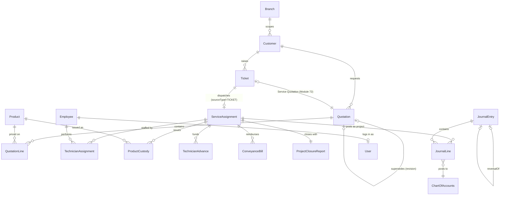

# Database Design Document

**Subject:** Brother's Technology System — Unified Business Management Platform
**Prepared as:** an independent Professional Database Designer review
**Sources read in full for this document:** `dfd.md`, `prd.md` v2.4, `architecture.md` v3.3
**Engine:** PostgreSQL 15+ · **ORM:** Prisma
**Date:** 7 September 2026

---

## 1. Database Overview

**Design philosophy, in priority order:**

1. **The ledger is the source of truth for money; everything else is the source of truth for operations.** No table outside the Finance domain (§7 below) ever stores a number that Finance also derives — a Sales Order's total is stored once, on the Sales Order; the fact that it becomes revenue is a `JournalLine`, not a duplicate total field on some Finance-side copy of the order.
2. **Nothing financial, inventory-related, or advance/loan-related is ever hard-deleted.** Every such table is append-only at the row level — corrections are new rows (reversals, adjustments), never `UPDATE`/`DELETE` on a posted row. This is `prd.md` §8.25 and `architecture.md` §22 restated as a database rule, not a new decision.
3. **Every table that can be scoped to a branch is scoped to a branch**, and that scoping is enforced in two independent places — the application's row-level check (`architecture.md` §2) and, new in this document (§14), a database-level policy — so a future bug in application code is not the only thing standing between one branch's data and another's.
4. **Extensibility over premature restriction.** Per the brief for this document specifically: every design choice below was checked against "what happens when Brother's Technology System adds a feature in a year." Where that check found a likely future pain point (native Postgres enums, in particular — §8), this document says so and picks the less convenient but more future-proof option.

**What this document is not:** a repeat of `architecture.md` §7's data model narrative, §39's bounded contexts, §41's dependency rules, §45's transaction boundaries, or §54's backup policy. Those are referenced by section number throughout rather than restated — this document's job is the layer beneath them: the actual tables, keys, indexes, and constraints that make those already-agreed rules real and enforceable.

---

## 2. Entity / Table List

~86 tables, organized by the same bounded contexts as `architecture.md` §39 and `dfd.md` §39/§8, so a table is always findable by the business capability it serves.

| Context | Tables |
|---|---|
| Identity & Access | `User`, `Employee`, `Role`, `Permission`, `RolePermission`, `Branch`, `Department` |
| Master Data | `Customer`, `CustomerAddress`, `Supplier`, `SupplierContact`, `Product`, `Category`, `Brand`, `Unit`, `Warehouse`, `TaxRate` |
| Procurement | `PurchaseRequest`, `PurchaseOrder`, `GoodsReceiptNote`, `PurchaseInvoice`, `SupplierPayment`, `PurchaseReturn` |
| Sales | `Quotation`, `QuotationLine`, `SalesOrder`, `DeliveryChallan`, `DeliveryChallanLine`, `DeliveryChallanReturn`, `DeliveryChallanReturnLine` *(Module 73)*, `Invoice`, `Payment`, `CreditNote` |
| Inventory | `StockLedger`, `StockAdjustment`, `StockTransfer`, `Batch`, `SerialNumber`, `SKULifecycleEvent`, `DamageLossReport`, `DamageLossLine` *(Module 74)* |
| Field Service | `ServiceAssignment`, `TechnicianAssignment`, `ProductCustody`, `TechnicianAdvance`, `ConveyanceBill`, `ProjectClosureReport`, `LiveLocationLog` |
| Customer Support (incl. Module 72) | `Warranty`, `WarrantyClaim`, `Ticket` |
| Finance & Accounting | `ChartOfAccounts`, `JournalEntry`, `JournalLine`, `Voucher`, `VoucherLine`, `Ledger`(view, §16), `TrialBalance`(view), `ProfitAndLoss`(view), `BalanceSheet`(view), `SuspenseEntry`, `ChequeRegisterEntry`, `BankTransactionProof` |
| Customer/Company Money Movement | `CustomerAdvance`, `AdvanceAdjustment`, `CompanyLoan`, `LoanRepaymentSchedule`, `Investment`, `EmployeeAdvance`, `EmployeeLoanInstallment` |
| HR & Payroll | `Timesheet`, `KPI`, `Attendance`, `LeaveRequest`, `SalaryStructure`, `PayrollRun`, `PayslipLine`, `AttendanceSalaryRule`, `ProjectAdvanceConveyanceReconciliation`, `employee_work_summary`(view, Module 75 — **no new table**, see the note below) |
| Platform / Cross-Cutting | `ApprovalRequest`, `RecordChangeRequest`, `Notification`, `Document`, `AuditLog`, `SavedFilter`, `DraftState`, `ExportJob`, `PrintPreference` |

**Note on the four Finance items marked `(view)`:** `Ledger`, `TrialBalance`, `ProfitAndLoss`, and `BalanceSheet` are named as models in `architecture.md` §7.8, but per this document's Rule 1 above, none of them should be physical tables — they're always derivable from `JournalEntry`/`JournalLine`, and a physical table for them would create exactly the "two sources of truth" problem Rule 1 exists to prevent. §16 below defines them as database views instead. This is the one place this document disagrees with `architecture.md`'s phrasing rather than just adding detail to it — flagged again in §24 (Validation Report homolog for this document, folded into §1's philosophy instead of a separate section, since the brief's 24 headings don't include one).

**Note on Module 75 (Employee Work & Performance):** its own source specification is explicit that this must be "a reporting and performance layer over existing business transactions, not a parallel transaction system" — reinforcing Rule 1 above independently. It is implemented entirely as views/query services over `ServiceAssignment`, `Ticket`, `ProductCustody`, and `Attendance` — zero new physical tables. Full schema for Modules 73–75 is in `database-schema.md` §26–§27 (extending, not duplicating, this section).

---

## 3. Prisma Schema (Consolidated)

`architecture.md` defines these models spread across §7.1–7.21 and §57. This section is the single, consolidated `schema.prisma` a developer actually runs — same models, same field names, nothing renamed — with the additions this document's later sections require (indexes in §6, `onDelete` in §5, audit/version columns in §10/§12) folded directly into the field lists rather than bolted on separately.

Given the size (~80 models), this section shows the pattern in full for one representative model per context, and the two most structurally important contexts (Finance, and the Module 72 Ticket flow) in complete detail. Every model not fully expanded here follows the exact same shape — id/business-key/FK-with-onDelete/audit-timestamps/branch-scope/`@@index` — demonstrated below; expanding all ~80 in full would reproduce `architecture.md` §7 at several times its length for no new information beyond what §5–§8 already state as the applicable rule.

```prisma
generator client {
  provider = "prisma-client-js"
}

datasource db {
  provider = "postgresql"
  url      = env("DATABASE_URL")
}

// ─────────────────────────────────────────────
// IDENTITY & ACCESS
// ─────────────────────────────────────────────

model Branch {
  id        String   @id @default(cuid())
  code      String   @unique              // e.g. "DHK-01" — human-readable, used in every document number
  name      String
  isActive  Boolean  @default(true)
  createdAt DateTime @default(now())
  updatedAt DateTime @updatedAt

  users     User[]
  customers Customer[]
  @@index([isActive])
}

model User {
  id           String    @id @default(cuid())
  email        String    @unique
  passwordHash String
  mfaEnabled   Boolean   @default(false)   // true only for SUPER_ADMIN / ACCOUNTS_FINANCE (prd.md §10.5)
  roleId       String
  branchId     String?                     // null for roles not branch-scoped (Super Admin)
  employeeId   String?   @unique
  isActive     Boolean   @default(true)
  version      Int       @default(0)       // optimistic lock — §10
  createdAt    DateTime  @default(now())
  updatedAt    DateTime  @updatedAt
  deletedAt    DateTime?                   // soft delete — §13; a User is never hard-deleted (audit trail depends on the FK)

  role     Role      @relation(fields: [roleId], references: [id], onDelete: Restrict)
  branch   Branch?   @relation(fields: [branchId], references: [id], onDelete: Restrict)
  employee Employee? @relation(fields: [employeeId], references: [id], onDelete: SetNull)

  @@index([branchId, isActive])
  @@index([roleId])
}

model Role {
  id          String @id @default(cuid())
  name        String @unique   // SUPER_ADMIN, ADMIN, ACCOUNTS_FINANCE, HR_PAYROLL, BRANCH_MANAGER, SALES_EXECUTIVE, WAREHOUSE_STAFF, TECHNICIAN, CUSTOMER_PORTAL, VENDOR_PORTAL
  permissions RolePermission[]
  users       User[]
}

model Permission {
  id     String @id @default(cuid())
  code   String @unique   // e.g. "sales.quotation.create" — dot-namespaced, §24 naming convention
  roles  RolePermission[]
}

model RolePermission {
  roleId       String
  permissionId String
  role         Role       @relation(fields: [roleId], references: [id], onDelete: Cascade)
  permission   Permission @relation(fields: [permissionId], references: [id], onDelete: Cascade)
  @@id([roleId, permissionId])
}

model Employee {
  id         String   @id @default(cuid())
  employeeCode String @unique
  fullName   String
  nidNumber  String   @unique              // 🔴 encrypted at rest (architecture.md §22) — DB stores ciphertext, app decrypts
  branchId   String
  departmentId String?
  isActive   Boolean  @default(true)
  createdAt  DateTime @default(now())
  updatedAt  DateTime @updatedAt

  branch     Branch     @relation(fields: [branchId], references: [id], onDelete: Restrict)
  department Department? @relation(fields: [departmentId], references: [id], onDelete: SetNull)
  user       User?

  @@index([branchId, isActive])
  @@index([departmentId])
}

model Department {
  id       String @id @default(cuid())
  name     String @unique
  employees Employee[]
}

// ─────────────────────────────────────────────
// MASTER DATA (Customer shown in full; Supplier/Product/Warehouse/TaxRate/etc. follow the identical pattern:
// id, business-key @unique, FK-with-onDelete, isActive, audit timestamps, branch scope where applicable, @@index)
// ─────────────────────────────────────────────

model Customer {
  id            String   @id @default(cuid())
  customerCode  String   @unique
  displayName   String
  phone         String   @unique
  branchId      String                       // "home" branch — a customer can still transact at other branches (dfd.md §57.4 ambiguity, still open)
  isServiceOnly Boolean  @default(false)      // true if this customer has never had a Sales relationship — Module 72
  isActive      Boolean  @default(true)
  version       Int      @default(0)
  createdAt     DateTime @default(now())
  updatedAt     DateTime @updatedAt

  branch        Branch          @relation(fields: [branchId], references: [id], onDelete: Restrict)
  addresses     CustomerAddress[]
  quotations    Quotation[]
  tickets       Ticket[]
  advances      CustomerAdvance[]

  @@index([branchId, isActive])
  @@index([phone])
}

model CustomerAddress {
  id         String @id @default(cuid())
  customerId String
  label      String   // "Home", "Office", site address for a service job
  addressLine String
  customer   Customer @relation(fields: [customerId], references: [id], onDelete: Cascade)  // an address has no meaning without its customer
  @@index([customerId])
}

// ... Supplier, SupplierContact, Product, Category, Brand, Unit, Warehouse, TaxRate: identical pattern, omitted here — see §2 for the full table list and §5-§8 for the rules every one of them follows.

// ─────────────────────────────────────────────
// SALES (Quotation/QuotationLine shown in full, matching architecture.md §7.4 exactly, with §5-§8's additions)
// ─────────────────────────────────────────────

enum QuotationStatus { DRAFT SENT ACCEPTED REJECTED EXPIRED CONVERTED }

model Quotation {
  id             String           @id @default(cuid())
  quotationNumber String          @unique     // QT-<branch>-<year>-<seq>
  customerId     String
  branchId       String
  salesExecutiveId String
  status         QuotationStatus  @default(DRAFT)
  validUntil     DateTime
  grandTotal     Decimal          @db.Decimal(14, 2)   // 2 dp per prd.md §10.12's rounding convention
  supersedesId   String?          @unique              // prd.md §9.12 revision chain
  ticketId       String?          @unique              // set when this Quotation is a Module 72 Service Quotation
  createdAt      DateTime         @default(now())
  updatedAt      DateTime         @updatedAt

  customer       Customer         @relation(fields: [customerId], references: [id], onDelete: Restrict)
  branch         Branch           @relation(fields: [branchId], references: [id], onDelete: Restrict)
  lines          QuotationLine[]
  supersedes     Quotation?       @relation("QuotationRevision", fields: [supersedesId], references: [id], onDelete: SetNull)
  ticket         Ticket?          @relation(fields: [ticketId], references: [id], onDelete: SetNull)

  @@index([branchId, status])
  @@index([customerId])
  @@index([validUntil])   // supports the auto-expiry background job's scan query
}

model QuotationLine {
  id          String   @id @default(cuid())
  quotationId String
  productId   String?                          // null = service/labour line (Module 72; prd.md §8.28)
  description String                           // required when productId is null — enforced in §7, not at the DB layer alone
  quantity    Decimal  @db.Decimal(10, 2)
  unitPrice   Decimal  @db.Decimal(14, 2)
  lineTotal   Decimal  @db.Decimal(14, 2)

  quotation   Quotation @relation(fields: [quotationId], references: [id], onDelete: Cascade)  // a line has no meaning without its quotation
  product     Product?  @relation(fields: [productId], references: [id], onDelete: Restrict)   // never delete a Product referenced by a historical quotation line

  @@index([quotationId])
}
```

The full `SalesOrder`/`DeliveryChallan`/`Invoice`/`Payment`/`CreditNote`, all of Procurement, all of Inventory, and every HR/Master-Data table follow this exact same shape and are covered by §5–§8's rules identically — listed by name in §2, not re-expanded field-by-field here.

**Field Service (full — the platform's signature flow, `architecture.md` §7.7 consolidated with this document's additions):**

```prisma
enum AssignmentStatus { ASSIGNED IN_PROGRESS COMPLETED CLOSED CANCELLED }
enum CustodyStatus    { ASSIGNED USED RETURNED DAMAGED LOST SOLD_TO_CUSTOMER }
enum ApprovalStatus   { PENDING APPROVED REJECTED }

model ServiceAssignment {
  id             String            @id @default(cuid())
  assignmentNumber String          @unique
  sourceType     String            // SALES_ORDER | INVOICE | TICKET — architecture.md §7.7
  sourceId       String
  branchId       String
  status         AssignmentStatus  @default(ASSIGNED)
  version        Int               @default(0)         // optimistic lock — §10; two Accounts users closing the same assignment must not both succeed
  createdAt      DateTime          @default(now())
  updatedAt      DateTime          @updatedAt

  branch         Branch                  @relation(fields: [branchId], references: [id], onDelete: Restrict)
  technicians    TechnicianAssignment[]
  custody        ProductCustody[]
  advances       TechnicianAdvance[]
  conveyance     ConveyanceBill[]
  closure        ProjectClosureReport?

  @@index([branchId, status])
  @@index([sourceType, sourceId])   // the FK this table doesn't have — see §5's note on polymorphic sourceType/sourceId
}

model TechnicianAssignment {
  id           String @id @default(cuid())
  assignmentId String
  employeeId   String
  assignedAt   DateTime @default(now())
  unassignedAt DateTime?             // set on reassignment (prd.md §9.11), never deleted

  assignment   ServiceAssignment @relation(fields: [assignmentId], references: [id], onDelete: Cascade)
  technician   Employee          @relation(fields: [employeeId], references: [id], onDelete: Restrict)

  @@index([assignmentId])
  @@index([employeeId])
}

model ProductCustody {
  id           String        @id @default(cuid())
  assignmentId String
  serialNumberId String?     // for serialized stock
  productId    String
  quantity     Decimal       @db.Decimal(10, 2)
  status       CustodyStatus @default(ASSIGNED)
  custodianId  String                              // current holder — reassignable, prd.md §9.11
  createdAt    DateTime      @default(now())

  assignment   ServiceAssignment @relation(fields: [assignmentId], references: [id], onDelete: Cascade)
  product      Product           @relation(fields: [productId], references: [id], onDelete: Restrict)
  custodian    Employee          @relation(fields: [custodianId], references: [id], onDelete: Restrict)

  @@index([assignmentId])
  @@index([custodianId, status])
}

model TechnicianAdvance {
  id           String   @id @default(cuid())
  assignmentId String
  employeeId   String
  amountIssued Decimal  @db.Decimal(14, 2)
  issuedAt     DateTime @default(now())

  assignment   ServiceAssignment @relation(fields: [assignmentId], references: [id], onDelete: Restrict)  // never cascade — this is a financial record (Rule 2, §1)
  technician   Employee          @relation(fields: [employeeId], references: [id], onDelete: Restrict)

  @@index([assignmentId])
  @@index([employeeId])
}

model ConveyanceBill {
  id             String         @id @default(cuid())
  assignmentId   String
  employeeId     String
  totalClaimed   Decimal        @db.Decimal(14, 2)
  approvalStatus ApprovalStatus @default(PENDING)
  receiptFileId  String?
  submittedAt    DateTime       @default(now())

  assignment     ServiceAssignment @relation(fields: [assignmentId], references: [id], onDelete: Restrict)
  technician     Employee          @relation(fields: [employeeId], references: [id], onDelete: Restrict)

  @@index([assignmentId, approvalStatus])
}

model ProjectClosureReport {
  id                     String   @id @default(cuid())
  assignmentId           String   @unique
  customerSignatureFileId String?
  closedAt               DateTime?
  closedById             String

  assignment             ServiceAssignment @relation(fields: [assignmentId], references: [id], onDelete: Restrict)
  closedBy               User              @relation(fields: [closedById], references: [id], onDelete: Restrict)

  @@index([closedAt])
}
```

**Finance & Accounting (full — the one context every other table ultimately posts into; `architecture.md` §7.8, §45's transaction rule, and §11 below all converge here):**

```prisma
enum JournalStatus { DRAFT POSTED REVERSED }

model ChartOfAccounts {
  id          String   @id @default(cuid())
  accountCode Int      @unique              // 1000s Assets, 2000s Liabilities, ... (Finance spec's COA numbering)
  name        String
  accountType String                        // ASSET | LIABILITY | EQUITY | REVENUE | COGS | EXPENSE | OTHER
  isActive    Boolean  @default(true)

  lines       JournalLine[]
  @@index([accountType])
}

model JournalEntry {
  id             String        @id @default(cuid())
  journalNumber  String        @unique
  sourceModule   String                       // "SALES" | "PROCUREMENT" | "SERVICE_OPS" | "PAYROLL" | ... — §11
  sourceId       String                       // polymorphic — see §5's note
  branchId       String
  fiscalPeriodId String
  status         JournalStatus @default(DRAFT)
  idempotencyKey String        @unique         // architecture.md §43 — prevents a retried request from double-posting
  postedAt       DateTime?
  postedById     String?
  reversalOfId   String?       @unique          // set on a reversal entry, pointing at the entry it reverses (never the other way)
  createdAt      DateTime      @default(now())

  branch         Branch         @relation(fields: [branchId], references: [id], onDelete: Restrict)
  lines          JournalLine[]
  reversalOf     JournalEntry?  @relation("Reversal", fields: [reversalOfId], references: [id], onDelete: Restrict)

  @@index([sourceModule, sourceId])
  @@index([branchId, fiscalPeriodId])
  @@index([status])
}

model JournalLine {
  id             String   @id @default(cuid())
  journalEntryId String
  accountId      String
  debit          Decimal  @db.Decimal(14, 2) @default(0)
  credit         Decimal  @db.Decimal(14, 2) @default(0)
  departmentId   String?
  projectId      String?                       // e.g. a ServiceAssignment id, for project-wise P&L
  customerId     String?
  supplierId     String?

  journalEntry   JournalEntry     @relation(fields: [journalEntryId], references: [id], onDelete: Cascade)  // a line has no meaning without its parent entry — the entry itself is never deleted (Rule 2), only this cascade
  account        ChartOfAccounts  @relation(fields: [accountId], references: [id], onDelete: Restrict)

  @@index([journalEntryId])
  @@index([accountId])
  @@index([projectId])          // supports "give me this ServiceAssignment's P&L" — the platform's most-run financial query
  @@check(constraint: "debit >= 0 AND credit >= 0 AND NOT (debit > 0 AND credit > 0)", name: "journal_line_single_sided")
}
```

---

## 4. Entity Relationships

The full graph is `architecture.md` §39's Bounded Context Map at table granularity. The relationship shapes that matter for schema design:

| Relationship | Cardinality | Pattern |
|---|---|---|
| Branch → most operational tables | 1:many | Every branch-scoped table carries `branchId`; never the reverse |
| Customer → Quotation/Ticket/CustomerAdvance | 1:many | A Customer can exist with zero Sales history (Module 72, `isServiceOnly`) |
| Quotation → QuotationLine | 1:many, cascade | A line is meaningless without its parent |
| Quotation ↔ Quotation (self-relation) | 1:1 optional | `supersedesId` — the revision chain, `prd.md` §9.12 |
| Quotation ↔ Ticket | 1:1 optional | Set only for a Module 72 Service Quotation |
| ServiceAssignment → {TechnicianAssignment, ProductCustody, TechnicianAdvance, ConveyanceBill} | 1:many each | The whole Field Service cluster hangs off one assignment |
| ServiceAssignment → ProjectClosureReport | 1:1 | Exactly one closure per assignment, ever |
| JournalEntry → JournalLine | 1:many, cascade (line only) | See §5's note — the entry itself is Restrict, never deleted |
| JournalLine → ChartOfAccounts | many:1 | Every line must resolve to a real account — Restrict, an account in use can't be deleted |
| \* → JournalEntry (`sourceModule`+`sourceId`) | many:1, **not a real FK** | Polymorphic by design — see §5 |
| Employee → User | 1:1 optional | Not every Employee has system access (e.g., a temporary field helper) |
| Role → Permission | many:many via RolePermission | Standard join table |

**No true many:many relationship exists anywhere else in this schema** — every other apparent many:many (e.g., "a Product appears on many Quotations") is actually one:many through a line/detail table (`QuotationLine`), which is deliberate: a bare many:many join table can't carry quantity/price/status, and this platform's business rules (§8.28's `productId: null` service lines, for instance) always need that extra context.

---

## 5. Foreign Keys & Referential Integrity

**The general rule, applied consistently across §3's schema:**

| `onDelete` | Used when | Example |
|---|---|---|
| `Restrict` (default assumption) | The referenced row is financial, or deleting it would orphan history | `JournalLine.accountId`, `TechnicianAdvance.assignmentId`, `Employee.branchId` |
| `Cascade` | The child row has no independent meaning without its parent | `QuotationLine` → `Quotation`, `JournalLine` → `JournalEntry`, `RolePermission` join rows |
| `SetNull` | The reference is informational, not load-bearing, and losing it shouldn't block the delete | `User.employeeId` (an Employee record being cleaned up shouldn't be blocked by a stale login), `Quotation.supersedesId` |

**The one deliberate compromise: polymorphic `sourceType`/`sourceId`.** `ServiceAssignment.sourceType`/`sourceId` (pointing at a `SalesOrder`, `Invoice`, or `Ticket`) and `JournalEntry.sourceModule`/`sourceId` (pointing at whichever of a dozen+ tables posted it) are **not real foreign keys** — Postgres/Prisma can't FK a column against "one of several possible tables" without either a shared parent table (over-engineering for what's fundamentally a reporting convenience) or a trigger-based check per source type. This document's recommendation: leave them as plain indexed columns (§6), and enforce validity at the Application layer (`architecture.md` §40) where the source is already known and typed — this is a real, named trade-off, not an oversight, and it's the same trade-off most large systems make for exactly this "any of several types" relationship shape.

**No `onDelete: Cascade` anywhere in the Finance or Field Service clusters except line-item tables.** This is deliberate and matches Rule 2 (§1) — a cascade delete on, say, `ServiceAssignment` → `TechnicianAdvance` would let one `DELETE` silently erase money-movement history. `Restrict` forces that money history to be reversed through the proper channel (Finance spec's reversal pattern) before its parent can even be considered for removal — and per §13, financial parents are never actually removed anyway.

---

## 6. Database Indexes

Every index in §3 exists to answer a specific query this platform is known to run — not added speculatively. The four repeating patterns:

1. **`@@index([branchId, status])`** on every branch-scoped operational table — the single most common query shape on this platform is "this branch's open/pending items" (a dashboard, an approval inbox, a technician's assignment list).
2. **FK columns are always indexed** (`customerId`, `employeeId`, `accountId`, etc.) — Postgres does not auto-index foreign keys the way primary keys are indexed; without this, every join and every `onDelete: Restrict` check does a sequential scan as the table grows.
3. **Date/expiry columns used by background jobs** (`Quotation.validUntil`, `DraftState`'s implicit last-edit timestamp for the 1-hour expiry) — these are scanned by a scheduled job (`architecture.md` §46), and an unindexed scan of that column becomes the platform's slowest query as data accumulates, invisibly, until it doesn't.
4. **`JournalLine.projectId`** specifically — Project P&L (the platform's headline feature, `prd.md` §2) is "sum every JournalLine where `projectId = X`," run constantly on live dashboards; this is the one index this document adds that isn't a FK or branch/status pair, because that specific query pattern is central enough to name explicitly rather than leave to the general FK rule.

**What's deliberately not indexed:** `AuditLog` and `Notification` are high-write, low-read-until-needed tables — indexing every column would slow every write on the platform's two highest-volume tables for query patterns ("show me last month's audit trail for employee X") that tolerate a slower, explicitly-filtered query. Both get exactly one index (`[entityType, entityId]` and `[recipientId, createdAt]` respectively) — enough for their real access pattern, not more.

---

## 7. Constraints & Validation Rules

Database-level constraints — the last line of defense, enforced even if an Application-layer bug (`architecture.md` §40) lets something through:

- **`journal_line_single_sided`** (§3): a `JournalLine` can't have both a debit and a credit — shown in full above as the pattern; the platform's core "debit = credit" balance itself (sum across all lines in one entry) is enforced by a trigger (below), since a `CHECK` constraint can't see sibling rows.
- **`quantity >= 0`** on every quantity/stock column (`QuotationLine.quantity`, `ProductCustody.quantity`, `StockLedger` balances) — `CHECK (quantity >= 0)`. The one deliberate exception is `StockAdjustment.quantityDelta`, which is signed by design (a negative adjustment is a write-off).
- **`validUntil > createdAt`** on `Quotation` — a quotation that's already expired at creation is a data-entry bug, not a valid state.
- **A trigger, not a `CHECK`, enforces `SUM(debit) = SUM(credit)` per `JournalEntry`** (`AFTER INSERT OR UPDATE ON "JournalLine"`, aggregating by `journalEntryId`) — this is the DB-level version of `architecture.md` §45's rule, and the direct fix for the gap `requirements.md`'s P0 finding flagged (the rule existed as a stated principle but not as an enforced mechanism until this document).
- **`@unique` composite on `(assignmentId)` for `ProjectClosureReport`** — already shown in §3 — is itself a constraint: the database physically cannot hold two closure reports for one assignment, which is stronger than "the application checks for one before creating another."

---

## 8. Enum Definitions

Consolidated from `architecture.md` §7's models (unchanged) plus Module 72's `TicketType`/`TicketStatus` (§57):

`QuotationStatus`, `SKULifecycleStage`, `ApprovalStatus`, `CustodyStatus`, `AssignmentStatus`, `ApprovalType`, `AdvanceStatus`, `LoanStatus`, `TicketType`, `TicketStatus`, `ExportFormat`, `PayrollRunStatus`, `ReconciliationOutcome`, `VoucherType`, `VoucherStatus`, `ChequeStatus`, `JournalStatus` *(new, §3)*.

**A "top-class, future-proof" flag on all of them, not a criticism of any specific one:** Prisma enums compile to native Postgres `ENUM` types. Postgres enums are notoriously awkward to change later — adding a value is cheap, but removing or reordering one requires rebuilding the type and every column using it, inside a migration that can't run inside the same transaction as other DDL. For enums this platform is likely to actively extend post-launch — **`TicketType`, `VoucherType`, and `ApprovalType`** specifically, since new ticket/voucher/approval categories are a plausible normal feature request, not an edge case — this document's recommendation is to model them as a `String` column with a `CHECK (value IN (...))` constraint instead of a native Postgres enum. A `CHECK` constraint is a one-line migration to extend; a native enum is not. The remaining enums (status-lifecycle fields like `AssignmentStatus`, `QuotationStatus`) are genuinely closed sets tied to a fixed workflow and are fine as native enums as specified in §3.

---

## 9. Database Transactions

The transaction *boundary rule* is already fully specified — `architecture.md` §45 — and unchanged here; this section is its DB-level implementation detail only.

- **Isolation level: `READ COMMITTED`** (Postgres's default) for almost everything — sufficient because §45's rule already ensures a business operation's writes are atomic as a unit; most reads don't need to see a perfectly frozen snapshot of unrelated concurrent writes.
- **`SERIALIZABLE` for exactly one operation: period closing** (`prd.md` §9, Finance spec's closing sequence) — closing a fiscal period while a `JournalEntry` for that period is mid-commit elsewhere is the one scenario where `READ COMMITTED`'s weaker guarantee could let a late entry sneak into an already-"closed" period. This is a deliberate, narrow exception, not a blanket policy.
- Every `$transaction` block (§45) that spans more than one context's tables (e.g., §42's Service Assignment closure, touching Field Service + Finance + Payroll) is kept as short as possible — no external API call, no email/SMS send, ever executes inside one, per §45's existing rule — specifically because a longer-held Postgres transaction increases lock contention (§10) proportionally to how long it's open.

---

## 10. Concurrency & Locking Rules

Not previously specified anywhere in `architecture.md` or `prd.md` — genuinely new for this document.

- **Optimistic locking (`version Int` column, shown throughout §3) on every table two different roles might edit near-simultaneously:** `User`, `Customer`, `ServiceAssignment`, `StockLedger`. An update includes `WHERE version = :expectedVersion` and increments it; a mismatch means someone else changed the row first, and the Application layer (§40) surfaces that as a `CONFLICT` (`architecture.md` §53's error taxonomy already has this response code) rather than silently overwriting.
- **Pessimistic row lock (`SELECT ... FOR UPDATE`) for exactly one operation: `StockLedger` quantity decrements at the moment of sale.** Optimistic locking is right for low-contention edits (two people rarely edit the same Customer at once) but wrong for the one genuinely high-contention case this platform has — two branches racing to sell the last unit of a serialized SKU (a scenario `requirements.md`'s Edge Case Analysis already named). A short-held row lock at the exact decrement, not the whole sale transaction, is the standard fix and is cheap because it's held for milliseconds.
- **No locking needed for `JournalLine` inserts** — they're append-only (Rule 2, §1), so there's nothing to contend over; two concurrent postings to the same account simply both insert, and the balance is always a `SUM()`, never a stored running total that could race.
- **BullMQ jobs (`architecture.md` §46) never hold a Postgres transaction open across a queue round-trip** — a job that needs to both write to Postgres and enqueue a follow-up job commits the Postgres write first, then enqueues; this avoids a lock being held for the duration of a Redis round-trip, which would otherwise be an easy way to accidentally serialize unrelated work.

---

## 11. Accounting Transaction Rules

`architecture.md` §45 and the Finance specification already state the business rules (single ledger, no direct edits, project-wise tagging). This section is what's specifically new at the database layer, consolidating §3/§7's Finance-table constraints into one place for whoever implements Phase 0's Posting/Ledger Stub (`prd.md` §13):

1. Every `JournalEntry` requires `idempotencyKey` — `@unique` — enforced by the schema itself, not just the Application-layer check `architecture.md` §43 describes; this is the actual fix for the double-posting gap `requirements.md` P0 flagged.
2. A `JournalEntry` in `POSTED` status is never targeted by an `UPDATE` on its `JournalLine`s from application code — enforced procedurally (§40's layering) since a blanket DB trigger blocking all updates to a "posted" row would also block the reversal-linking `UPDATE` that sets `reversalOfId` on the *new* entry (which is a fresh row, not an edit to the posted one) — so this is a code-review/ORM-layer rule, not a DB trigger, and is named here so it doesn't get assumed to be DB-enforced when it isn't.
3. The debit=credit trigger (§7) runs on every `JournalLine` write, not just at a batch "close" step — an unbalanced entry is rejected the moment it's attempted, not discovered later during period close.
4. `fiscalPeriodId` (§3) is required on every `JournalEntry`, resolved at write time from the entry's date against `prd.md` §14's still-open fiscal-year-convention question — the column exists now so the eventual decision (BD statutory year vs. calendar year) is a lookup-table change, not a schema migration.

---

## 12. Audit & History Tables

`architecture.md` §22/§52 already establish audit *scope* (financial data, and — since the 24-point pass — identity/access events too). This is that scope's table:

```prisma
model AuditLog {
  id         String   @id @default(cuid())
  entityType String                          // "JournalEntry", "User", "ServiceAssignment", ...
  entityId   String
  action     String                          // CREATE | UPDATE | DELETE | LOGIN_FAILED | PERMISSION_DENIED | ROLE_CHANGED
  actorId    String?                         // null for system/job-initiated actions
  beforeJson Json?
  afterJson  Json?
  ipAddress  String?
  createdAt  DateTime @default(now())

  @@index([entityType, entityId])
  @@index([actorId, createdAt])
}
```

- **`AuditLog` rows are the one table in this schema with no `onDelete` relations pointing away from them at all** — not even `Restrict` — because an audit row must be able to outlive the very entity it describes (an Employee who's later hard-deleted for a legitimate reason, if that's ever allowed, should still have their audit history). `entityId` is a plain string, not a FK, by design.
- **`beforeJson`/`afterJson` capture the full row state**, not a diff — a diff is cheaper to store but useless without also knowing the base state at read time, and this table is written far more than it's read, so the cheaper-to-write, self-contained option wins.
- History for domain-specific tables (a `ServiceAssignment`'s full status history, for instance) is **not** a separate `ServiceAssignmentHistory` table per entity — that pattern doesn't scale to ~80 tables. `AuditLog` filtered by `entityType`/`entityId` is the one history mechanism for everything, matching `architecture.md` §52's "one correlation-ID-based log, not per-module logs" philosophy applied to data history specifically.

---

## 13. Soft Delete Rules

- **Financial, inventory, loan, and advance tables are never deleted at all, soft or hard** (Rule 2, §1) — there is no `deletedAt` column on `JournalEntry`, `TechnicianAdvance`, `CompanyLoan`, etc., because a `deletedAt` column would imply deletion is a normal operation on them, and it isn't; the only "removal" mechanism these tables have is a reversal row.
- **Master data and identity tables get a real `deletedAt: DateTime?` column** (shown on `User` in §3) — used only when the record has zero linked transactions (`prd.md` §8.25's existing rule); every query against these tables filters `WHERE deletedAt IS NULL` by default, enforced at the Application/Prisma-middleware layer (`architecture.md` §40) rather than trusted to be remembered per-query.
- **`isActive: Boolean`, separately, means something different from `deletedAt` and both exist on the same table where relevant** (`Branch`, `Product`): `isActive = false` is a normal, reversible business state (a discontinued product, a closed branch) that should still appear in historical reports; `deletedAt` set means the record was a mistake and shouldn't appear anywhere. Conflating the two — using one boolean for both meanings — is a common schema mistake this design deliberately avoids.

---

## 14. Multi-Tenant & Branch Scoping

`architecture.md` §2 already established `tenantId`/`branchId` on every relevant entity and app-level row-scoping. New here, specifically because this document's brief is "no issues when the app is upgraded": **Postgres Row-Level Security (RLS) as a second, independent enforcement layer.**

```sql
ALTER TABLE "ServiceAssignment" ENABLE ROW LEVEL SECURITY;
CREATE POLICY branch_scope ON "ServiceAssignment"
  USING ("branchId" = current_setting('app.current_branch_id')::text
         OR current_setting('app.is_super_admin')::boolean = true);
```

Applied to every branch-scoped table in §2 (not shown per-table for space — the pattern above is identical everywhere). `app.current_branch_id`/`app.is_super_admin` are set once per request by the Application layer (§40) right after auth resolves the user's branch.

**Why this matters specifically for "no future upgrade issues":** `architecture.md` §2's row-level scoping is enforced by every query the Application layer writes remembering to add a `WHERE branchId = ...` clause. That's exactly the kind of rule a future developer — or a future AI coding assistant working on module 90-something two years from now — can forget on one new query, and nothing would catch it until a cross-branch data leak is reported by a customer. RLS makes the *database itself* refuse to return another branch's row even if the application query forgets the filter entirely. This is defense in depth, not a replacement for §2's existing rule — both stay in place.

`tenantId` (present on every entity per `architecture.md` §2 for future multi-tenant-SaaS readiness, `prd.md` §14) gets the identical RLS treatment once/if that business decision (still open) is confirmed — the policy pattern above already accepts it as a one-line addition to the `USING` clause.

---

## 15. Reporting & Aggregation

- Every report named in `prd.md` §8.10/§12 is a `SELECT ... SUM()/COUNT()` against §3's tables, filtered by the `@@index`es §6 already provides (branch, status, date range, `projectId`) — no report in the current scope requires a query shape this schema doesn't already support efficiently.
- Heavy/slow aggregations (branch-wide P&L, department-wise rollups) are routed to a BullMQ background job (`architecture.md` §46), not run synchronously against the live tables — consistent with `architecture.md` §16/§19's existing "background jobs for heavy reports" rule.
- **Aggregation never reads through the `Ledger`/`TrialBalance`/`ProfitAndLoss`/`BalanceSheet` views (§16) for a single-record drill-down** (`prd.md` §8.26's Drill-Down Standard) — those views are pre-aggregated by design and drilling into one further isn't their job; a drill-down query goes straight to `JournalLine` filtered by whatever the summary row's grouping key was, which is exactly what §8.26's "Summary → Breakdown → Source Document" pattern needs.

---

## 16. Materialized Views / Reporting Views

Not previously specified — genuinely new. Four views cover the platform's actual repeat-query load; more can be added the same way as new reports are requested, without a schema migration to the underlying tables. **Security fix applied in this revision, found during a full cross-document security audit — see the note after the code block.**

```sql
-- Regular (always-current) views — Rule 1, §1: these ARE the Ledger/TrialBalance/P&L/BalanceSheet
-- named as models in architecture.md §7.8; here they're views, never physical tables.
CREATE VIEW "Ledger" WITH (security_invoker = true) AS
  SELECT jl."accountId", je."branchId", je."fiscalPeriodId",
         SUM(jl.debit) AS total_debit, SUM(jl.credit) AS total_credit
  FROM "JournalLine" jl JOIN "JournalEntry" je ON je.id = jl."journalEntryId"
  WHERE je.status = 'POSTED'
  GROUP BY jl."accountId", je."branchId", je."fiscalPeriodId";

-- Materialized (refreshed on a schedule) — for the two dashboards that are read constantly
-- and don't need to-the-second accuracy (architecture.md §51's caching philosophy applied at the DB layer):

CREATE MATERIALIZED VIEW mv_branch_daily_sales AS
  SELECT "branchId", DATE(created_at) AS sale_date, SUM(grand_total) AS total_sales, COUNT(*) AS order_count
  FROM "Invoice" WHERE status = 'POSTED' GROUP BY "branchId", DATE(created_at);
-- Refreshed every 15 min via BullMQ (architecture.md §46) — matches the 15-min TTL architecture.md §51 already set for cached reference data.
-- Postgres materialized views CANNOT carry an RLS policy at all (§18's RLS applies only to regular tables) — application
-- code never queries this materialized view directly. It queries the wrapper view below instead:
CREATE VIEW branch_daily_sales WITH (security_invoker = true) AS
  SELECT * FROM mv_branch_daily_sales
  WHERE "branchId" = current_setting('app.current_branch_id')::text
     OR current_setting('app.is_super_admin')::boolean = true;

CREATE MATERIALIZED VIEW mv_project_pnl_summary AS
  SELECT jl."projectId", SUM(jl.credit) - SUM(jl.debit) AS net_result, COUNT(DISTINCT je.id) AS entry_count
  FROM "JournalLine" jl JOIN "JournalEntry" je ON je.id = jl."journalEntryId"
  WHERE jl."projectId" IS NOT NULL AND je.status = 'POSTED'
  GROUP BY jl."projectId";
-- Refreshed on ServiceAssignmentClosed / ProjectAdvanceConveyanceReconciliation events (architecture.md §44), not on a timer —
-- this one needs to be current the moment a project closes, unlike the daily sales view above.
-- Same RLS-cannot-attach problem and the same fix — a project's branch is reached via its ServiceAssignment:
CREATE VIEW project_pnl_summary WITH (security_invoker = true) AS
  SELECT p.* FROM mv_project_pnl_summary p
  JOIN "ServiceAssignment" sa ON sa.id = p."projectId"
  WHERE sa."branchId" = current_setting('app.current_branch_id')::text
     OR current_setting('app.is_super_admin')::boolean = true;
```

**Security gap found and fixed in this revision:** neither this section's original views nor `database-schema.md` §16/§27/§58.3 (`architecture.md`)'s views specified `security_invoker`, and the two materialized views had no row-level protection at all — a materialized view cannot carry a Postgres RLS policy under any configuration, so querying either one directly would return every branch's data regardless of who's asking, silently contradicting §14's "RLS as an independent second layer" claim for precisely the two views a dashboard hits hardest. **The fix, applied here and to every other view in this document set:** `security_invoker = true` on every regular view (PG 15+, already this project's minimum version — makes RLS enforcement explicit rather than relying on version-dependent default behavior), and a thin RLS-respecting wrapper view in front of every materialized view, with application code required to query the wrapper, never the `mv_` — prefixed table directly. `database-schema.md` §16/§27 and `architecture.md` §58.3's views get the same `security_invoker = true` addition — cross-referenced from here rather than repeated a third time.

**Rule for adding a new one later (the "no future issues" requirement, applied directly):** a materialized view is the right tool only when (a) the underlying query is genuinely expensive and (b) a few minutes of staleness is acceptable for that specific report. Anything needing to-the-second accuracy (an approval inbox count, a live stock level) stays a regular view or a direct query — never materialized — so a future developer reaching for "just materialize it" as a default has a written rule to check against first.

---

## 17. Seed Data

Not previously specified — required before Phase 0 (`prd.md` §13) can produce a runnable environment. What must exist before the first real user logs in:

1. **Roles** — all 10 from `prd.md` §6, with their `Permission` rows attached per §6.1's Role × Functional-Area matrix.
2. **Chart of Accounts** — the full numbered structure from the Finance specification (1000s–8000s), so Phase 0's Posting Stub (`prd.md` §13) has real accounts to post against on day one.
3. **One `Branch`** (the first real branch) and **one `SUPER_ADMIN` `User`**, bootstrapped outside the normal signup flow (there's no "first Super Admin signs up" flow by design — Section 22's security model assumes Super Admin accounts are provisioned deliberately, not self-served).
4. **`TaxRate`** — Bangladesh VAT rate(s) as currently applicable.
5. **`Unit`** — standard units of measure (pcs, box, meter, etc.) used across `Product`.

Seed data is a checked-in Prisma seed script (`prisma/seed.ts`), run once per environment, idempotent (safe to re-run — it upserts by business key, never blindly inserts), and contains **zero customer, employee, or transactional data** — that's §18's job, kept strictly separate so seed data can safely run in production while sample data never can.

---

## 18. Sample / Demo Data

For staging/demo environments only — **never run against production**, enforced by the seed script checking `NODE_ENV` before it will touch the sample-data tables at all.

- Follows `ui.md` §16's existing convention exactly (referenced, not restated): realistic Bangladeshi name formats, real district/branch naming conventions, non-round BDT amounts, plausible dates — no `"Test Customer 1"`, no ৳10,000.00-round numbers.
- Generated in dependency order (Branches → Employees/Users → Customers/Suppliers/Products → a few weeks of Purchase/Sales/Service history → the Journal Entries that history should have produced) so referential integrity holds and the demo P&L is a real, derived number, not hand-typed to look plausible — consistent with this document's Rule 1 (§1).
- A fixed random seed (`faker.seed(42)`) so demo data is reproducible across environment rebuilds — a screenshot taken today should still match what a rebuild produces next month.

---

## 19. Database Migration Strategy

Not previously specified — genuinely new, and directly answers this document's "no issues on future upgrade" brief.

- **Prisma Migrate**, migrations checked into the repo (`prisma/migrations/`) and applied via `prisma migrate deploy` in CI/CD — never `db push` outside local development, since `db push` doesn't produce a reviewable migration file.
- **Every migration is reviewed like a code change** — a migration that drops a column or changes a type is flagged in review the same way a breaking API change (`architecture.md` §43) would be, since both are the same category of problem: a change that can break something already running against the old shape.
- **Additive-first for anything touching a table with production data:** add the new column nullable → backfill in a background job (§46) → make it required in a *later* migration once the backfill is confirmed complete. Never add a required column with no default directly to a table that already has rows — this is the specific, concrete version of §1's "extensibility over premature restriction" philosophy.
- **A native-enum change (§8's flagged risk) always ships as: add the new value → deploy the code that can produce it → only remove an old value, if ever, in a separate migration once nothing still writes it.** Never rename or remove an enum value in the same migration that adds a new one.
- Migrations run **before** the new application code deploys (schema changes are backward-compatible with the *previous* code version for the duration of a rolling deploy, matching `architecture.md` §50's stateless-horizontal-scaling approach — old and new API containers may briefly run side by side against the same, already-migrated database).

---

## 20. Backup & Recovery

Fully specified already at `architecture.md` §54 (RTO 4h/RPO 24h, daily dump + WAL archiving, 90-day retention, quarterly restore drill) — not repeated here. The one database-specific addition: **`pg_dump` custom-format (`-Fc`), not plain SQL**, since custom-format supports selective table restore (useful for the quarterly drill's row-count/checksum check without a full-database restore every time) and is meaningfully smaller on disk than plain-text SQL at this schema's size.

---

## 21. Data Retention

`architecture.md` §54 sets the umbrella policy (90-day rolling, month-end snapshots longer). Table-specific detail that policy didn't get into:

| Table(s) | Retention | Why |
|---|---|---|
| `JournalEntry`/`JournalLine`, `Voucher`/`VoucherLine` | Indefinite — never purged | Statutory bookkeeping expectation (`prd.md` §10.7), and Rule 2 (§1) means there's no mechanism to purge them anyway |
| `AuditLog` | Indefinite in cold storage after 1 year in the primary table | Matches `prd.md` §10.4's proposal; partitioned by month so old partitions can move to cheaper storage without a `DELETE` |
| `DraftState` | 1 hour after last edit if unsubmitted | `prd.md` §14, already resolved |
| `LiveLocationLog` | **Still an open policy question** — flagged in `dfd.md` §16 and not yet resolved; this document assumes 90 days pending that decision, matching the general backup-retention default, but the actual number needs the same stakeholder confirmation `dfd.md` already asked for |
| `Notification` | 180 days, then purged (not archived) | Operational, not evidentiary — nothing depends on a 2-year-old "your payslip is ready" notification existing |

---

## 22. ERD

Core relationships across the four busiest contexts (Sales, Field Service, Finance, Module 72) — the full ~80-table ERD is this document's §2 table list plus §4's relationship table combined; this diagram is the subset worth looking at as a picture rather than a table.



---

## 23. Data Dictionary

`dfd.md` §9 already covers business meaning, source, and destination for the platform's ~20 highest-sensitivity entities — not repeated here. This section adds the column-level technical detail that dfd.md's business-oriented dictionary didn't carry: precision, nullability, and the DB type.

| Table.Column | DB Type | Nullable | Notes |
|---|---|---|---|
| `*.id` (every table) | `text` (cuid) | No | Never an auto-increment integer — cuid avoids leaking row-count/sequence information across a multi-branch system, and merges safely across environments (§18's demo data, §19's migrations) |
| `*.grandTotal`, `*.amountIssued`, `*.totalClaimed`, all money columns | `numeric(14,2)` | No | Never `float`/`double` for money — `prd.md` §10.12's rounding convention requires exact decimal arithmetic |
| `Employee.nidNumber` | `text`, application-layer encrypted | No | The column itself just holds ciphertext; Postgres never sees the plaintext NID |
| `JournalLine.debit` / `.credit` | `numeric(14,2)` | No, `default 0` | Exactly one of the pair is non-zero, enforced by §7's `CHECK` |
| `*.branchId` | `text` (FK) | Varies | Nullable only on `User` (Super Admin isn't branch-scoped) — every other occurrence is required |
| `*.version` (optimistic lock, §10) | `integer` | No, `default 0` | Present only on the four tables §10 names as genuinely contended |
| `*JournalEntry.idempotencyKey` | `text` | No, `@unique` | Client-generated (`architecture.md` §43), not server-generated — the whole point is the client can safely retry with the same value |

---

## 24. Naming Conventions

Not previously written down explicitly — inferred consistently across every model already shown in `architecture.md` §7, made an explicit rule here so it stays consistent as the schema grows past ~80 tables:

- **Models: `PascalCase`, singular** (`ServiceAssignment`, not `ServiceAssignments` or `service_assignment`).
- **Fields: `camelCase`** (`branchId`, `grandTotal`) — Prisma maps these to the DB's actual column names; no `@map` override needed since this project has no legacy-naming constraint to work around.
- **Foreign key fields: `<relatedModelCamelCase>Id`** (`customerId`, `accountId`) — never a bare `id` suffix on anything but the FK itself, and never abbreviated (`custId`).
- **Enums: `PascalCase` type name, `SCREAMING_SNAKE_CASE` values** (`QuotationStatus.ACCEPTED`) — matches every enum already in §3/§8.
- **Boolean fields: `is`/`has` prefix** (`isActive`, `isServiceOnly`, `hasApproval` if one is ever added) — never a bare adjective (`active`) that reads ambiguously as to whether it's the field name or a value.
- **Business-key/document-number fields: `<entity>Number`** (`quotationNumber`, `assignmentNumber`, `journalNumber`) — always `String @unique`, always human-readable with the branch/year/sequence pattern already established in `architecture.md` §7, never reused as the primary key (the `id` cuid stays separate so a future renumbering scheme change never touches a foreign key).
- **Permission codes** (`Permission.code`, §3): dot-namespaced, `<context>.<entity>.<action>` (`sales.quotation.create`, `finance.journal.post`) — chosen so a new module's permissions are self-evidently grouped and sortable without a lookup table.
- **`@@index` naming:** left to Prisma's default generated name in every case shown in this document — a custom index name is only worth adding if a future migration needs to reference it directly (e.g., to drop and recreate it), which is a decision for that migration, not this document.
