# Data Flow Diagram (DFD) Documentation

**Subject:** Brother's Technology System — Unified Business Management Platform
**Source:** `architecture.md` v3.2 (read in full for this document), cross-checked against `prd.md` v2.3
**Notation:** Gane–Sarson (rounded process, open rectangle store, square external entity)
**Date:** 6 September 2026

---

## 1. DFD Overview

This document decomposes the platform into a formal three-level DFD (Context → Level 1 → Level 2), matching `architecture.md`'s own Bounded Context Map (§39) and Domain Event catalog (§44) so the DFD is a direct visualization of the architecture already specified, not a parallel invention.

**Leveling approach:** the Context Diagram treats the whole platform as one process. Level 1 decomposes it into the ten process groups this analysis was scoped to. Level 2 decomposes the eight most transaction-heavy of those ten further — Identity & Access, Master Data, and System Administration stay at Level 1 only, since they are comparatively simple CRUD-and-permission processes with no internal sub-flows complex enough to warrant a further break (this is a judgment call, not an omission — noted again in §16).

**Security & privacy convention used throughout this document:** every data flow is tagged with a sensitivity level, carried through the Data Flow Dictionary (§6) and Data Flow Table (§10):

| Tag | Meaning | Baseline control (per `architecture.md` §22, §49) |
|---|---|---|
| 🔴 **Restricted** | Financial figures, NID/payment data, payroll, loan balances | TLS in transit + at-rest encryption for the specific field (§22); RBAC + row-level scope check on every read/write (§6.1 of `prd.md`); full before/after audit log (§22, extended §52) |
| 🟡 **Internal** | Operational business data (stock, quotations, tickets) not independently regulated, but not public | TLS in transit; RBAC + row-level scope; audit log on financial-adjacent writes only |
| 🟢 **Public-facing (still authenticated)** | Portal-facing views (Customer/Vendor) | TLS in transit; narrowed view model via the Portal anti-corruption layer (§39) — never the internal shape directly |

No flow in this document is unauthenticated end-to-end; even 🟢-tagged portal flows sit behind the Portal's own login (§8.15 of `prd.md`). This is what "100% security and privacy value maintained in the data flow" means operationally here: every single flow in §10's table carries one of these three tags and its baseline control, rather than security being a separate concern bolted on afterward.

---

## 2. Context Diagram (Level 0 DFD)

One process — the platform as a whole — surrounded by every external entity that sends it data or receives data from it.

### External entities at this level

**Human (10):** Super Admin, Admin, Accounts/Finance Officer, HR/Payroll Officer, Branch Manager, Sales Executive, Warehouse/Inventory Staff, Technician/Field Staff, Customer, Vendor/Supplier.
**System (4):** Payment Gateway (SSLCommerz), SMS Gateway, Email Service, Google Maps API.

### Diagram

```mermaid
flowchart TB
    E1[Super Admin]
    E2[Admin]
    E3[Accounts / Finance]
    E4[HR / Payroll Officer]
    E5[Branch Manager]
    E6[Sales Executive]
    E7[Warehouse Staff]
    E8[Technician]
    E9[Customer]
    E10[Vendor / Supplier]
    E11[Payment Gateway]
    E12[SMS Gateway]
    E13[Email Service]
    E14[Google Maps API]

    P0((0.0<br/>Brother's Technology<br/>System Platform))

    E1 -- "Config, RBAC rules, approvals" --> P0
    P0 -- "System reports, audit views" --> E1
    E2 -- "Master data, transactions" --> P0
    P0 -- "Dashboards, records" --> E2
    E3 -- "Journal entries, approvals" --> P0
    P0 -- "Ledger, P&L, reports 🔴" --> E3
    E4 -- "Employee, attendance, payroll input" --> P0
    P0 -- "Payslips, reports 🔴" --> E4
    E5 -- "Branch approvals, oversight" --> P0
    P0 -- "Branch dashboards" --> E5
    E6 -- "Quotation, order, customer data" --> P0
    P0 -- "Quotation/order status, KPIs" --> E6
    E7 -- "GRN, stock movement" --> P0
    P0 -- "Stock levels, alerts" --> E7
    E8 -- "GPS, conveyance, visit reports" --> P0
    P0 -- "Assignment, My Salary 🔴" --> E8
    E9 -- "Portal login, payment" --> P0
    P0 -- "Invoice, balance 🟢" --> E9
    E10 -- "PO ack, invoice, statement req" --> P0
    P0 -- "PO, payment status 🟢" --> E10
    P0 -- "Payment request" --> E11
    E11 -- "Payment confirmation 🔴" --> P0
    P0 -- "SMS content" --> E12
    E12 -- "Delivery receipt" --> P0
    P0 -- "Email content" --> E13
    E13 -- "Delivery receipt" --> P0
    P0 -- "Geocode/tracking request" --> E14
    E14 -- "Coordinates, route data" --> P0
```

---

## 3. Level 1 DFD

Decomposes Process 0.0 into ten processes, matching `architecture.md` §39's Bounded Context Map one-for-one (Portals and Platform/Cross-Cutting are folded into the ten below rather than standing alone, since every one of the ten already uses them internally).

| # | Process | Bounded context (§39) | Modules |
|---|---|---|---|
| 1.0 | Identity & Access | Identity & Access | 1–3 |
| 2.0 | Master Data Management | Master Data | 5, 6, 7, 41 |
| 3.0 | Procurement | Procurement & Inventory | 8 |
| 4.0 | Sales | Sales | 9, 10, 14–16, 27 |
| 5.0 | Inventory Management | Procurement & Inventory | 11–13, 53 |
| 6.0 | Service Operations (incl. Customer Support/Ticketing — folded in here, not given a separate Level 1 number, since every ticket needing field work already flows into this same process) | Field Service + Customer Support | 19, 20, 21, 22, 46, 47, 49, 72 |
| 7.0 | Finance & Accounting | Finance & Accounting | 17, 18, 29, 48, 51, 52, 54, 55, 66–68 |
| 8.0 | HR & Payroll | HR/Workforce + Payroll | 2, 23, 64 |
| 9.0 | Reporting & Analytics | (cross-cutting read) | 4, 26, 48, 58, 71 |
| 10.0 | System Administration | Platform/Cross-Cutting | 24, 25, 27, 28, 30–37, 42, 44, 45, 69, 70 |

### Data stores touched at this level

D1 Identity Store · D2 Master Data Store · D3 Procurement Store · D4 Sales Store · D5 Inventory Store · D6 Service Ops Store · D7 Ledger/Voucher Store · D8 Customer Advance Store · D9 Loan & Investment Store · D10 Warranty/Ticket Store · D11 Workforce Store · D12 Export/Print Store · D13 Draft State Store · D14 Notification/Audit Store · D15 Payroll Store · D16 Bank Proof Store · D17 Suspense/Cheque Store · D18 Approval Store

(Full definitions in §8 Data Store Dictionary.)

### Diagram

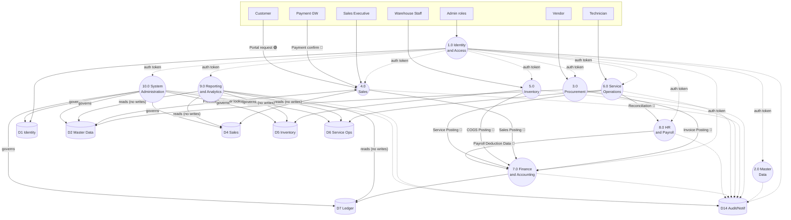

---

## 4. Level 2 DFD

Eight processes decomposed further, per scope. Approval Process is included even though it isn't one of the ten Level-1 numbers — it's the Platform/Cross-Cutting approval engine (§39), used identically by six of the ten Level-1 processes, so it earns its own Level 2 diagram rather than being redrawn eight times inside each parent.

### 4.1 Sales Process (decomposes 4.0)

**Updated for Module 73 (Delivery Challan Return):** process 4.6 added, reading from the same Delivery Challan data 4.3 already produces.

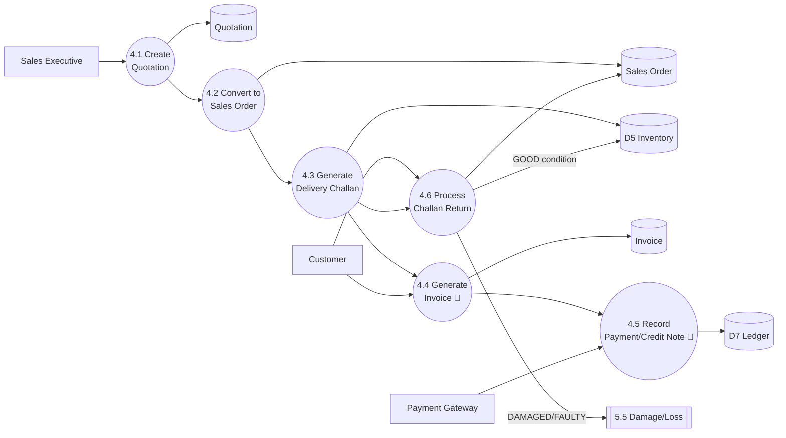

### 4.2 Procurement Process (decomposes 3.0)

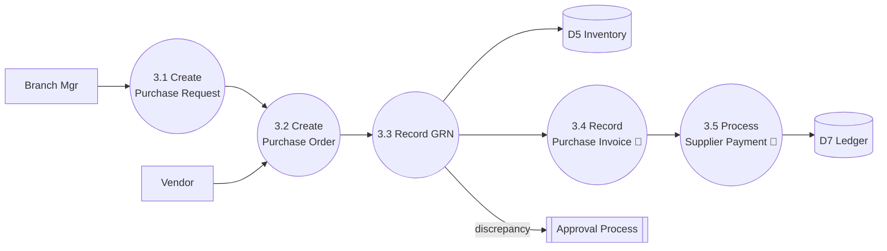

### 4.3 Inventory Process (decomposes 5.0)

**Updated for Module 74 (Warehouse Damage & Loss):** process 5.5 added.

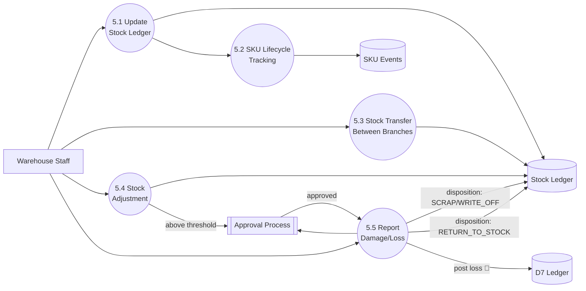

### 4.4 Service / Technician Process (decomposes 6.0)

**Updated for Module 72 (Service-Only Customer Workflow):** two new processes (6.0a, 6.0b) precede 6.1 for ticket-originated assignments; the warranty branch skips straight to 6.1 exactly as before, and 6.1 onward is completely unchanged for both branches.

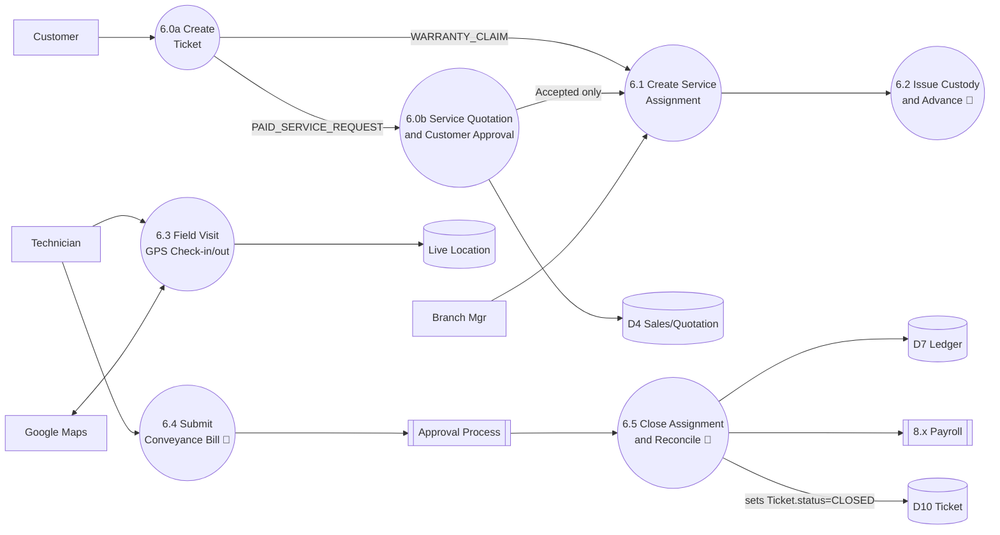

### 4.5 Accounting Process (decomposes 7.0)

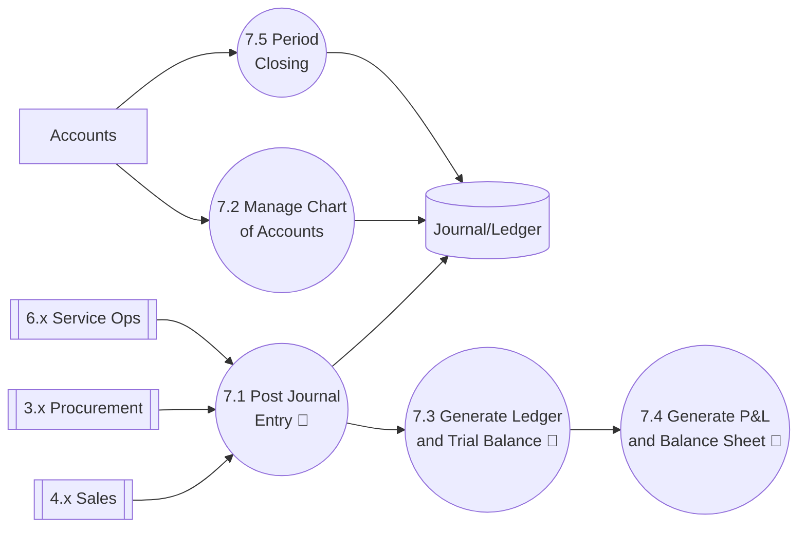

### 4.6 Payroll Process (decomposes 8.0, payroll part)

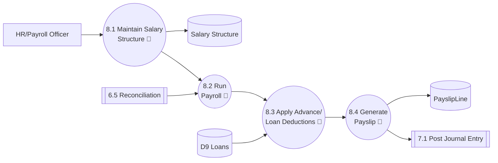

### 4.7 Approval Process (cross-cutting, used by 3.0/5.0/6.0/7.0/8.0/10.0)

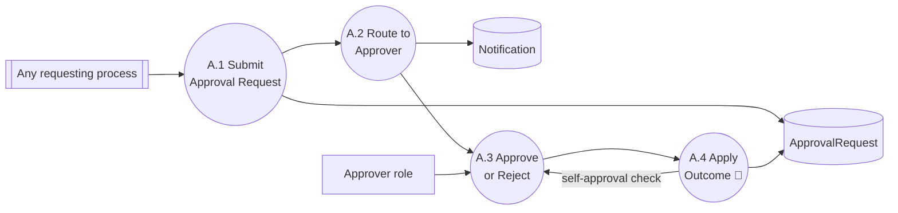

### 4.8 Reporting / Drill-down Process (decomposes 9.0)

**Updated for Module 75 (Employee Performance):** feeds 9.1 as another aggregation source — no new process needed, since Module 75 is itself a reporting-layer concept (`architecture.md` §58.3), not a transactional one.

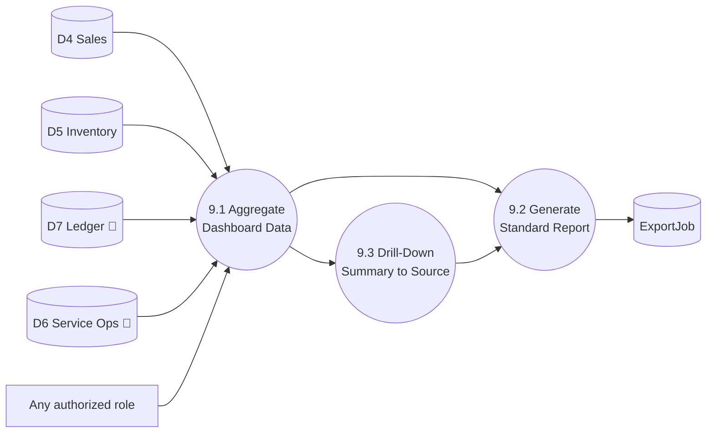

---

## 5. External Entity Dictionary

| ID | Entity | Type | Sends to system | Receives from system |
|---|---|---|---|---|
| E1 | Super Admin | Human | Config changes, RBAC policy, Edit/Delete approvals (except own) | Full audit views, system health |
| E2 | Admin | Human | Master data, transaction oversight | Dashboards, all-module records |
| E3 | Accounts / Finance Officer | Human | Journal entries, vouchers, approvals 🔴 | Ledger, P&L, Balance Sheet 🔴 |
| E4 | HR / Payroll Officer | Human | Employee records, attendance, salary structure 🔴 | Payslips, payroll reports 🔴 |
| E5 | Branch Manager | Human | Branch-level approvals, PRs | Branch dashboards, own-branch reports |
| E6 | Sales Executive | Human | Quotation, order, customer data | Order status, own KPIs |
| E7 | Warehouse / Inventory Staff | Human | GRN, stock adjustment, transfer | Stock levels, reorder alerts |
| E8 | Technician / Field Staff | Human | GPS, conveyance bill, visit report 🔴 | Assignment detail, "My Salary" 🔴 |
| E9 | Customer | Human (external) | Portal login, online payment 🟢 | Invoice, balance, ticket status 🟢 |
| E10 | Vendor / Supplier | Human (external) | PO acknowledgment, statement request 🟢 | PO copy, payment status 🟢 |
| E11 | Payment Gateway (SSLCommerz) | System | Payment confirmation/failure 🔴 | Payment request, amount, order ref |
| E12 | SMS Gateway | System | Delivery receipt | Message content, recipient number |
| E13 | Email Service | System | Delivery receipt | Message content, recipient address |
| E14 | Google Maps API | System | Coordinates, geocoded address, route | Address string, lat/long query |

---

## 6. Data Flow Dictionary

Named, composite flows referenced in §2–4's diagrams. Composition uses `+` (and), `[|]` (or), `{}` (repeating group), matching standard DFD data-dictionary notation.

| Flow name | Composition | Sensitivity |
|---|---|---|
| Login Credentials | username + password + [MFA code] | 🔴 |
| Auth Token | userId + role + branchId + expiry | 🔴 |
| Quotation Data | customerId + branchId + {QuotationLine} + validUntil + grandTotal | 🟡 |
| Sales Posting | sourceModule="SALES" + invoiceId + {JournalLine} | 🔴 |
| Invoice Posting | sourceModule="PROCUREMENT" + purchaseInvoiceId + {JournalLine} | 🔴 |
| COGS Posting | sourceModule="INVENTORY" + stockAdjustmentId + {JournalLine} | 🔴 |
| Service Posting | sourceModule="SERVICE_OPS" + serviceAssignmentId + {JournalLine} | 🔴 |
| Payroll Deduction Data | employeeId + reconciliationOutcome + amount | 🔴 |
| Payment Confirmation | gatewayTransactionId + orderId + amount + status | 🔴 |
| Conveyance Bill Data | assignmentId + technicianId + {ExpenseLine} + totalClaimed + receiptFileId | 🔴 |
| Reconciliation Result | assignmentId + advanceIssued + approvedSpend + outcome[SHORTFALL_DEDUCT\|EXCESS_REIMBURSE\|BALANCED] | 🔴 |
| Approval Request Data | requestedById + entityType + entityId + reason + [beforeJson + afterJson] | 🟡–🔴 (🔴 if entity is financial) |
| GPS Check-in/out | technicianId + assignmentId + latitude + longitude + timestamp | 🔴 (location = personal data) |
| Portal Balance View | customerId + invoiceSummary + advanceBalance (no internal IDs exposed) | 🟢 |
| Payslip Data | employeeId + grossPay + deductions + netPay + reconciliationAdjustment | 🔴 |
| NID / Payment Info | nidNumber \| cardLast4 \| bankAccountLast4 | 🔴 — at-rest encrypted, `architecture.md` §22 |
| Notification | recipientId + channel[IN_APP\|EMAIL\|SMS] + templateKey + payload | 🟡 (🔴 if payload is financial) |
| Draft Data | userId + moduleKey + [recordId] + formDataJson | 🟡 — user-scoped, never cross-user visible |

---

## 7. Process Dictionary

| ID | Process | Level | Inputs | Outputs | Logic summary |
|---|---|---|---|---|---|
| 0.0 | BTS Platform | 0 | All external entity inputs | All external entity outputs | The whole system, undecomposed |
| 1.0 | Identity & Access | 1 | Login Credentials | Auth Token | Validate credentials, issue JWT + refresh, enforce MFA for E3/Super Admin (`prd.md` §10.5) |
| 2.0 | Master Data Management | 1 | Product/Customer/Supplier/Warehouse edits | Confirmed master records | CRUD with Section 8.25 governance (no post-submission edit without approval) |
| 3.0 | Procurement | 1 | PR, PO ack, GRN, Purchase Invoice | Stock receipt, Supplier Payment | PR→PO→GRN→Invoice→Payment chain (§9 architecture.md) |
| 4.0 | Sales | 1 | Quotation, Order, Payment | Invoice, Sales Posting | Quotation→Order→Challan→Invoice→Payment/Credit Note |
| 5.0 | Inventory Management | 1 | Stock movement, SKU events | Stock Ledger, COGS Posting | FIFO/moving-average valuation, full SKU lifecycle |
| 6.0 | Service Operations | 1 | Assignment, GPS, Conveyance | Service Posting, Reconciliation Result | The platform's signature flow — see §4.4 |
| 7.0 | Finance & Accounting | 1 | All *Posting flows | Ledger, P&L, Balance Sheet | Single downstream consumer of every other context (§39) |
| 8.0 | HR & Payroll | 1 | Attendance, Reconciliation Result | Payslip Data | Salary + deductions + reconciliation → payslip → Journal Entry |
| 9.0 | Reporting & Analytics | 1 | Read access to D2–D18 | Dashboards, Reports, Drill-down | Read-only aggregation; never writes to any store |
| 10.0 | System Administration | 1 | RBAC changes, Edit/Delete requests | Audit records, governance decisions | Platform/Cross-Cutting shared kernel (§39) |
| 4.1–4.5 | Sales sub-processes | 2 | — | — | See §4.1 |
| 3.1–3.5 | Procurement sub-processes | 2 | — | — | See §4.2 |
| 5.1–5.4 | Inventory sub-processes | 2 | — | — | See §4.3 |
| 6.1–6.5 | Service Ops sub-processes | 2 | — | — | See §4.4 |
| 7.1–7.5 | Accounting sub-processes | 2 | — | — | See §4.5 |
| 8.1–8.4 | Payroll sub-processes | 2 | — | — | See §4.6 |
| A.1–A.4 | Approval sub-processes | 2 | — | — | See §4.7 |
| 9.1–9.3 | Reporting sub-processes | 2 | — | — | See §4.8 |

---

## 8. Data Store Dictionary

| ID | Data Store | Backing Prisma models (`architecture.md` §7) | Sensitivity |
|---|---|---|---|
| D1 | Identity Store | `User`, `Employee`, `Role`, `Permission`, `RolePermission`, `Branch`, `Department` | 🔴 (credentials, employee PII) |
| D2 | Master Data Store | `Customer`, `CustomerAddress`, `Supplier`, `SupplierContact`, `Product`, `Category`, `Brand`, `Unit`, `Warehouse`, `TaxRate` | 🟡 |
| D3 | Procurement Store | `PurchaseRequest`, `PurchaseOrder`, `GoodsReceiptNote`, `PurchaseInvoice`, `SupplierPayment`, `PurchaseReturn` | 🟡–🔴 (payment records 🔴) |
| D4 | Sales Store | `Quotation`, `QuotationLine`, `SalesOrder`, `DeliveryChallan`, `Invoice`, `Payment`, `CreditNote` | 🟡–🔴 (payment/invoice 🔴) |
| D5 | Inventory Store | `StockLedger`, `StockAdjustment`, `StockTransfer`, `Batch`, `SerialNumber`, `SKULifecycleEvent` | 🟡 |
| D6 | Service Ops Store | `ServiceAssignment`, `TechnicianAssignment`, `ProductCustody`, `TechnicianAdvance`, `ConveyanceBill`, `ProjectClosureReport`, `LiveLocationLog` | 🔴 (advance amounts, GPS = personal data) |
| D7 | Ledger / Voucher Store | `ChartOfAccounts`, `JournalEntry`, `JournalLine`, `Voucher`, `VoucherLine`, `Ledger`, `TrialBalance`, `ProfitAndLoss`, `BalanceSheet` | 🔴 |
| D8 | Customer Advance Store | `CustomerAdvance`, `AdvanceAdjustment` | 🔴 |
| D9 | Loan & Investment Store | `CompanyLoan`, `LoanRepaymentSchedule`, `Investment`, `EmployeeAdvance`, `EmployeeLoanInstallment` | 🔴 |
| D10 | Warranty / Ticket Store | `Warranty`, `WarrantyClaim`, `Ticket` (now incl. `ticketType`, nullable `serialNumberId`, `serviceQuotationId` — Module 72) | 🟡 |
| D11 | Workforce Store | `Timesheet`, `KPI`, `Attendance`, `LeaveRequest` | 🔴 (attendance = personal data) |
| D12 | Export / Print Store | `ExportJob`, `PrintPreference` | 🟡 |
| D13 | Draft State Store | `DraftState` | 🟡 (user-scoped only) |
| D14 | Notification / Audit Store | `Notification`, `Document`/`Attachment`, `AuditLog`, `SavedFilter` | 🔴 (audit log itself is sensitive) |
| D15 | Payroll Store | `SalaryStructure`, `PayrollRun`, `PayslipLine`, `AttendanceSalaryRule`, `ProjectAdvanceConveyanceReconciliation` | 🔴 |
| D16 | Bank Proof Store | `BankTransactionProof` | 🔴 (bank details, masked per §22) |
| D17 | Suspense / Cheque Store | `SuspenseEntry`, `ChequeRegisterEntry` | 🔴 |
| D18 | Approval / Governance Store | `ApprovalRequest`, `RecordChangeRequest` | 🟡–🔴 (🔴 when the underlying entity is financial) |

---

## 9. Data Dictionary

Entity/Data Object → Field → Data Type → Source → Destination → Business Meaning. Covers the platform's highest-value and highest-sensitivity entities; the same pattern (name, type, source process, destination store/process, one-line meaning) extends to every remaining entity in `architecture.md` §7 not listed here.

| Entity | Field | Type | Source | Destination | Business Meaning |
|---|---|---|---|---|---|
| User | passwordHash | String | 1.0 Identity | D1 | bcrypt/Argon2 hash, never the plaintext password 🔴 |
| User | mfaEnabled | Boolean | 1.0 Identity | D1 | True for Super Admin/Accounts-Finance only (`prd.md` §10.5) |
| Employee | nidNumber | String | 2.0 Master Data | D1 | National ID — 🔴, encrypted at rest |
| Quotation | quotationNumber | String @unique | 4.1 | D4 | `QT-<branch>-<year>-<seq>` — branch-scoped uniqueness |
| Quotation | status | Enum | 4.1–4.2 | D4 | DRAFT→SENT→ACCEPTED/REJECTED/EXPIRED→CONVERTED |
| Invoice | grandTotal | Decimal | 4.4 | D4, D7 | Drives both the customer-facing amount and the Sales Posting journal entry 🔴 |
| StockLedger | quantityOnHand | Decimal | 5.1 | D5 | Never allowed negative without an explicit backorder flag (open item, requirements review) |
| SKULifecycleEvent | eventType | Enum | 5.2, 6.x, 8.x(warranty) | D5 | RECEIVED→SOLD→INSTALLED→RETURNED/RETIRED_WARRANTY — full unit traceability |
| ServiceAssignment | status | Enum | 6.1–6.5 | D6 | OPEN→IN_PROGRESS→PENDING_CLOSURE→CLOSED |
| Ticket | ticketType | Enum | 6.0a (Module 72) | D10 | WARRANTY_CLAIM (free) vs. PAID_SERVICE_REQUEST (needs 6.0b's quotation approval before 6.1) |
| Ticket | serialNumberId | String? | 6.0a | D10 | Required for WARRANTY_CLAIM, null for PAID_SERVICE_REQUEST — the field that makes a service-only customer possible without a prior sale |
| ProductCustody | custodianId | String | 6.2 | D6 | Which technician currently holds which serialized unit — reassignable (`prd.md` §9.11) |
| TechnicianAdvance | amountIssued | Decimal | 6.2 | D6, D7 | The INTERIM project-cost figure (Finance spec §59) until reconciled 🔴 |
| ConveyanceBill | totalClaimed | Decimal | 6.4 | D6 | Feeds the §58 reconciliation engine, never posts to Finance directly — only the reconciliation *outcome* does 🔴 |
| ProjectAdvanceConveyanceReconciliation | outcome | Enum | 6.5 | D15 | SHORTFALL_DEDUCT / EXCESS_REIMBURSE / BALANCED — feeds next PayrollRun 🔴 |
| JournalEntry | totalDebit / totalCredit | Decimal | 7.1 | D7 | Must be equal — enforced at DB level per `architecture.md` §45 🔴 |
| Voucher | voucherNumber | String @unique | 7.1–7.2 | D7 | Sequential, per voucher type — never reused even after reversal 🔴 |
| CustomerAdvance | amount | Decimal | 4.x (via 55.3 flow) | D8, D7 | Posted as a liability until applied against an Invoice 🔴 |
| CompanyLoan | interestBearing | Boolean | 7.2 (setup) | D9 | **Currently inconsistent between `architecture.md` §0 (false) and §26 (implies true)** — see `requirements.md` P0 finding, still open |
| EmployeeAdvance | interestBearing | Boolean | 8.x (setup) | D9 | Resolved value: `false` (interest-free, stakeholder-confirmed) — `architecture.md` text itself not yet corrected |
| PayrollRun | status | Enum | 8.2 | D15 | DRAFT→PROCESSING→FINALIZED→PAID |
| PayslipLine | netPay | Decimal | 8.4 | D15 | Gross − deductions ± reconciliation adjustment 🔴 |
| BankTransactionProof | accountNumberMasked | String | 3.5, 4.5, 7.x, 8.4 | D16 | Last 4 digits only — full number never stored (`prd.md` §8.20) 🔴 |
| ApprovalRequest | requestedById | String | A.1 | D18 | Checked against `approvedById` at A.3 to enforce the self-approval rule (`prd.md` §9.6) |
| DraftState | formDataJson | Json | any module | D13 | Cleared 1 hour after last edit if never submitted (`prd.md` §14, resolved) |

---

## 10. Data Flow Table

Every flow crossing a process boundary at Level 1, with sensitivity and baseline control per §1's convention.

| ID | From | To | Data Flow | Sensitivity | Control |
|---|---|---|---|---|---|
| DF1 | E1–E10 | 1.0 | Login Credentials | 🔴 | TLS, bcrypt/Argon2, MFA for E1/E3 |
| DF2 | 1.0 | 2.0–10.0 | Auth Token | 🔴 | Short-lived JWT, RBAC + row-level check on every use |
| DF3 | E6 | 4.0 | Quotation Data | 🟡 | RBAC (Sales Executive scope) |
| DF4 | 4.0 | 7.0 | Sales Posting | 🔴 | Idempotency key (§43), one DB transaction (§45) |
| DF5 | 3.0 | 7.0 | Invoice Posting | 🔴 | Same as DF4 |
| DF6 | 5.0 | 7.0 | COGS Posting | 🔴 | Same as DF4 |
| DF7 | 6.0 | 7.0 | Service Posting | 🔴 | Same as DF4 |
| DF8 | 6.0 | 8.0 | Reconciliation Result | 🔴 | Cross-context via Application interface only (§41), never a direct table join |
| DF9 | 8.0 | 7.0 | Payroll Deduction Data | 🔴 | Same as DF4 |
| DF10 | E11 | 4.0 | Payment Confirmation | 🔴 | Webhook signature verification + idempotency key |
| DF11 | E8 | 6.0 | GPS Check-in/out | 🔴 | TLS; offline-cached then synced (`prd.md` §10.1) with financial-field conflict routed to manual review, not auto-merged |
| DF12 | 4.0 | E9 | Portal Balance View | 🟢 | Anti-corruption view model (§39) — internal IDs/shape never exposed |
| DF13 | 3.0/5.0/6.0/7.0/8.0/10.0 | Approval (A.1–A.4) | Approval Request Data | 🟡–🔴 | Self-approval check at A.3/A.4 (`prd.md` §9.6) |
| DF14 | 9.0 | D2–D18 | (read only) | 🔴 where source store is 🔴 | Read-only role; no write path exists from 9.0 to any store |
| DF15 | Any module | D13 | Draft Data | 🟡 | User-scoped; 1-hour expiry |
| DF16 | 7.0 | E3 | Ledger / P&L | 🔴 | RBAC (Accounts/Finance + Super Admin/Admin only) |
| DF17 | 8.0 | E8 (via 6.0) | Payslip Data ("My Salary") | 🔴 | Own-record-only row-level scope |
| DF18 | 4.6 | D5/5.5 | Challan Return Data | 🟡–🔴 (🔴 if condition≠GOOD, routes to Damage/Loss) | Quantity-exceeds-original rejected pre-write (`architecture.md` §58.1) |
| DF19 | 5.5 | Approval / D7 | Damage/Loss Report Data | 🔴 | Four-eyes (`no_self_approval`-pattern check, `database-schema.md` §58.2); zero financial effect pre-approval |

---

## 11. Process Table

| ID | Name | Level | Type | Parent |
|---|---|---|---|---|
| 0.0 | BTS Platform | 0 | Composite | — |
| 1.0 | Identity & Access | 1 | Composite | 0.0 |
| 2.0 | Master Data Management | 1 | Composite | 0.0 |
| 3.0 | Procurement | 1 | Composite | 0.0 |
| 4.0 | Sales | 1 | Composite | 0.0 |
| 5.0 | Inventory Management | 1 | Composite | 0.0 |
| 6.0 | Service Operations | 1 | Composite | 0.0 |
| 7.0 | Finance & Accounting | 1 | Composite | 0.0 |
| 8.0 | HR & Payroll | 1 | Composite | 0.0 |
| 9.0 | Reporting & Analytics | 1 | Composite | 0.0 |
| 10.0 | System Administration | 1 | Composite | 0.0 |
| 4.1–4.5 | Quotation → Payment chain | 2 | Elementary | 4.0 |
| 3.1–3.5 | PR → Payment chain | 2 | Elementary | 3.0 |
| 5.1–5.4 | Stock/SKU/Transfer/Adjustment | 2 | Elementary | 5.0 |
| 6.1–6.5 | Assignment → Reconciliation chain | 2 | Elementary | 6.0 |
| 7.1–7.5 | Journal → Closing chain | 2 | Elementary | 7.0 |
| 8.1–8.4 | Structure → Payslip chain | 2 | Elementary | 8.0 |
| A.1–A.4 | Approval chain | 2 | Elementary | (cross-cutting, not a child of one Level-1 process) |
| 9.1–9.3 | Aggregate → Drill-down chain | 2 | Elementary | 9.0 |

---

## 12. Data Store Table

| ID | Name | Level accessed | Read by | Written by |
|---|---|---|---|---|
| D1 | Identity Store | 1.0 | All processes (auth check) | 1.0, 10.0 |
| D2 | Master Data Store | 2.0 | 3.0, 4.0, 5.0, 9.0 | 2.0, 10.0 |
| D3 | Procurement Store | 3.0 | 5.0, 7.0, 9.0 | 3.0 |
| D4 | Sales Store | 4.0 | 7.0, 9.0, Portal(4.0) | 4.0 |
| D5 | Inventory Store | 5.0 | 4.0, 6.0, 7.0, 9.0 | 3.0, 5.0, 6.0 |
| D6 | Service Ops Store | 6.0 | 7.0, 8.0, 9.0 | 6.0 |
| D7 | Ledger / Voucher Store | 7.0 | 9.0, E3 | 7.0 only — no other process writes directly (§41) |
| D8 | Customer Advance Store | 4.0/7.0 | 7.0, 9.0 | 4.0, 7.0 |
| D9 | Loan & Investment Store | 7.0/8.0 | 8.0, 9.0 | 7.0 |
| D10 | Warranty / Ticket Store | (Customer Support) | 6.0, 9.0 | (Customer Support), 6.0 |
| D11 | Workforce Store | 8.0 | 8.0, 9.0 | 8.0, 6.0 (LiveLocationLog) |
| D12 | Export / Print Store | 9.0/10.0 | all (on export request) | 9.0, 10.0 |
| D13 | Draft State Store | any | owning user only | any |
| D14 | Notification / Audit Store | 10.0 | 1.0 (Super Admin), 10.0 | all processes (audit writes) |
| D15 | Payroll Store | 8.0 | 7.0, 9.0, E8 (own) | 8.0 |
| D16 | Bank Proof Store | 3.0/4.0/7.0/8.0 | 7.0, 9.0 | 3.0, 4.0, 7.0, 8.0 |
| D17 | Suspense / Cheque Store | 7.0 | 9.0 | 7.0 |
| D18 | Approval / Governance Store | A.1–A.4 | 9.0 (audit view), 10.0 | A.1–A.4 |

---

## 13. DFD Balance / Reconciliation Matrix

The core DFD-quality rule: a parent process's external inputs/outputs must equal the sum of its Level-2 children's flows that cross the *parent's own* boundary — internal-only flows between children (e.g., 4.1→4.2 inside Sales) don't count, since they never leave the parent process at Level 1.

| Parent (Level 1) | External inputs (Level 1 diagram) | External inputs reachable from Level 2 children | Balanced? |
|---|---|---|---|
| 4.0 Sales | Quotation Data (E6), Payment Confirmation (E11), Portal Request (E9) | 4.1 receives Quotation Data; 4.4 receives Portal/Customer data; 4.5 receives Payment Confirmation | ✅ Balanced |
| 3.0 Procurement | PR/PO data (E5), Vendor ack (E10) | 3.1 receives PR data; 3.2 receives Vendor ack | ✅ Balanced |
| 5.0 Inventory | Stock movement (E7) | 5.1/5.3/5.4 all receive from E7 | ✅ Balanced |
| 6.0 Service Ops | Assignment (E5), GPS/Conveyance (E8), Maps data (E14) | 6.1 receives from E5; 6.3 receives GPS + E14; 6.4 receives Conveyance | ✅ Balanced |
| 7.0 Finance | Sales/Invoice/COGS/Service Posting (4.0/3.0/5.0/6.0), CoA edits (E3) | 7.1 receives all four Posting flows; 7.2 receives CoA edits from E3 | ✅ Balanced |
| 8.0 Payroll | Attendance/Structure (E4), Reconciliation Result (6.0) | 8.1 receives from E4; 8.2 receives Reconciliation Result | ✅ Balanced |
| 9.0 Reporting | Read access to D2–D18 | 9.1 reads all listed stores | ✅ Balanced |
| Approval (cross-cutting) | Approval Request Data from six Level-1 processes | A.1 receives from `ANY[[Any requesting process]]` in §4.7 | ✅ Balanced — modeled as a single generic input, matching the platform's own "one reusable Approval Engine" principle (`prd.md` §8.14) rather than six separate input arrows |

**One genuine imbalance found, not smoothed over:** Level 1's diagram (§3) shows 6.0 sending "Service Posting" directly to 7.0, but §4.4's Level 2 diagram shows 6.5 sending its output to *both* 7.0 (via D7) and 8.0 (Payroll) — the Level 1 diagram only drew the Finance arrow. This is corrected in §3's diagram above (which already shows `P6 -- "Reconciliation" --> P8` alongside the Finance arrow) — flagged here explicitly so the correction is visible as a correction, not silently folded in.

---

## 14. Mermaid DFD Source

The Mermaid source for every diagram in this document is already embedded, ready to render, in §2 (Context), §3 (Level 1), and §4.1–4.8 (Level 2 × 8) above — copy any fenced ```mermaid block directly into a Mermaid renderer. This section adds one combined view not shown elsewhere: Context + Level 1 together, for a single one-page overview.

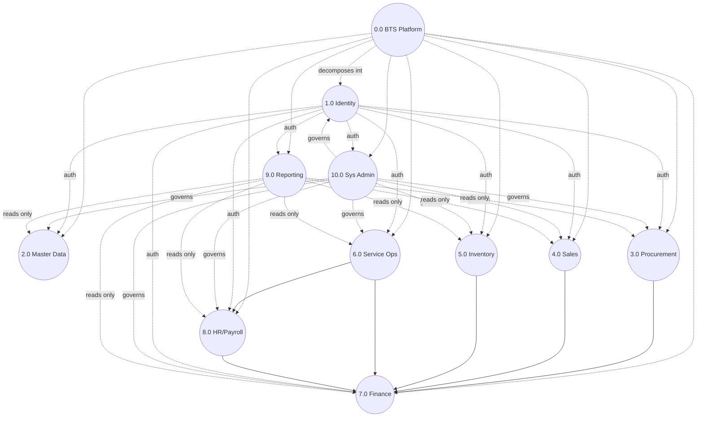

---

## 15. Draw.io XML Source

Valid, importable `.drawio` / `.xml` for the two most structurally important levels — Context and Level 1. Level 2's eight diagrams are fully specified in Mermaid (§4) already; the same node/edge pattern below extends to any of them on request, but reproducing all eight again in raw XML here would roughly quadruple this document's length for content already fully captured above.

**Context Diagram (Level 0) — import directly into app.diagrams.net (File → Import from → Device):**

```xml
<mxfile host="app.diagrams.net" agent="dfd.md" version="24.0.0">
  <diagram id="context-l0" name="Context Diagram (Level 0)">
    <mxGraphModel dx="1000" dy="700" grid="1" gridSize="10" guides="1" tooltips="1" connect="1" arrows="1" fold="1" page="1" pageScale="1" pageWidth="1100" pageHeight="850" math="0" shadow="0">
      <root>
        <mxCell id="0" />
        <mxCell id="1" parent="0" />
        <mxCell id="p0" value="0.0 Brother's Technology System Platform" style="ellipse;whiteSpace=wrap;html=1;fillColor=#d5e8d4;strokeColor=#82b366;" vertex="1" parent="1">
          <mxGeometry x="440" y="350" width="180" height="100" as="geometry" />
        </mxCell>
        <mxCell id="e1" value="Super Admin" style="rounded=0;whiteSpace=wrap;html=1;fillColor=#dae8fc;strokeColor=#6c8ebf;" vertex="1" parent="1"><mxGeometry x="800" y="350" width="140" height="60" as="geometry" /></mxCell>
        <mxCell id="e2" value="Admin" style="rounded=0;whiteSpace=wrap;html=1;fillColor=#dae8fc;strokeColor=#6c8ebf;" vertex="1" parent="1"><mxGeometry x="765" y="502" width="140" height="60" as="geometry" /></mxCell>
        <mxCell id="e3" value="Accounts / Finance" style="rounded=0;whiteSpace=wrap;html=1;fillColor=#dae8fc;strokeColor=#6c8ebf;" vertex="1" parent="1"><mxGeometry x="668" y="624" width="140" height="60" as="geometry" /></mxCell>
        <mxCell id="e4" value="HR / Payroll Officer" style="rounded=0;whiteSpace=wrap;html=1;fillColor=#dae8fc;strokeColor=#6c8ebf;" vertex="1" parent="1"><mxGeometry x="528" y="691" width="140" height="60" as="geometry" /></mxCell>
        <mxCell id="e5" value="Branch Manager" style="rounded=0;whiteSpace=wrap;html=1;fillColor=#dae8fc;strokeColor=#6c8ebf;" vertex="1" parent="1"><mxGeometry x="372" y="691" width="140" height="60" as="geometry" /></mxCell>
        <mxCell id="e6" value="Sales Executive" style="rounded=0;whiteSpace=wrap;html=1;fillColor=#dae8fc;strokeColor=#6c8ebf;" vertex="1" parent="1"><mxGeometry x="232" y="624" width="140" height="60" as="geometry" /></mxCell>
        <mxCell id="e7" value="Warehouse Staff" style="rounded=0;whiteSpace=wrap;html=1;fillColor=#dae8fc;strokeColor=#6c8ebf;" vertex="1" parent="1"><mxGeometry x="135" y="502" width="140" height="60" as="geometry" /></mxCell>
        <mxCell id="e8" value="Technician" style="rounded=0;whiteSpace=wrap;html=1;fillColor=#dae8fc;strokeColor=#6c8ebf;" vertex="1" parent="1"><mxGeometry x="100" y="350" width="140" height="60" as="geometry" /></mxCell>
        <mxCell id="e9" value="Customer" style="rounded=0;whiteSpace=wrap;html=1;fillColor=#dae8fc;strokeColor=#6c8ebf;" vertex="1" parent="1"><mxGeometry x="135" y="198" width="140" height="60" as="geometry" /></mxCell>
        <mxCell id="e10" value="Vendor / Supplier" style="rounded=0;whiteSpace=wrap;html=1;fillColor=#dae8fc;strokeColor=#6c8ebf;" vertex="1" parent="1"><mxGeometry x="232" y="76" width="140" height="60" as="geometry" /></mxCell>
        <mxCell id="e11" value="Payment Gateway" style="rounded=0;whiteSpace=wrap;html=1;fillColor=#f8cecc;strokeColor=#b85450;" vertex="1" parent="1"><mxGeometry x="372" y="9" width="140" height="60" as="geometry" /></mxCell>
        <mxCell id="e12" value="SMS Gateway" style="rounded=0;whiteSpace=wrap;html=1;fillColor=#f8cecc;strokeColor=#b85450;" vertex="1" parent="1"><mxGeometry x="528" y="9" width="140" height="60" as="geometry" /></mxCell>
        <mxCell id="e13" value="Email Service" style="rounded=0;whiteSpace=wrap;html=1;fillColor=#f8cecc;strokeColor=#b85450;" vertex="1" parent="1"><mxGeometry x="668" y="76" width="140" height="60" as="geometry" /></mxCell>
        <mxCell id="e14" value="Google Maps API" style="rounded=0;whiteSpace=wrap;html=1;fillColor=#f8cecc;strokeColor=#b85450;" vertex="1" parent="1"><mxGeometry x="765" y="198" width="140" height="60" as="geometry" /></mxCell>
        <mxCell id="f1" style="edgeStyle=orthogonalEdgeStyle;html=1;" edge="1" parent="1" source="e1" target="p0"><mxGeometry relative="1" as="geometry" /></mxCell>
        <mxCell id="f2" style="edgeStyle=orthogonalEdgeStyle;html=1;" edge="1" parent="1" source="e6" target="p0"><mxGeometry relative="1" as="geometry" /></mxCell>
        <mxCell id="f3" style="edgeStyle=orthogonalEdgeStyle;html=1;" edge="1" parent="1" source="e8" target="p0"><mxGeometry relative="1" as="geometry" /></mxCell>
        <mxCell id="f4" style="edgeStyle=orthogonalEdgeStyle;html=1;" edge="1" parent="1" source="e9" target="p0"><mxGeometry relative="1" as="geometry" /></mxCell>
        <mxCell id="f5" style="edgeStyle=orthogonalEdgeStyle;html=1;" edge="1" parent="1" source="e10" target="p0"><mxGeometry relative="1" as="geometry" /></mxCell>
        <mxCell id="f6" style="edgeStyle=orthogonalEdgeStyle;html=1;dashed=1;" edge="1" parent="1" source="p0" target="e11"><mxGeometry relative="1" as="geometry" /></mxCell>
        <mxCell id="f7" style="edgeStyle=orthogonalEdgeStyle;html=1;dashed=1;" edge="1" parent="1" source="p0" target="e12"><mxGeometry relative="1" as="geometry" /></mxCell>
        <mxCell id="f8" style="edgeStyle=orthogonalEdgeStyle;html=1;dashed=1;" edge="1" parent="1" source="p0" target="e13"><mxGeometry relative="1" as="geometry" /></mxCell>
        <mxCell id="f9" style="edgeStyle=orthogonalEdgeStyle;html=1;dashed=1;" edge="1" parent="1" source="p0" target="e14"><mxGeometry relative="1" as="geometry" /></mxCell>
        <mxCell id="f10" style="edgeStyle=orthogonalEdgeStyle;html=1;" edge="1" parent="1" source="e2" target="p0"><mxGeometry relative="1" as="geometry" /></mxCell>
        <mxCell id="f11" style="edgeStyle=orthogonalEdgeStyle;html=1;" edge="1" parent="1" source="e3" target="p0"><mxGeometry relative="1" as="geometry" /></mxCell>
        <mxCell id="f12" style="edgeStyle=orthogonalEdgeStyle;html=1;" edge="1" parent="1" source="e4" target="p0"><mxGeometry relative="1" as="geometry" /></mxCell>
        <mxCell id="f13" style="edgeStyle=orthogonalEdgeStyle;html=1;" edge="1" parent="1" source="e5" target="p0"><mxGeometry relative="1" as="geometry" /></mxCell>
        <mxCell id="f14" style="edgeStyle=orthogonalEdgeStyle;html=1;" edge="1" parent="1" source="e7" target="p0"><mxGeometry relative="1" as="geometry" /></mxCell>
      </root>
    </mxGraphModel>
  </diagram>
</mxfile>
```

**Level 1 DFD — same import method.** Simplified to the ten processes and their primary cross-process flows (individual data stores omitted from the XML for readability — all eighteen are already fully defined in §8/§12; add them as additional rectangles per that table if a fully store-inclusive diagram is needed):

```xml
<mxfile host="app.diagrams.net" agent="dfd.md" version="24.0.0">
  <diagram id="level1-dfd" name="Level 1 DFD">
    <mxGraphModel dx="1000" dy="700" grid="1" gridSize="10" guides="1" tooltips="1" connect="1" arrows="1" fold="1" page="1" pageScale="1" pageWidth="1200" pageHeight="700" math="0" shadow="0">
      <root>
        <mxCell id="0" />
        <mxCell id="1" parent="0" />
        <mxCell id="p1" value="1.0 Identity &amp; Access" style="ellipse;whiteSpace=wrap;html=1;fillColor=#d5e8d4;strokeColor=#82b366;" vertex="1" parent="1"><mxGeometry x="40" y="300" width="140" height="80" as="geometry" /></mxCell>
        <mxCell id="p2" value="2.0 Master Data" style="ellipse;whiteSpace=wrap;html=1;fillColor=#d5e8d4;strokeColor=#82b366;" vertex="1" parent="1"><mxGeometry x="220" y="300" width="140" height="80" as="geometry" /></mxCell>
        <mxCell id="p3" value="3.0 Procurement" style="ellipse;whiteSpace=wrap;html=1;fillColor=#d5e8d4;strokeColor=#82b366;" vertex="1" parent="1"><mxGeometry x="400" y="120" width="140" height="80" as="geometry" /></mxCell>
        <mxCell id="p4" value="4.0 Sales" style="ellipse;whiteSpace=wrap;html=1;fillColor=#d5e8d4;strokeColor=#82b366;" vertex="1" parent="1"><mxGeometry x="400" y="300" width="140" height="80" as="geometry" /></mxCell>
        <mxCell id="p5" value="5.0 Inventory" style="ellipse;whiteSpace=wrap;html=1;fillColor=#d5e8d4;strokeColor=#82b366;" vertex="1" parent="1"><mxGeometry x="400" y="480" width="140" height="80" as="geometry" /></mxCell>
        <mxCell id="p6" value="6.0 Service Ops" style="ellipse;whiteSpace=wrap;html=1;fillColor=#d5e8d4;strokeColor=#82b366;" vertex="1" parent="1"><mxGeometry x="580" y="480" width="140" height="80" as="geometry" /></mxCell>
        <mxCell id="p7" value="7.0 Finance &amp; Accounting" style="ellipse;whiteSpace=wrap;html=1;fillColor=#ffe6cc;strokeColor=#d79b00;" vertex="1" parent="1"><mxGeometry x="760" y="300" width="150" height="80" as="geometry" /></mxCell>
        <mxCell id="p8" value="8.0 HR &amp; Payroll" style="ellipse;whiteSpace=wrap;html=1;fillColor=#d5e8d4;strokeColor=#82b366;" vertex="1" parent="1"><mxGeometry x="580" y="120" width="140" height="80" as="geometry" /></mxCell>
        <mxCell id="p9" value="9.0 Reporting &amp; Analytics" style="ellipse;whiteSpace=wrap;html=1;fillColor=#e1d5e7;strokeColor=#9673a6;" vertex="1" parent="1"><mxGeometry x="960" y="120" width="150" height="80" as="geometry" /></mxCell>
        <mxCell id="p10" value="10.0 System Administration" style="ellipse;whiteSpace=wrap;html=1;fillColor=#e1d5e7;strokeColor=#9673a6;" vertex="1" parent="1"><mxGeometry x="960" y="480" width="150" height="80" as="geometry" /></mxCell>
        <mxCell id="f1" value="Sales Posting" style="edgeStyle=orthogonalEdgeStyle;html=1;" edge="1" parent="1" source="p4" target="p7"><mxGeometry relative="1" as="geometry" /></mxCell>
        <mxCell id="f2" value="Invoice Posting" style="edgeStyle=orthogonalEdgeStyle;html=1;" edge="1" parent="1" source="p3" target="p7"><mxGeometry relative="1" as="geometry" /></mxCell>
        <mxCell id="f3" value="COGS Posting" style="edgeStyle=orthogonalEdgeStyle;html=1;" edge="1" parent="1" source="p5" target="p7"><mxGeometry relative="1" as="geometry" /></mxCell>
        <mxCell id="f4" value="Service Posting" style="edgeStyle=orthogonalEdgeStyle;html=1;" edge="1" parent="1" source="p6" target="p7"><mxGeometry relative="1" as="geometry" /></mxCell>
        <mxCell id="f5" value="Reconciliation Result" style="edgeStyle=orthogonalEdgeStyle;html=1;" edge="1" parent="1" source="p6" target="p8"><mxGeometry relative="1" as="geometry" /></mxCell>
        <mxCell id="f6" value="Payroll Deduction Data" style="edgeStyle=orthogonalEdgeStyle;html=1;" edge="1" parent="1" source="p8" target="p7"><mxGeometry relative="1" as="geometry" /></mxCell>
        <mxCell id="f7" value="auth" style="edgeStyle=orthogonalEdgeStyle;html=1;dashed=1;" edge="1" parent="1" source="p1" target="p2"><mxGeometry relative="1" as="geometry" /></mxCell>
        <mxCell id="f8" value="reads" style="edgeStyle=orthogonalEdgeStyle;html=1;dashed=1;" edge="1" parent="1" source="p7" target="p9"><mxGeometry relative="1" as="geometry" /></mxCell>
        <mxCell id="f9" value="governs" style="edgeStyle=orthogonalEdgeStyle;html=1;dashed=1;" edge="1" parent="1" source="p10" target="p7"><mxGeometry relative="1" as="geometry" /></mxCell>
        <mxCell id="f10" value="lookup" style="edgeStyle=orthogonalEdgeStyle;html=1;" edge="1" parent="1" source="p4" target="p2"><mxGeometry relative="1" as="geometry" /></mxCell>
      </root>
    </mxGraphModel>
  </diagram>
</mxfile>
```

---

## 16. DFD Validation Report

### What this exercise confirmed was already sound

`architecture.md` v3.2's Bounded Context Map (§39), Module Dependency Rules (§41), and Domain Event catalog (§44) mapped onto a DFD cleanly and consistently — that's not a given for a document that wasn't originally written DFD-first, and it's a good sign the §39–44 additions genuinely reflect how the system is structured rather than being aspirational.

### One structural error caught during construction, corrected rather than hidden

While drafting §3's Level 1 diagram, the first pass only drew Process 6.0 (Service Operations) sending its output to 7.0 (Finance) — matching the simpler mental model of "everything posts to Finance." Building Level 2 (§4.4) first revealed that 6.5's Reconciliation Result *also* goes to 8.0 (Payroll) directly, per `architecture.md` §7.17/§44. §13's Balance Matrix caught this as an imbalance between the Level 1 and Level 2 diagrams, and §3's diagram above was corrected to include both arrows before this document was finalized — left visible in §13 rather than silently fixed, since it's a useful example of what the balance check is *for*.

### Security & privacy audit of every tagged flow (the "100%" requirement)

Every flow in §10's Data Flow Table carries a sensitivity tag and a stated control — that part is complete. Auditing the controls themselves against `architecture.md` turned up two flows where the tag is right but the *policy behind* the control isn't fully specified yet:

1. **GPS Check-in/out (DF11) and `LiveLocationLog` (D6).** Tagged 🔴 correctly (location history is personal data), and TLS-in-transit is covered by Nginx (§38) — but `architecture.md` states no retention period for location history, and no rule on who can see a technician's *historical* route versus only their *current* position. Right now the honest answer to "is this 100% covered" is: encrypted and access-controlled in transit and via RBAC, but not yet governed by an explicit retention/visibility policy the way financial data is (§54's retention policy doesn't mention this store).
2. **NID Number (`Employee.nidNumber`, in the Data Dictionary §9).** Tagged 🔴, encrypted at rest per §22 — but "encrypted at rest" answers *storage* security, not *display* security: nothing in `architecture.md` states whether an authorized viewer (e.g., a Branch Manager pulling up an employee record) sees the full NID or a masked version, the way `BankTransactionProof.accountNumberMasked` (D16) is already explicitly masked by design.
3. **Approval Request Data (DF13), when it carries a 🔴 financial payload.** The Approval Process (§4.7) is a shared kernel used by six different Level-1 processes (§39) — but nothing confirms the approval inbox UI itself re-applies the same row-level scope as the record's normal view. A Branch Manager approving a non-financial Edit/Delete Request, for instance, should not incidentally see full financial detail on a *different* pending item in the same inbox if that item belongs to a context they don't have access to.

None of these three break the platform's overall security model — they're the same class of finding as the earlier `requirements.md` pass (a real control exists, but the policy governing it isn't written down yet) rather than a design flaw. Recommend adding all three to the same pending-decisions list already tracked for this project, since fixing them is a documentation/policy task, not a re-architecture.

### Scope this document deliberately did not expand into

- Identity & Access, Master Data, and System Administration were kept at Level 1 only (§1) — they're CRUD/governance processes without the branching complexity that made the other eight worth a Level 2 break. Extending them to Level 2 would add diagrams without adding decision-relevant detail.
- Draw.io XML (§15) is provided for Context and Level 1 only; all eight Level 2 diagrams are complete in Mermaid (§4) but not re-authored as raw XML, since that would reproduce the same information at roughly four times the length for a format the Mermaid versions already cover.
- The Data Dictionary (§9) covers the platform's ~20 highest-value/highest-sensitivity entities in full field-level detail rather than all ~50+ entities across `architecture.md` §7 — the same row format extends directly to any entity not listed, on request.

### Module 72 addition (Service-Only Customer Workflow) — non-duplication check

Before drawing anything new, this update checked whether the requested Call→Ticket→Quotation→Approval→Assignment→...→Closed flow already existed. Twelve of its fourteen steps did — they're Section 4.4's existing 6.1–6.5 chain (already covers Technician, Field Work, Parts Used via `ProductCustody`, Labour/Conveyance, Sign-off via `ProjectClosureReport`) plus the existing Sales/Finance processes for Invoice, Payment, and P&L. Only two new processes were added — **6.0a Create Ticket** and **6.0b Service Quotation and Customer Approval** — both feeding into the unchanged 6.1. No new Level 1 process, no new data store, and no duplicate version of any existing process were created; §3's Level 1 table and §8/§12's dictionaries were corrected in place (Customer Support's module list, D10's field list) rather than given parallel new entries.

### Modules 73–75 addition (Challan Return, Damage/Loss, Employee Performance) — non-duplication check

Same discipline applied again: Module 73 added exactly one new Level 2 process (4.6) to the existing Sales diagram rather than a parallel Returns diagram; Module 74 added exactly one (5.5) to the existing Inventory diagram; Module 75 added **zero** new processes at all — it feeds 9.1's existing aggregation as one more data source, matching its own source specification's explicit rule that it is a reporting layer, not a new transactional flow. No new Level 1 process was added for any of the three.
